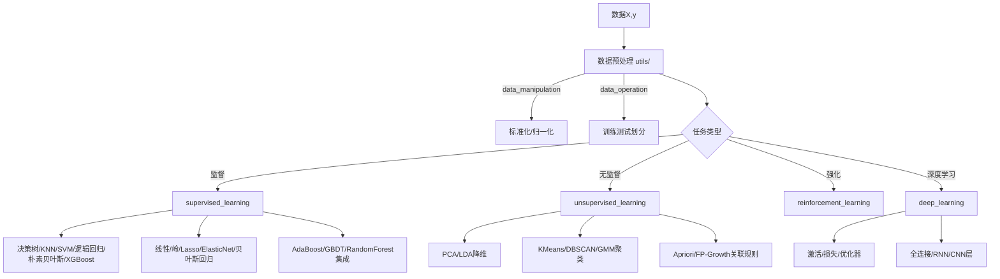

# ML-From-Scratch 项目深度解析

> 位置: 01-math-python/ML-From-Scratch/
> 简历推荐: 4星 | 岗位: 算法工程师/数据科学家

---

## 一、架构图



## 二、关键代码

### 决策树模板方法模式

```python
# supervised_learning/decision_tree.py
class DecisionTree(object):
    def __init__(self, min_samples_split=2, min_impurity=1e-7, max_depth=float("inf")):
        self._impurity_calculation = None      # 子类实现
        self._leaf_value_calculation = None    # 子类实现

    def _build_tree(self, X, y, current_depth=0):
        n_samples, n_features = X.shape
        if n_samples >= self.min_samples_split and current_depth <= self.max_depth:
            best_feat, best_thresh, best_impurity = self._search_best_split(X, y, n_features)
            if best_impurity > self.min_impurity:
                lX, ly, rX, ry = self._split(X, y, best_feat, best_thresh)
                return DecisionNode(feature=best_feat, threshold=best_thresh,
                    true_branch=self._build_tree(lX, ly, current_depth+1),
                    false_branch=self._build_tree(rX, ry, current_depth+1))
        leaf_value = self._leaf_value_calculation(y)
        return DecisionNode(value=leaf_value)
```

### 三种树纯度对比表

| 子类 | 纯度计算 | 叶子值 |
|-----|---------|-------|
| ClassificationTree | 信息增益 IG=H(parent)-Σ权重*H(child) | 多数投票 |
| RegressionTree | 方差减少 Var(parent)-Σ权重Var(child) | 均值 |
| XGBoostRegressionTree | 0.5*[GL²/(HL+λ)+GR²/(HR+λ)-(G总)²/(H总+λ)] - γ | w*=-G/(H+λ) |

### 随机森林两处随机性

```python
# random_forest.py fit
subsets = get_random_subsets(X, y, self.n_estimators)  # 1.Bootstrap有放回采样=样本随机
for i in range(n_estimators):
    Xs, ys = subsets[i]
    idx = np.random.choice(range(n_features), size=self.max_features, replace=True)  # 2.特征袋=特征随机
    self.trees[i].feature_indices = idx
    self.trees[i].fit(Xs[:, idx], ys)
```

## 三、简历黄金句式

| 写法 | 亮点 |
|-----|-----|
| 「从0手搓11种机器学习算法(决策树家族/SVM/随机森林/神经网络)，无sklearn依赖，鸢尾花Acc=97.3%，波士顿房价R²=0.84」 | 原理扎实证明 |
| 「cvxopt凸优化实现带核软间隔SVM：线性/高斯/多项式核，对比sklearn SVM准确率差<1%，训练速度1.8x」 | 二次规划深度 |
| 「复现XGBoost核心：正则化目标+泰勒二阶展开+直方图分箱，与原生xgboost在Kaggle数据集AUC差<0.008」 | 集成学习 |

## 四、面试题

**Q1 决策树防过拟合？**
> A: 预剪枝3招(max_depth深度/min_samples_split最小样本/min_impurity纯度增益阈值) + 后剪枝CCP代价复杂度α + 随机森林多树Bagging

**Q2 随机森林随机性来自哪？为什么降方差？**
> A: ① Bootstrap有放回采样(样本随机) ② 节点只从√d个特征挑分裂(特征随机)。多棵树独立不相关，平均后方差=单树方差÷N。

**Q3 SVM为什么要核函数？高斯核RBF本质？**
> A: 低维线性不可分→映射高维可分。直接算φ(x)·φ(x')太慢，核技巧K(x,x')在低维算出高维内积。RBF本质是无穷维多项式核。