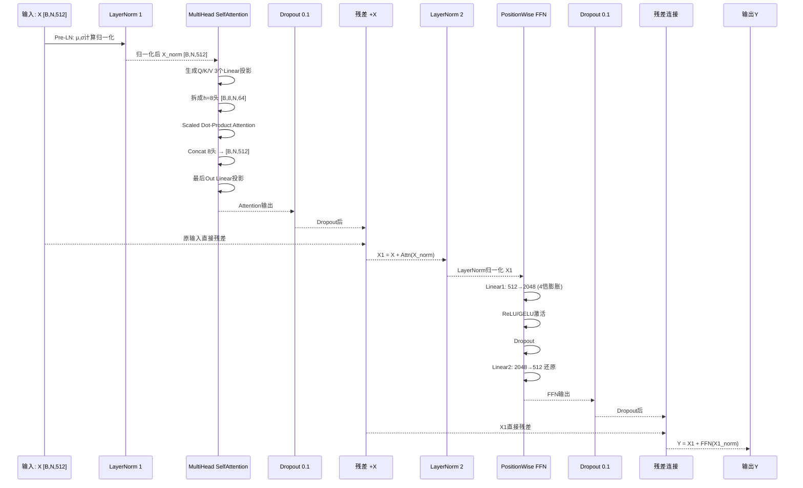
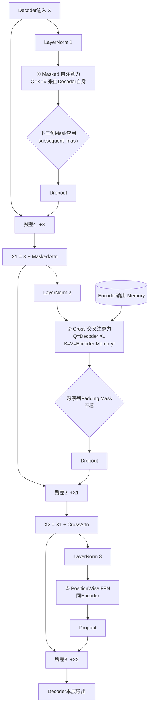

# Transformer架构 流程图详解

> 位置: 03-deep-learning/annotated-transformer/doc/
> 配套文档: Transformer架构逐行解析.md | Transformer性能优化重难点.md | Transformer面试题汇总.md

---

## 一、原始Transformer完整架构

### 1.1 端到端机器翻译流程图 (德→英)

```mermaid
flowchart TD
    subgraph Input[输入层 德语]
        A1[德语句子: Ich bin ein Berliner]
        A1 --> A2[Tokenize分词 → 5个Token]
        A2 --> A3[Word Embedding 512维]
        A3 --> A4[乘以√512缩放]
        A4 --> A5[+正弦位置编码 PE]
        A5 --> A6[Dropout 0.1]
    end

    subgraph Encoder[Encoder N=6层 堆叠]
        A6 --> E1[第1层 Encoder]
        E1 --> E2[第2层 Encoder]
        E2 --> E3[......]
        E3 --> E4[第6层 Encoder]
        E4 --> E5[最后加一个LayerNorm]
        E5 --> EncOut[Memory Encoder输出: [5, 512]]
    end

    subgraph DecoderInput[Decoder输入 英语 Shifted Right]
        B1[目标英语: I am a Berliner <EOS>]
        B1 --> B2[右移1位: <SOS> I am a Berliner]
        B2 --> B3[Embedding + PE + Dropout]
    end

    subgraph Decoder[Decoder N=6层 堆叠]
        B3 --> D1[第1层 Decoder]
        D1 --> D2[第2层 Decoder]
        D2 --> D3[......]
        D3 --> D4[第6层 Decoder]
        D4 --> D5[最后LayerNorm]
    end

    EncOut --> D1
    EncOut --> D2
    EncOut --> D4

    D5 --> O1[Linear映射到词表V=37000]
    O1 --> O2[LogSoftmax取对数概率]
    O2 --> O3[预测下一个词分布]
    O3 --> O4[Greedy/Beam Search解码]
    O4 --> O5[最终翻译输出]
```

### 1.2 各阶段数据形状表 (以翻译任务为例)

| 阶段 | 形状 | 说明 |
|-----|------|------|
| 输入Token IDs | [B, src_len] = [32, 50] | Batch=32, 最长50词 |
| Encoder Embedding | [32, 50, 512] | d_model=512 |
| 位置编码PE | [1, max_len=5000, 512] | 固定 广播加 |
| Encoder输出 Memory | [32, 50, 512] | 6层后形状不变 |
| Decoder输入 (Shifted) | [32, tgt_len=60, 512] | 目标端右移一位 |
| Decoder Mask | [1, 1, 60, 60] | 下三角 防偷看未来 |
| Decoder输出 | [32, 60, 512] | |
| Linear投影 | [32, 60, 37000] | 映射到词表 |
| LogSoftmax | [32, 60, 37000] | 对数概率 算Loss |

---

## 二、单层Encoder内部详细流程

### 2.1 模块连接时序图



### 2.2 代码流程图对应 annotated-transformer.py

```
SublayerConnection = 残差 + LN
  │
  ├─ Self-Attention 子层
  │   ├── clones(Linear, 4): Q, K, V, Out
  │   ├── d_k=512/8=64
  │   ├── attention() 函数: softmax(QK^T/√d_k)·V
  │   ├── +Encoder Padding Mask (屏蔽<PAD>)
  │   └── Concat + Out Linear
  │
  └─ FeedForward 子层
      ├── Linear(512, 2048)
      ├── ReLU
      ├── Dropout(p=0.1)
      └── Linear(2048, 512)
```

---

## 三、单层Decoder内部详细流程

### 3.1 Decoder内部3个子层完整结构



### 3.2 Cross Attention Q/K/V来源对比

| 注意力类型 | Q来源 | K来源 | V来源 | Mask | 作用 |
|-----------|------|------|------|------|------|
| Encoder Self | 上一层Encoder输出 | 同Q | 同Q | Padding Mask | 建模源语言内部依赖 |
| Decoder Masked Self | 上一层Decoder输出 | 同Q | 同Q | 下三角+Padding | 建模目标语言历史依赖（不看未来） |
| **Decoder Cross** | 上一层Decoder输出 | **Encoder最终输出** | **Encoder最终输出** | 源Padding Mask | ⭐ 对齐：目标词去查哪个源词最相关 |

---

## 四、Scaled Dot-Product Attention 原子计算

### 4.1 单头注意力计算步骤图

```mermaid
graph LR
    subgraph 输入QKV
        Q[Q: [h×B, tgt, 64]]
        K[K: [h×B, src, 64]]
        V[V: [h×B, src, 64]]
    end

    Q --> MM1((MatMul 1))
    K --> MM1
    MM1 --> SCORES[scores: [h×B, tgt, src]<br/>每个目标位置×每个源位置相关性]

    SCORES --> DIV[/ ÷√64 = 8 /]
    DIV --> SCALED[缩放后scores<br/>方差=1 防止Softmax饱和]

    SCALED --> MASK{Optional Mask}
    MASK -->|Decoder自注意力| SUBMASK[下三角subsequent_mask<br/>未来位置→-inf]
    MASK -->|Encoder/Decoder| PADMASK[Padding位置→-inf]
    SUBMASK --> SM[Softmax dim=-1]
    PADMASK --> SM
    SM --> P[P_attn: [h×B, tgt, src]<br/>每行和=1]

    P --> DROP[Dropout 训练时]
    DROP --> MM2((MatMul 2))
    V --> MM2
    MM2 --> OUT[Output: [h×B, tgt, 64]<br/>V按Attention权重加权求和]
```

### 4.2 下三角Mask生成过程

```mermaid
flowchart LR
    L[目标长度 size=5] --> SIZE[1×1×5×5 全1矩阵]
    SIZE --> TRI[torch.triu 取上三角 diagonal=1]
    TRI --> INV[0/1反转: 上三角=0 下三角=1]
    INV --> EXAMPLE[
        行0: 1 0 0 0 0  → 第1个词只能看自己
        行1: 1 1 0 0 0  → 第2个词能看前2个
        行2: 1 1 1 0 0
        行3: 1 1 1 1 0
        行4: 1 1 1 1 1
    ]
    EXAMPLE --> MASKEDFILL[scores.masked_fill(mask==0, -1e9)]
```

---

## 五、完整训练流程

### 5.1 训练Epoch循环图

```mermaid
flowchart TD
    Start[开始训练] --> Init[初始化: make_model<br/>d=512, N=6, h=8, d_ff=2048]
    Init --> Init2[NoamOpt 调度器<br/>warmup=4000 steps<br/>factor=2]
    Init2 --> LossFn[LabelSmoothing KLDivLoss<br/>ε=0.1 平滑标签]
    LossFn --> EpochLoop[Epoch × 100 循环]
    EpochLoop --> BatchLoop[Batch循环]

    BatchLoop --> Data[加载 src-tgt Batch]
    Data --> Shift[Tgt Shift Right 右移1位<br/>前面加<SOS>]
    Shift --> Masking[生成: 下三角Mask + Padding Mask]
    Masking --> FWD[前向传播 model.forward]
    FWD --> Generator[Generator: Linear+LogSoftmax]
    Generator --> LOSS[计算 KL Div Loss]
    LOSS --> BACK[反向传播 backward]
    BACK --> Clip[梯度裁剪 max_norm=1.0]
    Clip --> Step[NoamOpt.step() 更新参数]
    Step --> Report[记录损失/学习率]
    Report --> BatchLoop

    BatchLoop --> Eval{每Epoch评估}
    Eval -->|是| ValidSet[验证集算Loss/BLEU]
    ValidSet --> Save[保存Best Checkpoint]
    Save --> EpochLoop
    Eval -->|否| EpochLoop

    EpochLoop --> Finish{100 Epoch完成}
    Finish --> Test[测试集BLEU打分]
```

### 5.2 Noam学习率曲线示意

```
lr
 ↑
 │    ╱╲
 │   ╱  ╲
 │  ╱    ╲_________ step^-0.5衰减
 │ ╱
 │╱   Warmup线性上升 (step / warmup^1.5)
 └────────────────────────────→ 训练步数
     ↑
   warmup=4000步
```

公式: `lr = factor × d_model^(-0.5) × min(step^(-0.5), step × warmup_steps^(-1.5))`

---

## 六、推理Beam Search解码流程

### 6.1 Beam=3 搜索示例

```mermaid
flowchart TD
    T0[时刻0 输入<SOS>] --> T0Out[预测Top3候选: I/My/We<br/>Beam={I, My, We}]

    T0Out --> T1I[分支1: <SOS> I]
    T0Out --> T1My[分支2: <SOS> My]
    T0Out --> T1We[分支3: <SOS> We]

    T1I --> T1IOut[预测: am/have/was]
    T1My --> T1MyOut[预测: name/is/favorite]
    T1We --> T1WeOut[预测: are/have/will]

    subgraph 剪枝保留Beam=3概率最高
        T1IOut --> P1["P(I am)=0.12 ⭐"]
        T1MyOut --> P2["P(My name)=0.10 ⭐"]
        T1IOut --> P3["P(I have)=0.08 ⭐"]
    end

    P1 --> T2[时刻2 Top3路径]
    P2 --> T2
    P3 --> T2

    T2 --> Continue[继续... 直到最长L步或<EOS>]
    Continue --> Final[最终3条完整句子<br/>取概率最高那条输出]
```

---

## 七、Annotated-Transformer源码模块对应

```
make_model(src_vocab=11, tgt_vocab=11, N=6, d_model=512, d_ff=2048, h=8, dropout=0.1)
│
├── Encoder
│   └── clones(EncoderLayer, N=6) + 最终LayerNorm
│       └── EncoderLayer: SelfAttn SublayerConnection + FFN SublayerConnection
│
├── Decoder
│   └── clones(DecoderLayer, N=6) + 最终LayerNorm
│       └── DecoderLayer: MaskedSelfAttn + CrossAttn + FFN
│
├── SrcEmbed: Embeddings + PositionalEncoding
├── TgtEmbed: Embeddings + PositionalEncoding
│
└── Generator: Linear(512 → tgt_vocab) + LogSoftmax
```

每个模块独立调用：
```
训练: out = model.forward(src, tgt, src_mask, tgt_mask)
       prob = generator(out)  → 算KL散度Loss

推理: memory = model.encode(src, src_mask)
       out = model.decode(memory, src_mask, tgt_y, tgt_mask)
```