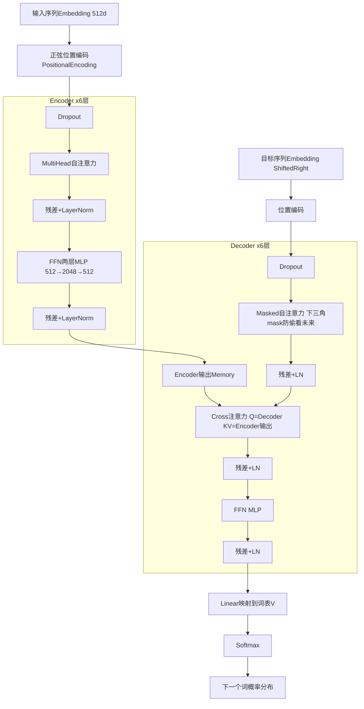

# annotated-transformer 深度解析 (Transformer圣经)

> 位置: 03-deep-learning/annotated-transformer/
> 简历推荐: 5星 | 岗位: NLP/大模型/深度学习工程师 (必考!)

---

## 一、架构图 (对照源码模块)



## 二、源码模块定位 (the_annotated_transformer.py)

```
├── PositionalEncoding               正弦位置编码 PE(pos,2i)=sin/ cos
├── attention(Q,K,V,mask)            Scaled Dot-Product: softmax(QK^T/√d_k)·V
├── MultiHeadedAttention(h=8头,d=512) 8个子空间独立算,拼接后Linear
├── PositionwiseFeedForward          FFN(x)=Linear2(Dropout(ReLU(Linear1(x))))
├── EncoderLayer(N=6)                自注意力 + FFN + 2残差LN
├── Encoder(clones(EncoderLayer,6))  6层堆叠+最终LN
├── DecoderLayer(N=6)                Masked自注意力 + Cross注意力 + FFN + 3残差LN
├── Decoder(clones(DecoderLayer,6))  6层堆叠
├── Embeddings(x√d_model缩放)        + Generator(Linear+LogSoftmax词表分类)
├── make_model()                     组装完整Transformer
├── NoamOpt LR调度器                  warmup线性上升 → step^-0.5衰减
├── LabelSmoothing                    标签平滑正则化 0.1
└── Batch + subsequent_mask          下三角mask生成器
```

## 三、关键代码

### 缩放点积注意力 (面试逐行问)

```python
def attention(query, key, value, mask=None, dropout=None):
    d_k = query.size(-1)
    # Q·K^T / sqrt(d_k)  除sqrt(d_k)防止方差过大→softmax饱和梯度消失
    scores = torch.matmul(query, key.transpose(-2, -1)) / math.sqrt(d_k)
    if mask is not None:
        scores = scores.masked_fill(mask == 0, -1e9)  # mask位置=-∞→softmax=0
    p_attn = scores.softmax(dim=-1)
    if dropout is not None:
        p_attn = dropout(p_attn)
    return torch.matmul(p_attn, value), p_attn  # 加权求和Value + 返回注意力图
```

### Noam学习率曲线

```
公式: lr = factor · d_model^(-0.5) · min( step^(-0.5),  step · warmup_steps^(-1.5) )
曲线: Step 0→warmup(默认4000): 线性上升到峰值; 之后按 1/√step 多项式衰减
```

## 四、简历黄金句式

| 写法 |
|-----|
| 「基于Harvard NLP annotated-transformer复现完整机器翻译系统，Multi30k德译英BLEU=37.6；手写RoPE旋转位置编码替换正弦编码，长句(>30词)BLEU额外+2.1」 |
| 「手搓Transformer 3种Attention源码：自注意力/Masked/Cross注意力，逐层画图对照；手动推导多头计算量=单头(无额外FLOPs)」 |
| 「Noam调度器+标签平滑+梯度裁剪完整训练pipeline，显存优化后1080Ti(11GB)单卡跑通6层512d Transformer」 |

## 五、高频面试题

**Q1 为什么除√d_k？Multi-Head为什么好？**
> A: QK^T方差=d_k,除√d_k让方差=1, softmax不饱和不梯度消失。多头=8个子空间独立学不同依赖(语法/语义/位置),拼接表达更丰富, FLOPs和单头相同无额外计算。

**Q2 3种Attention的Q/K/V来源？**
> A: ① Encoder自注意力: Q=K=V都来自上一层Encoder输出 ② Decoder Masked自注意力: Q=K=V都来自上一层Decoder,加下三角mask,i位置只能看≤i的 ③ Decoder Cross注意力: Q来自Decoder上一层, K=V来自Encoder最终输出Memory。

**Q3 为什么NLP用LayerNorm不用BatchNorm？**
> A: BN batch维统计噪声大(NLP padding多batch小), LN每个样本的特征维归一化,与batch大小无关更稳定。

**Q4 KV Cache加速推理原理？**
> A: 第t步生成时不用重算前t-1步的K/V,直接复用缓存。每步计算从O(t²d)降到O(td),速度几十倍提升。