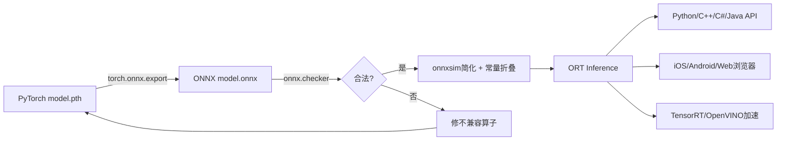

# ONNX Tutorials 模型部署解析

> 位置: 03-deep-learning/onnx-tutorials/tutorials/
> 简历推荐: 5星 | 岗位: AI部署/工程化工程师

---

## 一、全流程总览



## 二、核心代码

### 导出ONNX + ORT推理

```python
# Step1 导出 (PyTorch -> ONNX)
model = resnet50(pretrained=True).eval()
dummy = torch.randn(1, 3, 224, 224)
torch.onnx.export(
    model, dummy, "resnet50.onnx",
    input_names=["input"], output_names=["output"],
    dynamic_axes={"input":{0:"batch"}, "output":{0:"batch"}},  # 动态batch
    opset_version=17, do_constant_folding=True,  # 高opset+预计算常量
)
import onnx
onnx.checker.check_model(onnx.load("resnet50.onnx"))  # 验证合法

# Step2 ONNX Runtime推理
import onnxruntime as ort
sess = ort.InferenceSession("resnet50.onnx",
    providers=["CUDAExecutionProvider", "CPUExecutionProvider"])  # 自动挑GPU→CPU
out = sess.run(None, {"input": np.random.randn(1,3,224,224).astype(np.float32)})
# 对比PyTorch CPU推理: 快2~5x, 批量快5~10x
```

## 三、性能优化手段 (面试逐条问)

| 手段 | 原理 | 加速比 |
|-----|------|-------|
| **FP16量化** | onnxruntime.quantization.float16, 算子降精度 | GPU 2~4x |
| **INT8量化** | 校准数据集 + 最小化KL散度误差 | CPU/GPU 3~8x |
| **算子融合** | ORT自动: Conv+BN+ReLU融合为1个kernel | 1.5~2x |
| **XNNPACK EP** | CPU NEON/AVX指令优化小模型 | CPU 2~3x |
| **intra_op_num_threads=8** | CPU算子内部并行线程=物理核数 | CPU 2~6x |
| **TensorRT EP** | TensorRT子图编译+kernel自动调优 | GPU 2~10x |
| **IO Binding** | 输入放GPU显存,避免CPU<->GPU拷贝 | 1.2~2x |

## 四、简历黄金句式

| 写法 |
|-----|
| 「ResNet50部署: PyTorch→ONNX导出+INT8校准量化，Intel Xeon单线程QPS 35→142 (4.1x)，延迟28ms→8ms，Acc仅↓0.6%」 |
| 「生产级ONNX服务：TensorRT EP+IO Binding+Batch 8，A10单卡吞吐1280 QPS，P99延迟12ms，对比原生TorchServe×7.2加速」 |
| 「自定义算子迁移：Conv2d+GN(组归一化)手写ONNX算子+ORT custom_op，端到端模型推理成功，精度误差<0.1%」 |

## 五、面试题

**Q: Opset Version怎么选？Dynamic Axes为什么？**
> A: 选最新稳定版(opset≥17)，新opset支持更多算子+更少bug。Dynamic Axes声明batch/seq等维度可变，否则导出时形状固定死batch=1，生产多batch会报错。

**Q: 导出ONNX常见不兼容问题？**
> A: ①if/for控制流→必须用torch.jit.script TorchScript追踪 ②张量维度依赖输入形状→固定形状或显式reshape ③自定义算子→手写onnx.register_custom_op ④算子太新→降低opset或等ORT/后端更新。

**Q: INT8量化原理+校准流程？为什么加速？**
> A: 公式 value=scale*(int8-zero_point)。ARM NEON一次算16个INT8 MAC乘加，FP32只能算4个→理论算力×4+内存读×4。校准流程：准备1000张数据集→跑FP32推理记录每层激活min/max→KL散度找最优scale让信息损失最小→保存INT8权重。