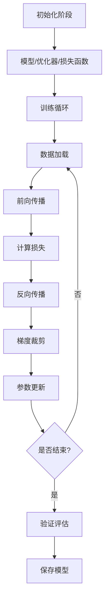
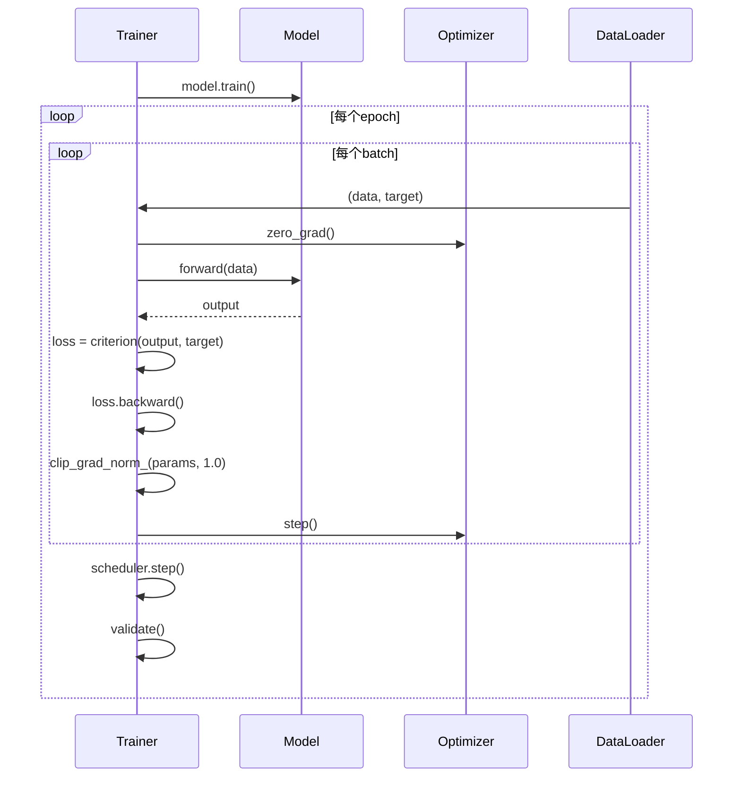
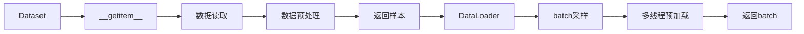
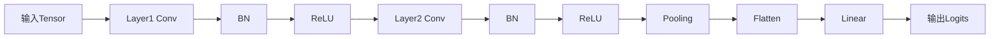

# PyTorch 训练流程图详解

> 位置: 03-deep-learning/pytorch-examples/

---

## 一、标准训练循环流程



## 二、训练循环时序图



## 三、数据加载流程



```python
class CustomDataset(Dataset):
    def __init__(self, data, labels, transform=None):
        self.data = data
        self.labels = labels
        self.transform = transform
    
    def __len__(self):
        return len(self.data)
    
    def __getitem__(self, idx):
        sample = self.data[idx]
        label = self.labels[idx]
        if self.transform:
            sample = self.transform(sample)
        return sample, label

# DataLoader配置
train_loader = DataLoader(
    dataset,
    batch_size=32,
    shuffle=True,
    num_workers=4,
    pin_memory=True,
    persistent_workers=True
)
```

## 四、前向传播流程



## 五、反向传播流程

```mermaid
graph TD
    A[损失值] --> B[backward()]
    B --> C[梯度计算]
    C --> D[链式法则]
    D --> E[梯度累积]
    E --> F[梯度裁剪]
    F --> G[参数更新]
    G --> H[优化器step]
```

```python
# 完整训练循环
for epoch in range(epochs):
    model.train()
    for data, target in train_loader:
        data, target = data.cuda(), target.cuda()
        
        optimizer.zero_grad(set_to_none=True)
        output = model(data)
        loss = criterion(output, target)
        loss.backward()
        torch.nn.utils.clip_grad_norm_(model.parameters(), 1.0)
        optimizer.step()
    
    # 验证
    model.eval()
    with torch.no_grad():
        val_loss, val_acc = validate()
    
    scheduler.step(val_acc)
```