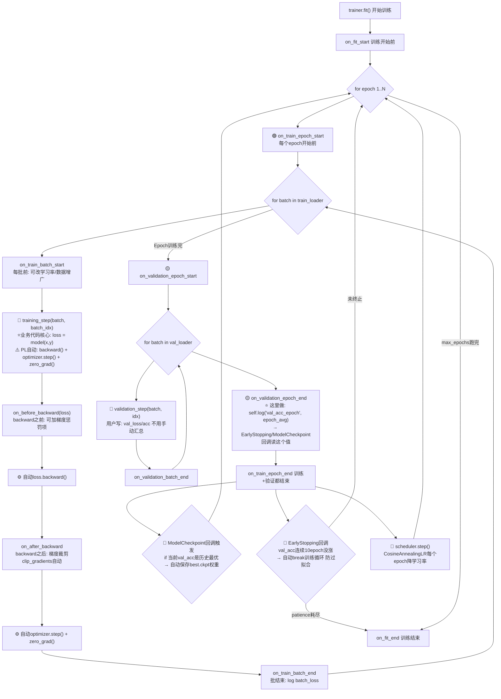
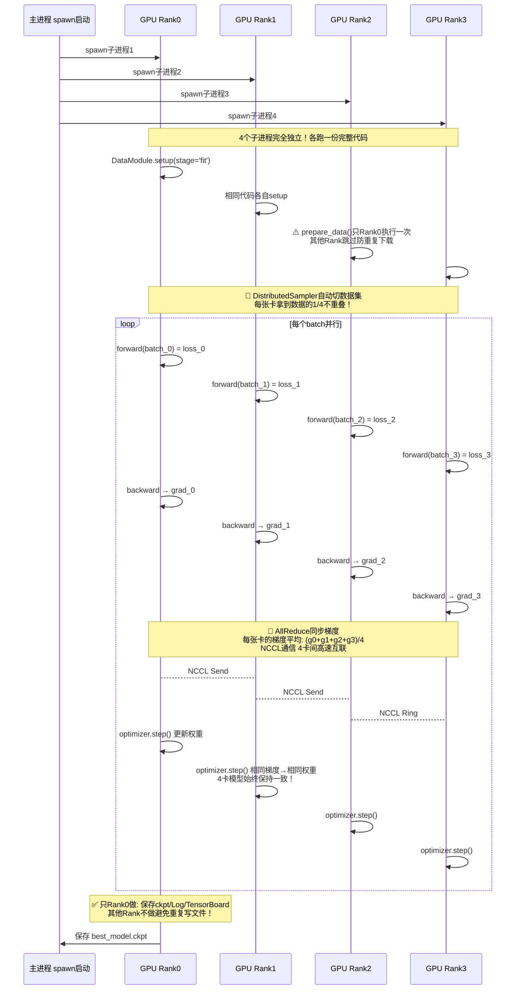
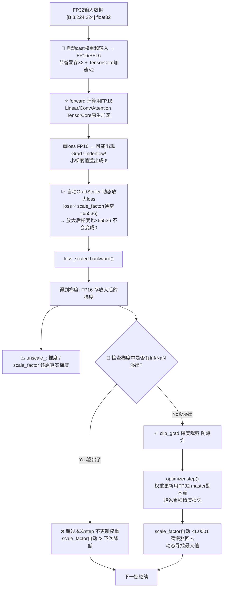
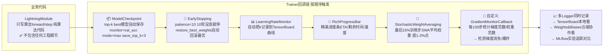

# PyTorch Lightning 流程图详解

> 位置: 03-deep-learning/pytorch-lightning/doc/
> 配套文档: PyTorchLightning模块化训练框架.md | PyTorchLightning性能优化重难点.md | PyTorchLightning面试题汇总.md

---

## 一、PL核心架构7模块流程图

```mermaid
flowchart TD
    subgraph DataModule数据
        A1["prepare_data() ⭐只在1卡/GPU执行一次<br/>→ 下载数据集/解压/预处理Tokenize"]
        A1 --> A2["setup(stage) 每张卡执行<br/>→ train_dataset/val_dataset/test_dataset实例化"]
        A2 --> A3["train_dataloader() DataLoader批量<br/>→ num_workers/pin_memory/shuffle"]
        A2 --> A4["val_dataloader() 验证集Dataloader<br/>→ 分布式DistributedSampler"]
    end

    subgraph LightningModule模型
        B1["__init__ 定义层: Transformer/ViT层"]
        B1 --> B2["forward(x) 推理路径<br/>⚠️ forward只写前向推理"]
        B2 --> B3["training_step(batch, idx) 训练单步<br/>→ 算loss return loss/log_dict"]
        B2 --> B4["validation_step(batch, idx) 验证单步<br/>→ 算val_acc/val_loss记录"]
        B2 --> B5["configure_optimizers()<br/>→ AdamW + CosineAnnealingLR Scheduler"]
    end

    subgraph Trainer引擎⭐核心
        C1["Trainer(max_epochs=100, devices=4, strategy='ddp')<br/>→ 接管所有工程细节"]
        C1 --> C2["Callbacks回调: EarlyStopping/ModelCheckpoint/LearningRateMonitor<br/>→ 插件机制 非侵入加功能"]
        C1 --> C3["Logger日志: TensorBoard/W&B/MLflow<br/>→ 自动log_metrics"]
        C1 --> C4["Precision精度: 16-mixed bf16-mixed 32<br/>→ 自动混合精度AMP"]
        C1 --> C4_2["Strategy分布式: ddp/fsdp/deepspeed_stage3<br/>→ 8行代码切分布式不用改模型"]
    end

    A3 --> C1
    A4 --> C1
    B3 --> C1
    B4 --> C1
    C1 --> FIT[trainer.fit(model, datamodule)]
```

---

## 二、完整训练生命周期钩子执行顺序



---

## 三、分布式DDP 4卡并行流程图



---

## 四、16-bit混合精度AMP执行流程



---

## 五、Callbacks非侵入插件机制



---

## 六、从PyTorch原生迁移PL对比流程

```mermaid
flowchart TD
    subgraph PyTorch原生 100行样板代码
        PT1[手动: model.train() / eval()]
        PT2[手动: optimizer.zero_grad()]
        PT3[手动: loss.backward()]
        PT4[手动: torch.nn.utils.clip_grad_norm_()]
        PT5[手动: optimizer.step() / scheduler.step()]
        PT6[手动: with torch.no_grad() + torch.cuda.amp.autocast()]
        PT7[手动: GradScaler 混合精度调scale_factor]
        PT8[手动: DistributeDataParallel DDP封装]
        PT9[手动: torch.save(state_dict) + 比较best_acc]
        PT10[手动: writer.add_scalar TensorBoard写日志]
        PT11[手动:  EarlyStopping计数器逻辑]
    end

    subgraph LightningModule 20行只写业务
        PL1["🔵 training_step(batch, idx) return loss<br/>→ PT的1,2,3,4,5,6,7自动"]
        PL2["🔵 validation_step 写验证逻辑<br/>→ 自动no_grad/eval模式"]
        PL3["🔵 configure_optimizers return optimizer,scheduler<br/>→ step顺序自动"]
        PL4["Trainer(devices=4, strategy='ddp', precision='16-mixed')<br/>→ PT的8自动分布式"]
        PL5["Callbacks=[ModelCheckpoint, EarlyStopping]<br/>→ PT的9,11自动"]
        PL6["Trainer(logger=TensorBoardLogger)<br/>→ PT的10自动log"]
    end

    PT1 --> PL1
    PT2 --> PL1
    PT3 --> PL1
    PT4 --> PL1
    PT5 --> PL1
    PT6 --> PL1
    PT7 --> PL1
    PT8 --> PL4
    PT9 --> PL5
    PT10 --> PL6
    PT11 --> PL5
```