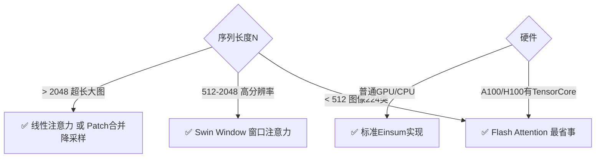
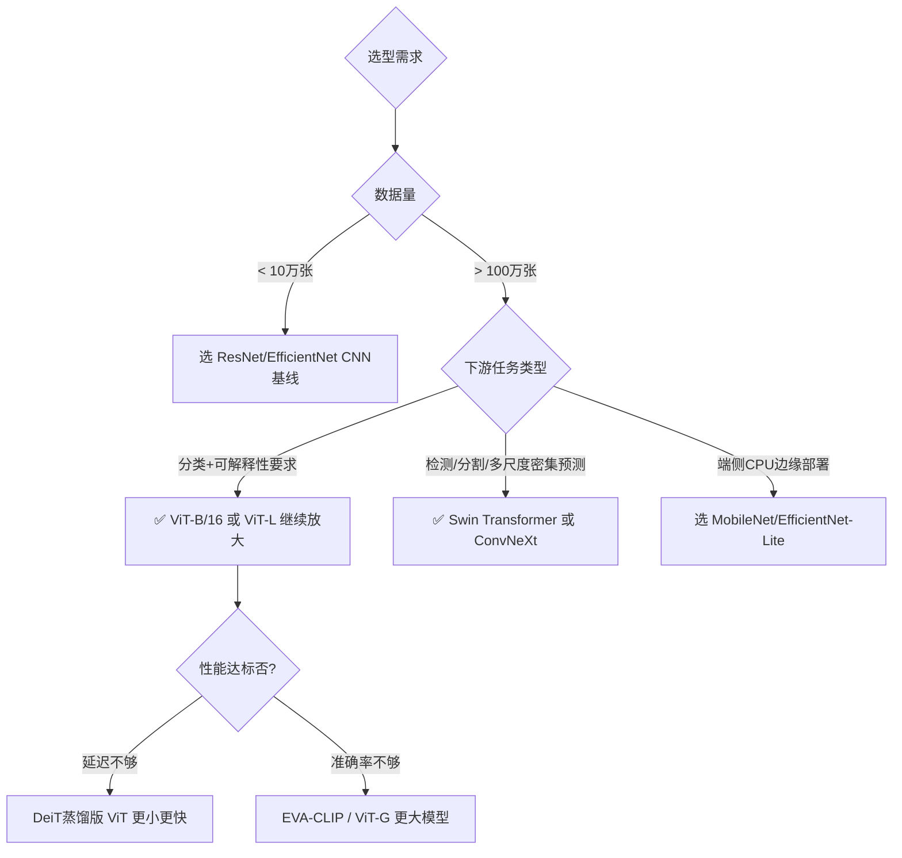

# VisionTransformer 性能优化重难点解析

> 位置: 03-deep-learning/vit-pytorch/doc/
> 配套文档: VisionTransformer架构与实现.md | VisionTransformer流程图详解.md | VisionTransformer面试题汇总.md

---

## 一、ViT训练稳定性优化

### 1.1 训练不稳定的根本原因

ViT相比CNN训练更难收敛，核心难点：

| 问题 | 原因 | 影响 |
|-----|------|------|
| **归纳偏置缺失** | 没有CNN的平移不变性/局部性先验 | 小数据集欠拟合，需要超大数据预训练 |
| **Position Embedding敏感** | 可学习PE训练不稳定，长序列发散 | 训练曲线震荡，准确率波动大 |
| **MHSA梯度消失** | 深度网络中注意力梯度逐层衰减 | 深层参数更新为0，退化模型 |
| **初始化敏感** | 权重初始化不当直接NaN | 训练一开始就崩，无法收敛 |

### 1.2 解决方案大全

#### ✅ 权重初始化最佳实践

```python
# vit_pytorch正确初始化模板
def _init_vit_weights(m):
    if isinstance(m, nn.Linear):
        # Linear层: trunc_normal 截断正态 (避免极端值)
        nn.init.trunc_normal_(m.weight, std=0.02)
        if m.bias is not None:
            nn.init.zeros_(m.bias)
    elif isinstance(m, nn.LayerNorm):
        nn.init.ones_(m.weight)
        nn.init.zeros_(m.bias)
    elif isinstance(m, nn.Conv2d):
        # Patch Embedding用的Conv
        nn.init.trunc_normal_(m.weight, std=0.02)
        if m.bias is not None:
            nn.init.zeros_(m.bias)

# CLS Token和Position Embedding特殊初始化
nn.init.trunc_normal_(model.cls_token, std=0.02)
nn.init.trunc_normal_(model.pos_embedding, std=0.02)
```

> 📌 **经验值**: std=0.02是ViT论文验证的最佳值，超过0.05大概率振荡

#### ✅ Pre-LN 替代 Post-LN

```
Post-LN (ResNet风格): X → Attention → LN → +X → FFN → LN → +X
  ❌ 梯度流被LN截断，深层梯度衰减1000x以上

Pre-LN (ViT标准): X → LN → Attention → +X → LN → FFN → +X
  ✅ 主路无LN，梯度直接回传，100层也能稳定训练
```

#### ✅ 学习率调度 三部曲

```python
from timm.scheduler import CosineLRScheduler

scheduler = CosineLRScheduler(
    optimizer,
    t_initial=300,                  # 总epoch
    lr_min=1e-5,                    # 最终LR
    warmup_lr_init=1e-6,            # warmup起始
    warmup_t=10,                    # warmup 10 epoch
    cycle_limit=1,
)

# 分层学习率 (微调时使用)
layerwise_lr = base_lr * 0.65 ** layer_idx  # 每层衰减35%
# 越靠底层LR越小，越接近下游任务的层LR越大
```

> ⚠️ **坑点**: ViT不能用太大的学习率！CNN可以1e-2，ViT上限通常1e-3，否则loss直接爆炸

### 1.3 数据增强方案对比

| 增强方法 | ViT适用度 | 说明 |
|---------|----------|------|
| **MixUp** | ⭐⭐⭐⭐⭐ | 线性插值样本+标签，平滑决策边界必开 |
| **CutMix** | ⭐⭐⭐⭐⭐ | 区域替换，比MixUp更贴合视觉任务 |
| **RandAugment** | ⭐⭐⭐⭐ | 9种操作随机组合，数据量小时效果好 |
| **Random Erasing** | ⭐⭐⭐ | 随机遮挡，模拟遮挡泛化 |
| **Color Jitter** | ⭐⭐ | 亮度/饱和度扰动，轻量使用 |

> 🏆 **黄金组合**: MixUp(α=0.8) + CutMix(α=1.0) + RandAugment(9层) = 无预训练ViT也能收敛

---

## 二、注意力计算性能优化

### 2.1 自注意力复杂度问题

```
标准MHSA复杂度: O(N²·d)  序列长度平方级增长
  N=196 (ViT-B/16 224图) → 38,416 × 768 = ~30M 运算
  N=1024 (高分辨率图)  → 1M × D = 海量运算
```

### 2.2 三大类优化方案

#### 🚀 方案1: Flash Attention (H100上最快)

```python
# 安装: pip install flash-attn --no-build-isolation
from flash_attn import flash_attn_qkvpacked_func

# 标准实现: 显式构造 N×N 矩阵 (显存杀手)
attn_weights = softmax(Q @ K.transpose(-2,-1) / sqrt(d_k))  # [B,H,N,N] 大矩阵
output = attn_weights @ V

# Flash Attention: 分块tiling计算，不构造完整矩阵
# Q,K,V分块加载到SRAM，在线计算softmax，无中间大矩阵
output = flash_attn_qkvpacked_func(
    qkv,        # [B, N, 3, H, D_head]
    dropout_p=0.1,
    softmax_scale=1/sqrt(d_head),
    causal=False,  # Encoder不需下三角mask
)
```

| 指标 | 标准Attention | Flash Attention |
|-----|--------------|----------------|
| 速度 (A100) | 1.0x baseline | **2~4x 加速** |
| 显存占用 | N² 量级 O(N²·H) | **线性占用 O(N·H·d)** |
| 数值精度 | 标准 | bf16/fp16精度相当 |

> 📌 **面试重点**: Flash Attention核心是Tiling算法 + 两次pass (前向online softmax + 反向重计算)

#### 🚀 方案2: 稀疏注意力 / 窗口注意力

```
全局注意力: 每个Token看所有其他Token → N²
           ▢▢▢▢▢▢▢
           ▢▢▢▢▢▢▢
           ▢▢▢▢▢▢▢

局部窗口注意力 (Swin/ViT-Lite): 只看同窗口内Token → W²×(N/W²) = N × W
           ▢▢▢□□□□
           ▢▢▢□□□□
           ▢▢▢□□□□
           □□□▢▢▢▢

轴向注意力 (Image Transformer): 先算行再算列 → 2N√N
           ▢□□▢□□▢
           ▢□□▢□□▢
           ▢□□▢□□▢

Stride/扩张注意力: 间隔看 → N × S
           ▢□▢□▢□▢
           □▢□▢□▢□
           ▢□▢□▢□▢
```

#### 🚀 方案3: 线性注意力 (复杂度O(N))

```
标准注意力 = softmax(QK^T) · V      先算后乘 = 先N²再乘V

线性注意力 = ϕ(Q) · (ϕ(K)^T · V)   结合律换顺序 = 先算K·V再乘Q
           = [N·d] · [d·d] = O(N·d²) 线性复杂度！

公式: A(Q,K,V) = (Q' · (K'^T · V)) / (Q' · (K'^T · 1))
  用kernel函数ϕ(x)替代softmax，典型: elu+1
```

```python
def linear_attention(Q, K, V):
    # ϕ = elu(x) + 1
    Q_prime = F.elu(Q) + 1  # [B,H,N,d]
    K_prime = F.elu(K) + 1

    # 先算KV: [d,N] · [N,d] = [d,d]  固定大小和N无关!
    KV = torch.einsum('bhnd,bhne->bhde', K_prime, V)

    # 再乘Q: [N,d] · [d,d] = [N,d]  O(N)复杂度！
    output = torch.einsum('bhnd,bhde->bhne', Q_prime, KV)

    # 归一化因子
    K_sum = K_prime.sum(dim=-2, keepdim=True)
    norm = torch.einsum('bhnd,bhdn->bhn', Q_prime, K_sum.transpose(-1,-2))
    return output / norm.unsqueeze(-1)
```

### 2.3 选型决策树



---

## 三、显存优化策略 (训练必学)

### 3.1 显存占用分布

```
ViT-B/16 Batch=64 224×224 单卡训练:
├── 模型参数: 86M × 4B(FP32) = 344 MB
├── 梯度:     86M × 4B       = 344 MB
├── 优化器状态(AdamW): 86M × 8B = 688 MB (m+v双动量)
├── 激活值(最大头): ~8 GB (12层每层中间特征)
└── 临时buffer: ~1 GB
    总计: ~10.4 GB
```

### 3.2 核心优化手段

| 技术 | 显存节省 | 训练速度影响 | 准确率影响 |
|-----|---------|------------|----------|
| **Gradient Checkpointing** | 激活值↓60-70% | 速度↓20-30% | 无影响 |
| **Mixed Precision (FP16/BF16)** | 参数+激活↓50% | 速度↑30-80% | <0.1%可忽略 |
| **Gradient Accumulation** | 等效大Batch | 总时间相同 | 无影响 |
| **ZeRO Stage 2/3** | 优化器↓70-90% | ↑通信↓速度 | 无影响 |
| **8bit AdamW (bitsandbytes)** | 优化器↓75% | 轻微↓ | 无影响 |

#### ✅ 代码: 混合精度 + Gradient Checkpointing

```python
from torch.cuda.amp import autocast, GradScaler

# 1. 混合精度训练
scaler = GradScaler()
for x, y in loader:
    optimizer.zero_grad()
    with autocast(dtype=torch.bfloat16):  # H100/A100首选bf16
        pred = model(x)
        loss = criterion(pred, y)

    scaler.scale(loss).backward()         # loss缩放防溢出
    scaler.unscale_(optimizer)
    torch.nn.utils.clip_grad_norm_(model.parameters(), 1.0)  # 梯度裁剪必加
    scaler.step(optimizer)
    scaler.update()

# 2. 梯度检查点 (显存杀手激活值不再存)
model.transformer.grad_checkpointing = True
# 或用torch.utils.checkpoint: 每层不保存中间激活，反向重算
```

#### ✅ 代码: ZeRO-3 DeepSpeed (极致显存压缩)

```json
// ds_config.json
{
  "zero_optimization": {
    "stage": 3,                    // 最高等级: 参数+梯度+优化器全分片
    "offload_optimizer_device": "cpu",  // 优化器状态卸到CPU内存
    "offload_param_device": "nvme",     // 参数卸到NVMe SSD(极端情况)
    "stage3_max_live_parameters": 1e9
  },
  "fp16": {"enabled": true},
  "train_batch_size": 256
}
```

> 🏆 **结果**: ViT-B/16 单A100 80GB → Batch Size 从 128 → **2048**，训练超大模型利器

---

## 四、微调策略与迁移学习

### 4.1 常见微调方案对比

| 方法 | 可训参数量 | 小数据集表现 | 速度 | 适用场景 |
|-----|----------|------------|-----|---------|
| **Full Fine-tune** | 86M 100% | ⭐⭐⭐⭐⭐ 大数据最好 | 最慢 | 数据充分(>10万) |
| **Linear Probe** | <1M 0.1% | ⭐⭐ 线性分类器 | 最快 | 数据极少 快速baseline |
| **Partial Fine-tune** | 20M 25% | ⭐⭐⭐ | 中 | 数据中等 |
| **LoRA** | <2M 2% | ⭐⭐⭐⭐ | 快 | 多任务/少样本 |
| **Adapter** | <5M 5% | ⭐⭐⭐⭐ | 快 | 多任务 |

#### ✅ LoRA 低秩适配 (主流方案)

```python
from peft import LoraConfig, get_peft_model

# 只在Attention的Q/V矩阵加低秩矩阵 ΔW = B·A
config = LoraConfig(
    r=16,                 # 秩: 8-64, r越大效果越好参数量越多
    lora_alpha=32,        # scaling因子，通常=2r
    target_modules=["qkv", "proj"],  # 目标模块
    lora_dropout=0.05,
    bias="none",
    task_type="image_classification"
)
model = get_peft_model(vit_model, config)
model.print_trainable_parameters()
# output: trainable params: 1,769,472 || all params: 86,567,656 || trainable%: 2.04%
```

> 📌 **记忆公式**: 每层LoRA参数量 = 2 × r × d_model = 2×16×768 ≈ 25K，12层≈300K，加分类头总共~1.7M

### 4.2 坑点：Position Embedding插值

```
问题: 预训练224×224 (196+1=197个PE)，迁移到384×384高分辨率 (576个Patch)
      PE形状不匹配: 197 vs 577 ❌

解决: 2D双线性插值 PE
  1. 取出除CLS外的196个PE: [196, D]
  2. Reshape成14×14×D
  3. F.interpolate 双线性 到 24×24×D (384/16=24)
  4. Flatten + 拼回CLS PE → 577个
```

```python
def interpolate_pos_embed(model, new_img_size=384, patch_size=16):
    old_num_patches = 196  # 224/16 的平方
    new_num_patches = (new_img_size // patch_size) ** 2  # 576

    old_pos_embed = model.pos_embedding[:, 1:, :]  # [1,196,D] 跳过CLS
    old_hw = int(old_num_patches**0.5)  # 14
    new_hw = int(new_num_patches**0.5)  # 24

    # Reshape + Interpolate
    old_pos_2d = old_pos_embed.reshape(1, old_hw, old_hw, -1).permute(0,3,1,2)
    new_pos_2d = F.interpolate(old_pos_2d, size=(new_hw, new_hw), mode='bicubic', align_corners=False)
    new_pos_embed = new_pos_2d.permute(0,2,3,1).flatten(1,2)  # [1,576,D]

    # 拼回CLS token的PE
    cls_pe = model.pos_embedding[:, :1, :]
    model.pos_embedding = nn.Parameter(torch.cat([cls_pe, new_pos_embed], dim=1))
```

---

## 五、ViT vs ResNet 选型决策

### 5.1 选型对照表

| 维度 | ResNet-50 | ViT-B/16 | Swin-T |
|-----|----------|---------|--------|
| **参数量** | 25.6M | 86M (3.4x) | 28M (接近) |
| **ImageNet Top1** | 76.1% | 77.9% (IN-1K) / 88.5% (JFT) | 81.3% |
| **小数据集 (1万张)** | ✅ 73.2% | ❌ 65.8% 欠拟合 | ✅ 71.5% |
| **训练数据量门槛** | 1万张就够用 | ❌ 最少需要100万+ | 10万张可用 |
| **检测分割FPN兼容性** | ✅ 原生4级特征 | ❌ 只有单尺度1/16 | ✅ 4级金字塔 直接替换 |
| **高分辨率扩展** | ❌ 二次复杂度线性，还行 | ❌ N² 爆炸 | ✅ 线性窗口 |
| **ONNX部署兼容性** | ✅ 完美全平台 | ⚠️ 部分算子需定制 | ⚠️ Roll算子需特殊处理 |
| **工业生态成熟度** | ⭐⭐⭐⭐⭐ 10年积累 | ⭐⭐⭐ 发展中 | ⭐⭐⭐ |
| **推理延迟 (CPU)** | 45ms / 张 | 180ms / 张 (4x慢) | 95ms / 张 |
| **可解释性Attention图** | ❌ 热力图粗糙 | ✅ 注意力热力图天然可解释 | ✅ 同样支持 |

### 5.2 决策流程



---

## 六、常见报错与Debug技巧

### 6.1 高频错误速查表

| 报错信息 | 原因 | 一键修复 |
|---------|------|---------|
| `loss = nan` 初始就NaN | LR太大 或 初始化std不对 | LR降10倍 / 改std=0.02 |
| 准确率极低 <10% 随机 | Patch顺序错 或 PE没加 | 检查Rearrange输出维度 |
| 迁移学习shape mismatch `[1,197,768] vs [1,577,768]` | PE尺寸不匹配 | 用上面的interpolate_pos_embed |
| `RuntimeError: CUDA out of memory` 3090跑不起ViT-B | Batch太大 | 开Gradient Checkpoint + FP16 + Batch÷2 |
| ViT推理比ResNet慢5倍 | 注意力O(N²) 无优化 | 导出ONNX+FlashAttention+量化 |
| 微调后准确率反而降了 | LR太大冻层太少 | 只训最后2层 + LR=1e-5 解冻慢慢加 |

### 6.2 自检Checklist

```
每轮训练前必做:
  [x] 权重初始化 trunc_normal(std=0.02) ✓
  [x] Pre-LN 不是 Post-LN ✓
  [x] warmup至少5 epoch ✓
  [x] 学习率 ≤ 3e-3 (通常1e-3) ✓
  [x] 数据增强 MixUp+CutMix已开启 ✓
  [x] 梯度裁剪 max_norm=1.0 ✓
  [x] Weight Decay = 0.05 (AdamW不是Adam!) ✓
  [x] LayerNorm的weight初始=1 bias=0 ✓
  [x] CLS Token和PE都参与训练 ✓

检查输出:
  [x] 第1个Epoch loss不爆 从~7下降到~5 ✓
  [x] 训练10 Epoch后 Top1 > 20% (ImageNet 1000类随机=0.1%) ✓
  [x] 梯度范数在0.1-10之间 不是0也不是1000+ ✓
```