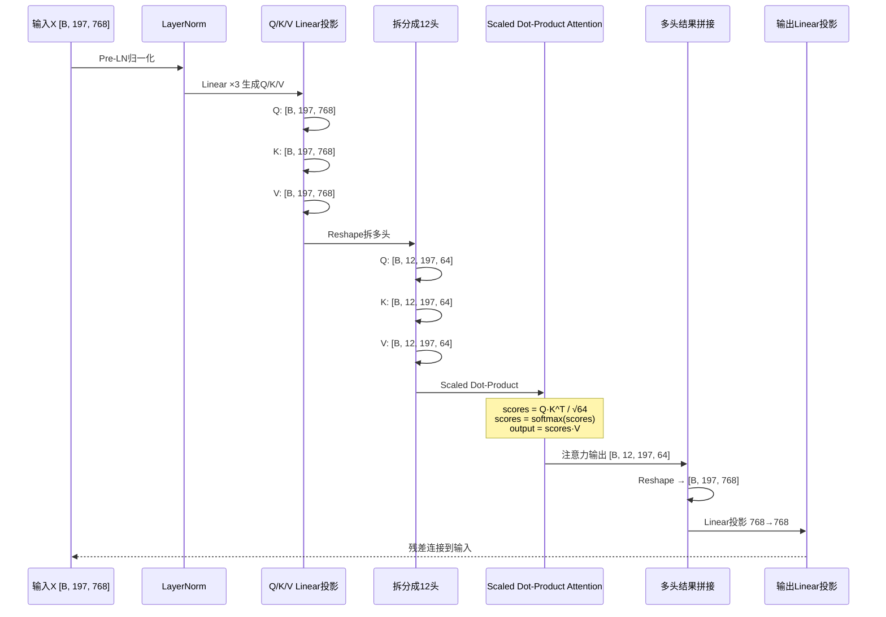
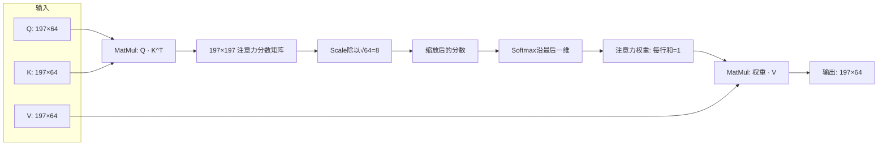
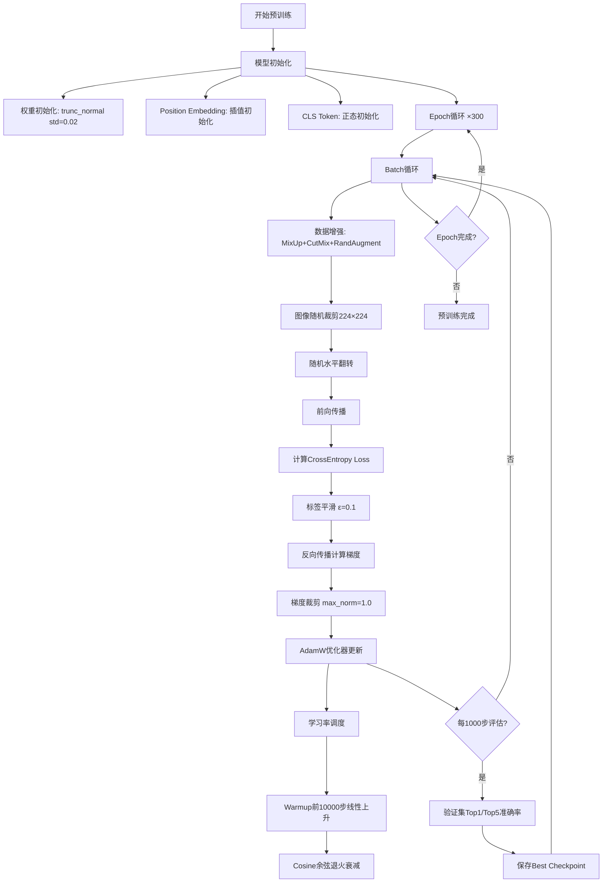
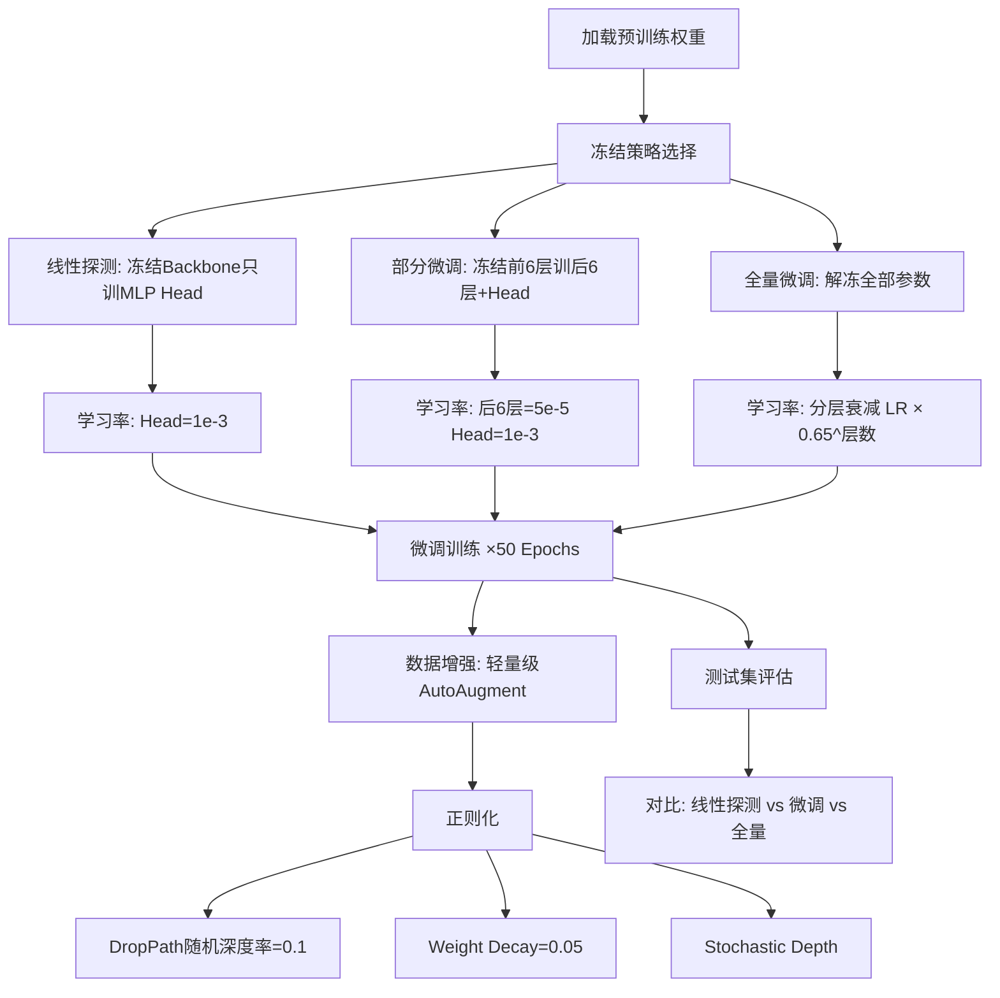
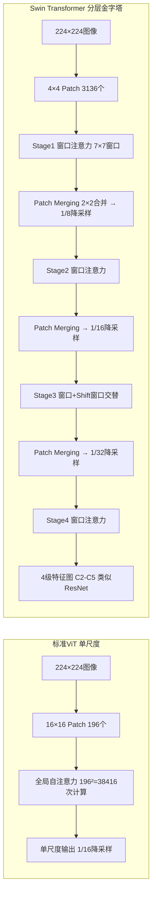
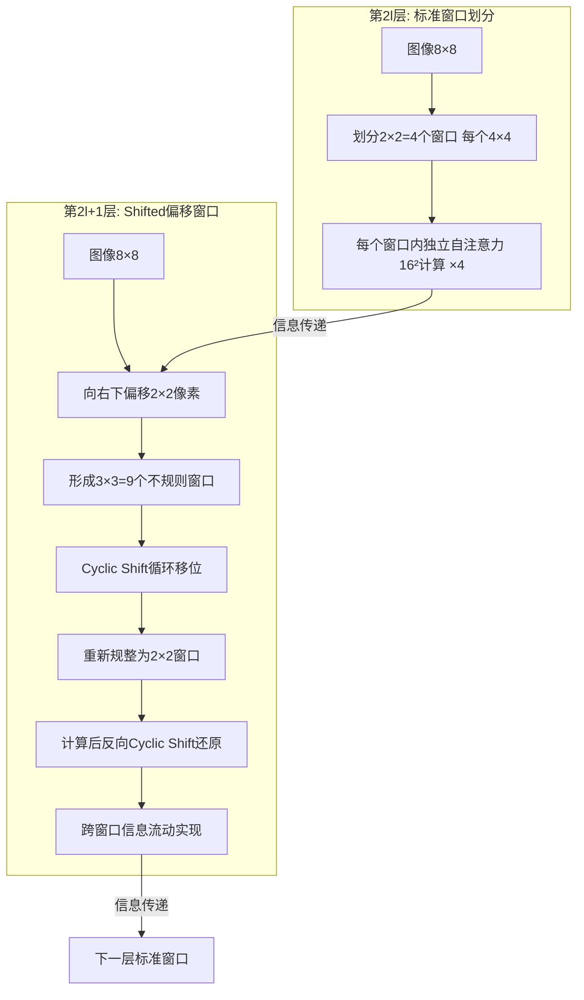
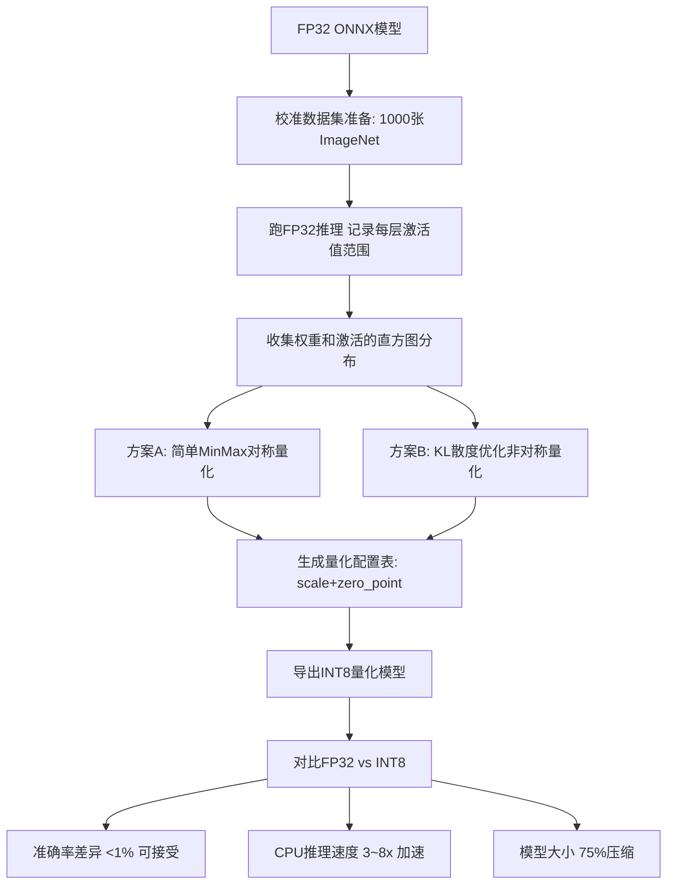
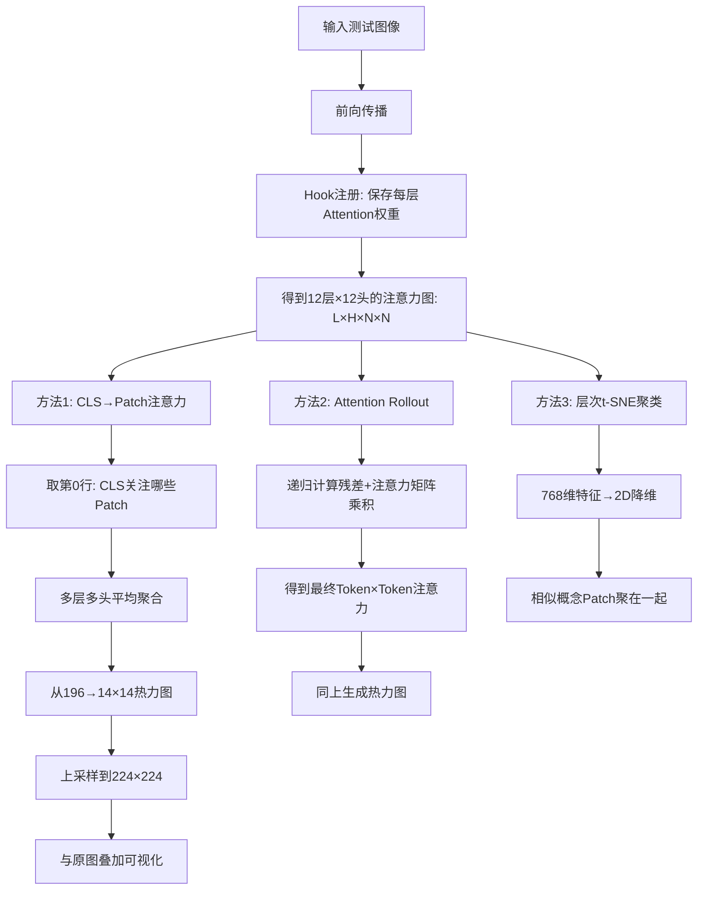

# VisionTransformer 流程图详解

> 位置: 03-deep-learning/vit-pytorch/doc/
> 配套文档: VisionTransformer架构与实现.md | VisionTransformer性能优化重难点.md | VisionTransformer面试题汇总.md

---

## 一、ViT完整推理流程

### 1.1 端到端推理流程图

```mermaid
flowchart TD
    subgraph Input[输入层]
        A[224×224×3 RGB图像] --> A1[数据预处理]
        A1 --> A2[归一化 mean=[0.485,0.456,0.406] std=[0.229,0.224,0.225]]
    end

    subgraph PatchEmbedding[Patch Embedding层]
        A2 --> B1[图像分块: 16×16 Patch]
        B1 --> B2[得到 14×14=196个Patch]
        B2 --> B3[每个Patch展平: 16×16×3=768维]
        B3 --> B4[Linear投影: 768→768维]
        B4 --> B5[LayerNorm归一化]
    end

    subgraph TokenProcess[Token预处理]
        B5 --> C1[生成 <[BOS_never_used_51bce0c785ca2f68081bfa7d91973934]> Token: 1×768]
        C1 --> C2[拼接: CLS + 196 Patch = 197个Token]
        C2 --> C3[加可学习Position Embedding: 197×768]
        C3 --> C4[Dropout正则化]
    end

    subgraph TransformerEncoder[Transformer Encoder ×12层]
        C4 --> D1[第1层 Encoder]
        D1 --> D2[第2层 Encoder]
        D2 --> D3[...]
        D3 --> D4[第12层 Encoder]
    end

    subgraph EncoderLayer[单层Encoder内部结构]
        E0[输入: X] --> E1[LayerNorm前归一化 Pre-LN]
        E1 --> E2[Multi-Head Self-Attention 12头]
        E2 --> E3[Dropout]
        E3 --> E4[残差连接: X + Attention输出]
        E4 --> E5[LayerNorm前归一化]
        E5 --> E6[FFN: Linear→GELU→Dropout→Linear]
        E6 --> E7[Dropout]
        E7 --> E8[残差连接: 输出]
    end

    subgraph ClassificationHead[分类头]
        D4 --> F1[取第0个Token: <[BOS_never_used_51bce0c785ca2f68081bfa7d91973934]>输出]
        F1 --> F2[LayerNorm]
        F2 --> F3[Linear: 768→1000类]
        F3 --> F4[Softmax得到概率分布]
    end

    F4 --> Output[输出: 1000维分类概率向量]
```

### 1.2 关键数据形状变化表

| 阶段 | 输入形状 | 操作 | 输出形状 | 说明 |
|-----|---------|------|---------|------|
| 原始图像 | [B, 3, 224, 224] | 数据预处理 | [B, 3, 224, 224] | Batch, Channel, H, W |
| Patch分块 | [B, 3, 224, 224] | Rearrange分块+展平 | [B, 196, 768] | 14×14=196个Patch |
| Linear投影 | [B, 196, 768] | Linear 768→768 | [B, 196, 768] | Patch Embedding |
| 加CLS Token | [B, 196, 768] | Concat CLS | [B, 197, 768] | 第0位是CLS |
| 加位置编码 | [B, 197, 768] | +PE | [B, 197, 768] | 逐元素相加 |
| Encoder×12 | [B, 197, 768] | 12层Transformer | [B, 197, 768] | 形状不变 |
| 取CLS输出 | [B, 197, 768] | 切片[:,0,:] | [B, 768] | 全局特征向量 |
| MLP分类头 | [B, 768] | LN+Linear | [B, 1000] | ImageNet分类 |

---

## 二、Multi-Head Self-Attention 详细流程

### 2.1 自注意力时序图



### 2.2 单头注意力计算流程



---

## 三、ViT训练完整流程图

### 3.1 预训练流程 (JFT-300M/ImageNet-21K)



### 3.2 微调分类流程



---

## 四、ViT变体结构对比流程图

### 4.1 ViT vs Swin Transformer 结构差异



### 4.2 Swin Shifted Window 工作机制



---

## 五、ViT部署推理流程

### 5.1 ONNX导出与部署

```mermaid
flowchart TD
    PT[PyTorch ViT-B/16 state_dict] --> Load[加载模型结构+权重]
    Load --> Eval[model.eval()切换推理模式]
    Eval --> Dummy[生成Dummy输入: 1×3×224×224]

    Dummy --> Export[torch.onnx.export]
    Export --> P1[opset_version=17]
    Export --> P2[dynamic_axes={batch维度}]
    Export --> P3[do_constant_folding=True]

    P1 --> Check[onnx.checker.check_model]
    P2 --> Check
    P3 --> Check

    Check --> Simplify[onnxsim: 常量折叠+图简化]
    Simplify --> OPT[onnxoptimizer: 算子融合优化]

    OPT --> ORT[ONNX Runtime Inference]
    ORT --> EP1[CPU: XNNPACK/MKL-DNN EP]
    ORT --> EP2[GPU: CUDA/TensorRT EP]
    ORT --> EP3[移动端: NNAPI/CoreML EP]

    EP1 --> Benchmark[性能基准测试: 延迟/吞吐/准确率]
    EP2 --> Benchmark
    EP3 --> Benchmark
```

### 5.2 端侧部署量化流程



---

## 六、注意力可视化流程

