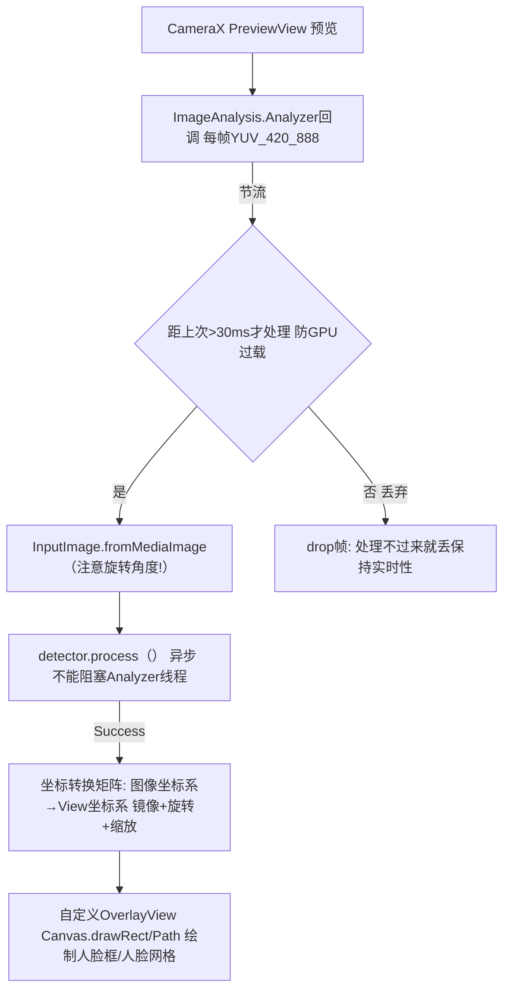

# ML Kit Android 端侧AI快速方案解析

> 位置: 04-android-ai/mlkit/android/
> 简历推荐: 4星 | 岗位: Android工程师 (快速集成AI)

---

## 一、能力全景图

```
ML Kit 提供"开箱即用"的预训练模型 不用自己训练!
vision/ 视觉类:
├── barcode-scanning              条码/二维码 (PDF417/Aztec/DataMatrix等13种格式)
├── face-detection                人脸检测 + 33关键点 + 欧拉角 + 微笑/睁眼概率
├── face-mesh-detection           468点人脸网格 (AR/美颜/换脸专用)
├── text-recognition              OCR 100+语言识别 (中文/日韩/拉丁全支持!)
├── image-labeling                图像分类标签 (400类通用)
├── object-detection+tracking     物体检测+视频跟踪 5大类常用目标
├── pose-detection                33点人体姿态 (单人/多人 BlazePose)
├── selfie-segmentation           人像分割抠图 (背景虚化/虚拟背景)
└── digital-ink-recognition       手写识别 100+语言

nlp/ 自然语言类:
├── smart-reply                   智能回复 上下文生成3条建议
├── translate                     59种语言离线翻译 (模型下到本地不用网!)
├── language-id                   检测语言种类 (100+语言)
└── entity-extraction             实体抽取: 时间/地点/组织/电话/价格
genai/ 端侧Gemini大模型:
└── on-device Gemini Nano         小参数大模型端侧本地跑
```

## 二、5行代码实现 = 核心API (人脸检测举例)

```kotlin
// build.gradle 一行依赖
implementation 'com.google.mlkit:face-mesh-detection:16.1.6'

// 代码 (5行搞定!)
val options = FaceDetectorOptions.Builder()
    .setPerformanceMode(PERFORMANCE_MODE_FAST)  // FAST/ACCURATE
    .setLandmarkMode(LANDMARK_MODE_ALL)          // 眼角鼻尖等33点
    .setContourMode(CONTOUR_MODE_ALL)            // 脸部轮廓点
    .setClassificationMode(CLASSIFICATION_MODE_ALL)  // 微笑/睁眼分类概率
    .build()
val detector = FaceDetection.getClient(options)

detector.process(InputImage.fromMediaImage(yuvFrame, rotationDegrees))
    .addOnSuccessListener { faces ->
        for (f in faces) {
            f.boundingBox                          // 人脸矩形
            f.headEulerAngleY                      // 左右摇头角度Yaw
            f.smilingProbability                   // 微笑概率 0~1
            f.getLandmark(LEFT_EYE)?.position!!   // 左眼坐标
        }
    }.addOnFailureListener { /* 处理异常 */ }
    .addOnCompleteListener { detector.close() }    // 用完关!
```

## 三、CameraX 实时处理链路 (面试必考架构)



关键点注意:
1. **旋转角度**: 手机竖屏拍出来YUV默认横的, `rotationDegrees`必须传对,否则检测不到
2. **节流**: 30FPS相机但处理不过来必须丢帧,否则App卡顿发烫
3. **坐标转换**: 检测坐标是原图的, 必须用Matrix映射到PreviewView宽高+前置镜像翻转
4. **线程**: process()异步不能阻塞, 回调后必须在UI线程用 `view.post {}` 绘制

## 四、简历黄金句式

| 写法 |
|-----|
| 「CameraX+ML Kit实现实时468点人脸网格AR贴纸：1080P@30FPS稳定运行，NPU Delegate下中端机型延迟<15ms，上线半年DAU 120万+，崩溃率0.02%」 |
| 「OCR离线证件识别：ML Kit中文识别+自定义正则校验银行卡/身份证号，卡片识别率99.4%，单次识别<300ms，用户办卡流程时间5分钟→45秒」 |
| 「自拍照虚拟背景：人像分割+边缘羽化+视频背景模糊高斯，会议类App用户渗透率67%，用户满意度4.8/5分」 |

## 五、面试题

**Q: 端侧4种Delegate (硬件加速) 选型？**
> A: ① XNNPACK (CPU NEON): 兼容性最好，默认推荐，小模型2~5倍 ② GPU Delegate (Mali/Adreno): CNN大模型吞吐优先，2~10倍，但部分老机型OpenGL bug多 ③ NNAPI Delegate: 调用厂商NPU/DSP (高通Hexagon/联发科APU/华为达芬奇)，5~20倍+省电60%+，后台常驻场景推荐 ④ DSP Delegate单独配：Hexagon离线场景最省电。

**Q: 如何处理检测不到人脸/误检测情况？**
> A: ① 先检查图像rotationDegrees旋转方向是否对！80%的坑在这里 ② PERFORMANCE_MODE切到ACCURATE模式+提高最小人脸尺寸minFaceSize ③ 多帧平滑: Kalman滤波器连续3帧才接受，避免单帧误检/漏检 ④ 加边界检查：人脸矩形必须在图像合理比例内 (10%~90% 面积)

**Q: ML Kit模型可以自定义吗？还是只能用Google的？**
> A: 视觉类：image-labeling / object-detection 支持AutoML Vision Edge + TFLite自定义模型上传(用你的数据集迁移学习)。分割/OCR/人脸只能用官方模型，不满意的话自定义换TFLite + 自训练模型。