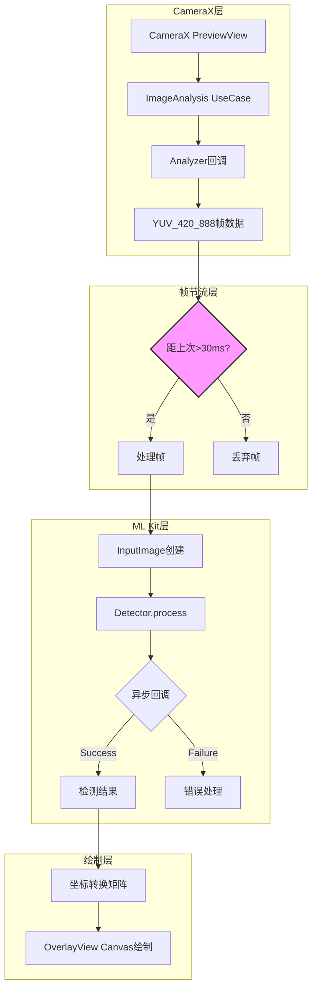
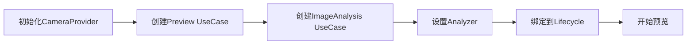
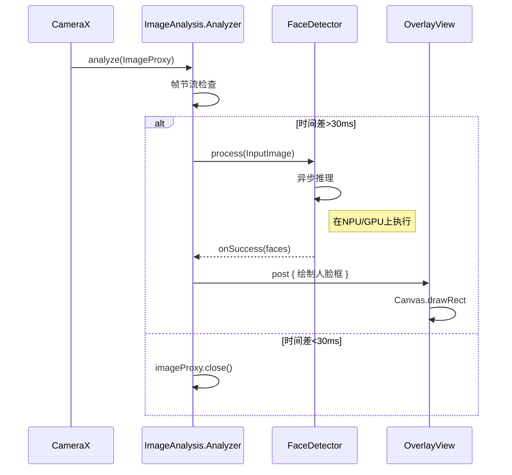
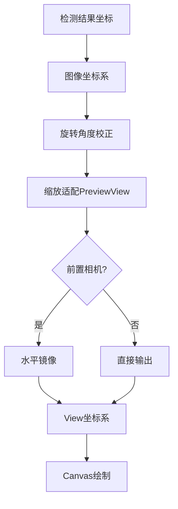

# ML Kit + CameraX 流程图详解

> 位置: 04-android-ai/mlkit/android/

---

## 一、CameraX实时处理架构



## 二、CameraX配置流程



```kotlin
// CameraX配置示例
val cameraProviderFuture = ProcessCameraProvider.getInstance(context)

cameraProviderFuture.addListener({
    val cameraProvider = cameraProviderFuture.get()
    
    val preview = Preview.Builder()
        .build()
        .also { it.setSurfaceProvider(viewFinder.surfaceProvider) }
    
    val imageAnalysis = ImageAnalysis.Builder()
        .setBackpressureStrategy(ImageAnalysis.STRATEGY_KEEP_ONLY_LATEST)
        .build()
        .also { it.setAnalyzer(cameraExecutor, MyAnalyzer()) }
    
    cameraProvider.bindToLifecycle(
        this, CameraSelector.DEFAULT_BACK_CAMERA, preview, imageAnalysis)
}, ContextCompat.getMainExecutor(context))
```

## 三、ML Kit检测流程



## 四、坐标转换流程



```kotlin
// 坐标转换矩阵
val matrix = Matrix().apply {
    // 旋转
    postRotate(rotationDegrees.toFloat())
    // 缩放
    postScale(scaleX, scaleY)
    // 前置镜像
    if (isFrontCamera) postScale(-1f, 1f, centerX, centerY)
}
```

## 五、关键节点详解

### 1. 帧节流实现

```kotlin
class ThrottlingAnalyzer(
    private val intervalMs: Long = 33,
    private val callback: (ImageProxy) -> Unit
) : ImageAnalysis.Analyzer {
    
    private var lastProcessTime = 0L
    
    override fun analyze(image: ImageProxy) {
        val current = System.currentTimeMillis()
        if (current - lastProcessTime < intervalMs) {
            image.close()
            return
        }
        lastProcessTime = current
        callback(image)
    }
}
```

### 2. InputImage创建

```kotlin
// 关键：必须传入正确的旋转角度
val rotationDegrees = imageProxy.imageInfo.rotationDegrees
val inputImage = InputImage.fromMediaImage(
    imageProxy.image!!, 
    rotationDegrees
)
```

### 3. 检测结果处理

```kotlin
detector.process(inputImage)
    .addOnSuccessListener { faces ->
        for (face in faces) {
            val boundingBox = face.boundingBox
            val smileProbability = face.smilingProbability
            // 转换坐标并绘制
        }
    }
    .addOnFailureListener { e ->
        // 错误处理
    }
    .addOnCompleteListener {
        imageProxy.close()  // 必须释放!
    }
```