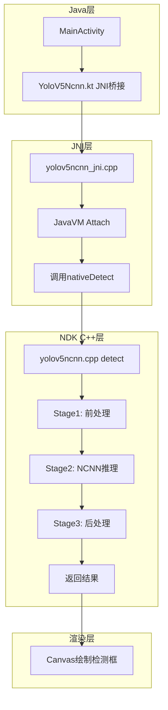
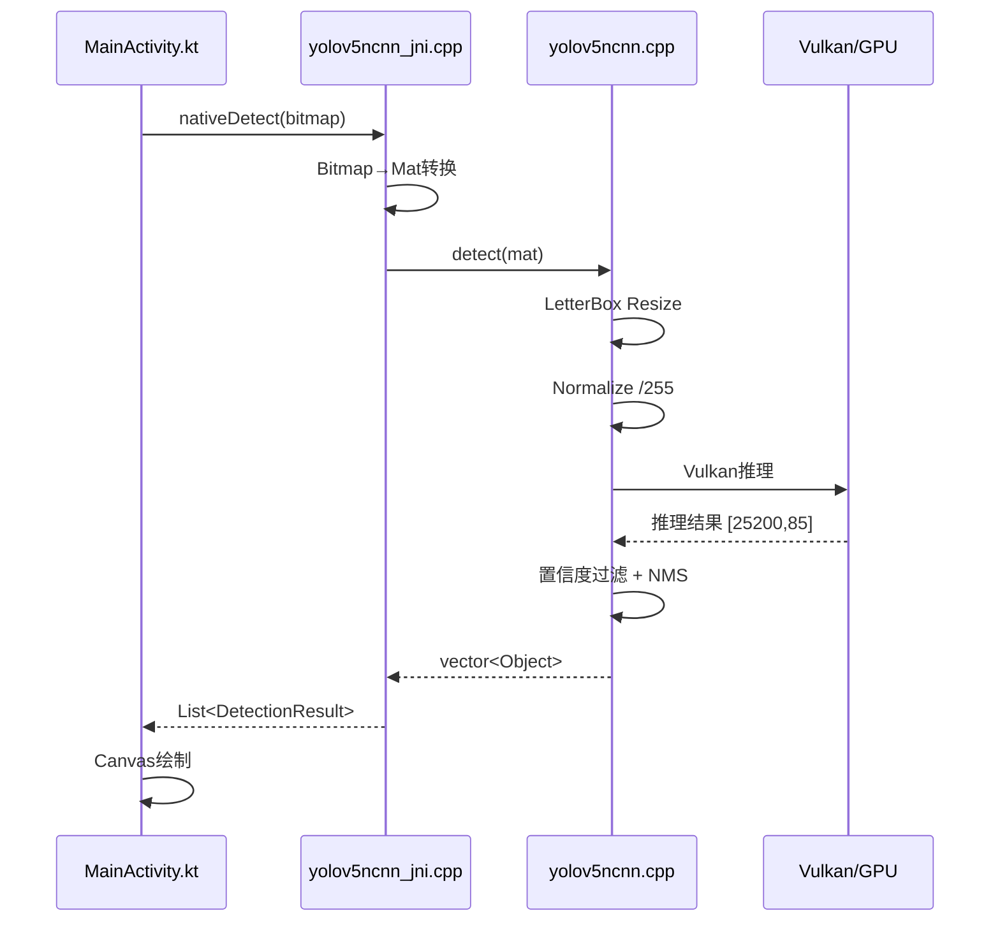
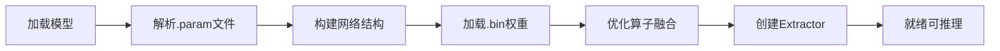

# NCNN YOLOv5 推理流程图详解

> 位置: 04-android-ai/ncnn-android-yolov5/

---

## 一、NCNN端到端推理流程



## 二、三阶段核心流程

### Stage 1: 前处理

```cpp
// LetterBox + Normalize + HWC2CHW
int YoloV5Ncnn::detect(const cv::Mat& rgb, std::vector<Object>& objects) {
    const int target_size = 640;
    
    // 1. LetterBox缩放
    ncnn::Mat in = ncnn::Mat::from_pixels_resize(
        rgb.data, ncnn::Mat::PIXEL_RGB, 
        rgb.cols, rgb.rows, 
        target_size, target_size);
    
    // 2. 归一化 /255
    const float norm_vals[3] = {1/255.f, 1/255.f, 1/255.f};
    in.substract_mean_normalize(0, norm_vals);
    
    // 3. HWC -> CHW (ncnn内部自动处理)
    ...
}
```

### Stage 2: NCNN推理

```cpp
// 创建Extractor
ncnn::Extractor ex = Net->create_extractor();
ex.set_light_mode(true);            // 轻量模式: 内存÷2
ex.set_num_threads(4);              // CPU线程数
ex.set_vulkan_compute(use_gpu);     // Vulkan GPU开关

// 输入输出
ex.input("images", in);
ncnn::Mat out;
ex.extract("output", out);          // 输出 [25200, 85]
```

### Stage 3: 后处理

```cpp
// 置信度过滤 + NMS
std::vector<Object> proposals;
for (int i = 0; i < out.h; i++) {
    const float* row = out.row(i);
    float objness = row[4];
    if (objness < prob_threshold) continue;  // 置信度过滤
    
    // 解码边界框
    Object obj;
    obj.rect = decode_bbox(row, ...);
    proposals.push_back(obj);
}

// NMS去重
nms_sorted_bboxes(proposals, objects, nms_threshold);
```

## 三、完整时序图



## 四、NCNN网络初始化流程



```cpp
// 初始化示例
Net = new ncnn::Net();
Net->load_param("yolov5s.param");
Net->load_model("yolov5s.bin");
Net->opt.use_vulkan_compute = true;  // GPU加速
```