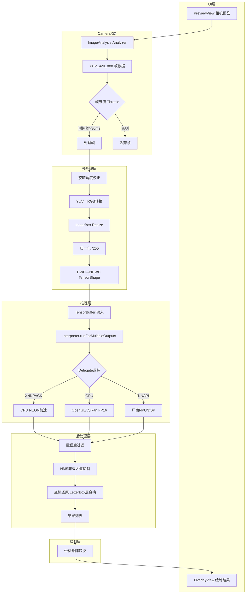
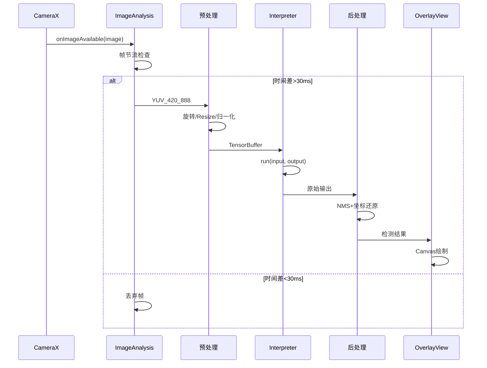

# TFLite 推理流程图详解

> 位置: 04-android-ai/tensorflow-examples/lite/examples/

---

## 一、端到端推理完整流程



## 二、关键节点详解

### 1. 帧节流机制
```kotlin
private var lastProcessTimeMs = 0L

fun analyze(image: ImageProxy) {
    val currentTime = System.currentTimeMillis()
    if (currentTime - lastProcessTimeMs < 33) {  // 30FPS阈值
        image.close()
        return
    }
    lastProcessTimeMs = currentTime
    // 处理帧...
}
```

### 2. Delegate三级降级策略
```kotlin
val options = Interpreter.Options().apply {
    setUseXNNPACK(true)  // 兜底方案
    runCatching { addDelegate(GpuDelegate(...)) }   // 优先GPU
    runCatching { addDelegate(NnApiDelegate(...)) } // 后台用NNAPI
}
```

### 3. 预处理流水线
```kotlin
val processor = ImageProcessor.Builder()
    .add(ResizeOp(224, 224, ResizeOp.ResizeMethod.BILINEAR))
    .add(NormalizeOp(floatArrayOf(127.5f,127.5f,127.5f), floatArrayOf(127.5f,127.5f,127.5f)))
    .build()
```

## 三、数据流时序图

