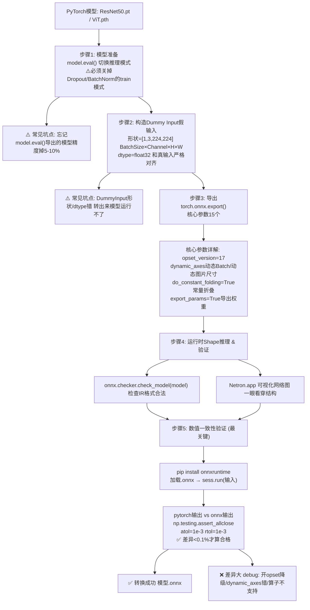
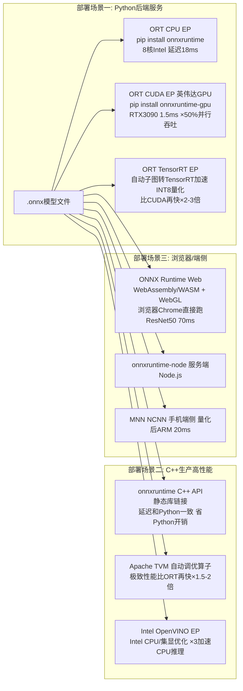
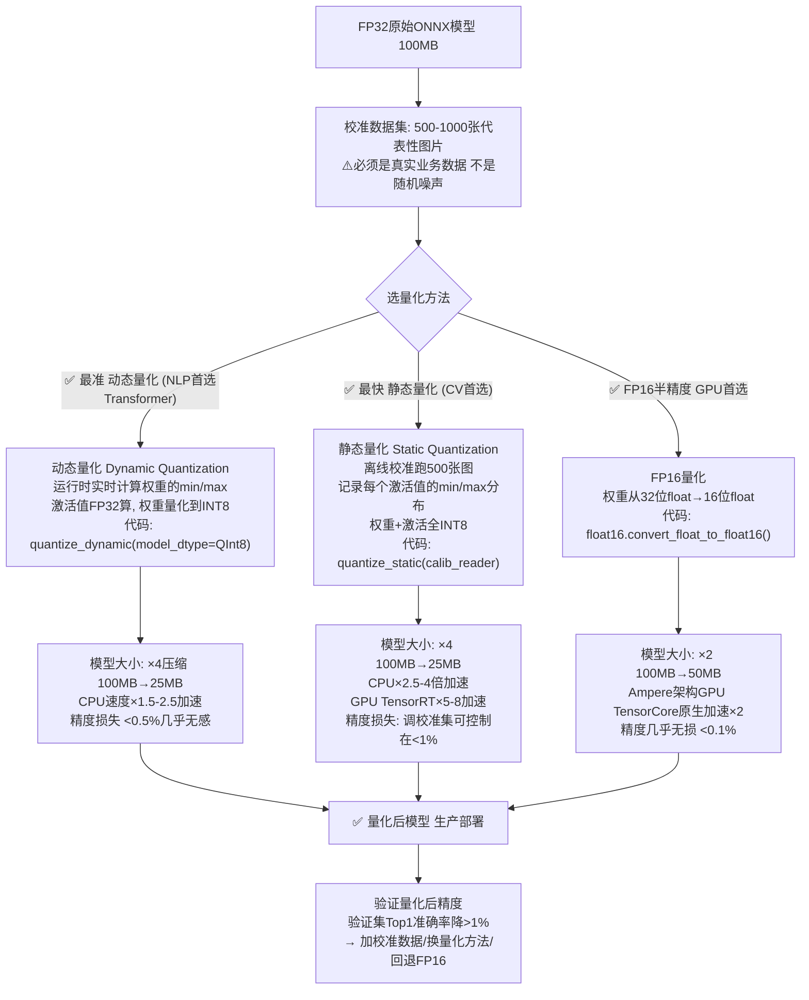
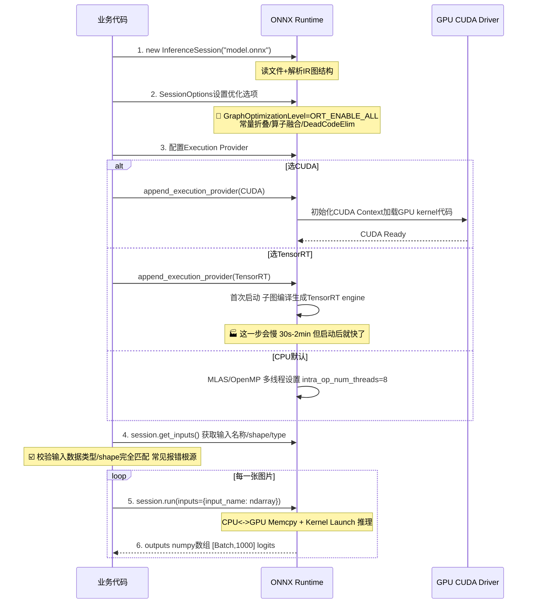

# ONNX模型部署流程图详解

> 位置: 04-模型部署/onnx-tutorial/doc/
> 配套文档: ONNX模型部署实战指南.md | ONNX性能优化重难点.md | ONNX面试题汇总.md

---

## 一、PyTorch模型 → ONNX 完整转换流程



---

## 二、后端推理 跨平台部署矩阵



---

## 三、量化 INT8/FP16 详细流程



---

## 四、ONNX Runtime 推理Session创建全流程



---

## 五、模型转换失败常见节点 + 修复路径

```mermaid
flowchart TD
    FAIL[导出失败 / 数值不一致 / 跑不起来]

    FAIL --> C1["类型1: ExportError 导出阶段就报错<br/>'Exporting the operator prim::XXX to ONNX opset version 17 is not supported'"]
    C1 --> F1[修复: opset_version升级17→19/20 新版本支持新算子<br/>或 register_custom_op_symbolic 自己实现符号函数]

    FAIL --> C2["类型2: Checker报错 模型格式非法<br/>'N node X is not zero dimensional but has no shape info'"]
    C2 --> F2[修复: 开dynamic_axes参数 动态轴shape推理<br/>或torch.onnx.export(shape_inference=True)]

    FAIL --> C3["类型3: Shape不匹配 RuntimeError<br/>'Got invalid dimensions for arguments'"]
    C3 --> F3[修复: DummyInput形状和代码真输入完全一致<br/>特别是Batch维度/NLP seq_len维度]

    FAIL --> C4["类型4: 数值差异大 assert_allclose FAIL<br/>PyTorch输出和ORT输出差1%+"]
    C4 --> F4["4步排查法:<br/>1. model.eval()是不是漏了<br/>2. 有没有用torch.no_grad()关闭autograd<br/>3. 关PostTrainingQuantization回到FP32试试<br/>4. opset降级 最新版本可能有bug"]

    FAIL --> C5["类型5: 某些算子不支持CustomOp"]
    C5 --> F5["三选一: a) torch里替换算子成标准算子<br/>b) ORT自定义op实现CPU/CUDA kernel<br/>c) 保持PyTorch原生子图 混合执行 fallback到PyTorch"]
```