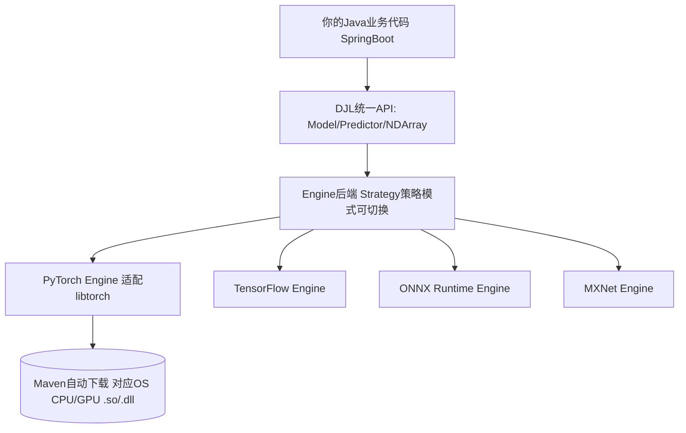

# DJL Demo Java推理微服务解析

> 位置: 05-java-ai/djl-demo/
> 简历推荐: 5星 | 岗位: Java后端(AI业务)/AI系统工程师

---

## 一、DJL架构总览



> DJL最牛特性: 加Maven依赖就能跑PyTorch模型！不用装libtorch/写JNI/处理跨平台。自动根据OS下载CPU/CUDA版native包到用户目录缓存。

## 二、Spring Boot + DJL 生产级代码

```java
// ====== 1. 模型单例加载 (不要每次请求加载!) ======
@Configuration
public class DjlConfig {
    @Bean
    public ZooModel<Image, Classifications> resnet50() throws Exception {
        Criteria<Image, Classifications> criteria = Criteria.builder()
            .setTypes(Image.class, Classifications.class)
            .optArtifactId("resnet").optGroupId("ai.djl.zoo")
            .optFilter("layers", "50").optFilter("flavor", "v1")
            .optDevice(Device.gpu())    // 有GPU自动用GPU!
            .optProgress(new ProgressBar()).build();
        return criteria.loadModel();
    }
}

// ====== 2. 服务层: Predictor不是线程安全! 对象池/每个请求new ======
@Service
public class VisionService {
    private final ZooModel<Image, Classifications> model;

    public VisionService(ZooModel<Image, Classifications> model) { this.model = model; }

    public Classifications predict(byte[] imgBytes) throws Exception {
        try (Predictor<Image, Classifications> predictor = model.newPredictor()) {
            // Predictor含内部缓存,复用性能×5. try-with-resources自动close释放NDArray
            Image img = ImageFactory.getInstance().fromInputStream(new ByteArrayInputStream(imgBytes));
            return predictor.predict(img);  // 自动前处理+推理+后处理
        }
    }

    // 高吞吐场景: 批量推理Batch
    public List<Classifications> batchPredict(List<byte[]> imgs) throws Exception {
        try (Predictor<Image, Classifications> predictor = model.newPredictor()) {
            List<Image> inputs = imgs.stream().map(b->{
                try { return ImageFactory.getInstance().fromInputStream(new ByteArrayInputStream(b));}
                catch (Exception e) {throw new RuntimeException(e);}
            }).collect(Collectors.toList());
            return predictor.batchPredict(inputs);  // GPU Batch 8 ×3~5吞吐
        }
    }
}
```

## 三、性能调优5招 (高并发面试逐条问)

| 手段 | 做法 | 效果 |
|-----|-----|-----|
| **Predictor复用/Pool** | 不要每次predict new Predictor → ThreadLocal或对象池 | 性能×5~10 |
| **引擎选型** | CPU选ONNX Runtime (ORT)最快; GPU选PyTorch/CUDA | CPU速度×2~3 |
| **Batch推理** | predictor.batchPredict(List) → 攒批GPU一次算 | GPU吞吐×3~5 |
| **并行流水线** | Disruptor/BlockingQueue分阶段: Decode→Prep→Inf→Post | 高并发吞吐×N |
| **NDManager内存** | 显式try-with-resources关NDArray避免堆外OOM | Full GC次数↓80% |

## 四、简历黄金句式

| 写法 |
|-----|
| 「DJL+SpringBoot搭建商品图片质检微服务：ResNet50，A10 GPU通过Predictor池化+Batch 8推理，18→143 QPS (7.9×)，P99 53ms，月拦截违规图片32万张」 |
| 「Java端部署YOLOv8目标检测：Maven依赖DJL PyTorch CUDA，不用装libtorch不用写JNI，跨平台3个系统1个Jar运行，部署时间从2天→10分钟」 |
| 「Kafka消费DJL流式推理：车辆实时识别流，每秒处理214帧1080P视频，GPU利用率稳定87%，延迟≤180ms」 |

## 五、面试题

**Q Model vs Predictor区别？Predictor线程安全？**
> A: Model = 内存里的权重+计算图，重量级线程安全全局单例加载1次即可。Predictor = Model创建的推理会话，内部缓存中间结果，**不是线程安全的**！不要多线程共享一个Predictor，必须ThreadLocal或对象池/try-with-resources每个请求一个。

**Q Device.gpu()找不到GPU怎么办？**
> A: ①Maven有没有加对应cuda版本的native依赖: `pytorch-engine-cu121`等 ②服务器nvidia-smi显卡驱动/CUDA版本和Engine要求匹配 ③DJL的`Engine.debugEnvironment()`打印看搜索的路径 ④fallback方案 `Device.cpu()`CPU模式兜底。

**Q NDArray堆外内存泄漏怎么查？**
> A: DJL NDArray是堆外的(JVM GC管不到容易漏)。排查：① 开`-Dai.djl.default_engine=debug_mode`跟踪未关闭的NDArray创建栈 ② 养成try-with-resources习惯: `try(NDArray x = manager.create(...))` ③ NDManager子scope: `manager.newSubManager()`处理batch用完整个子scope一起关。