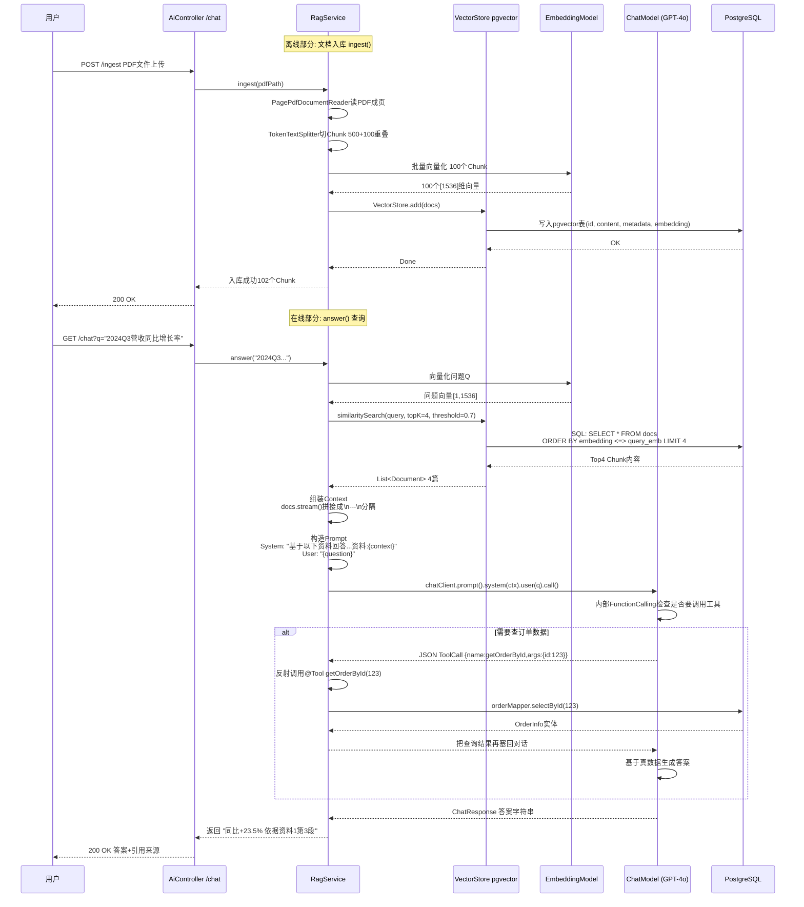
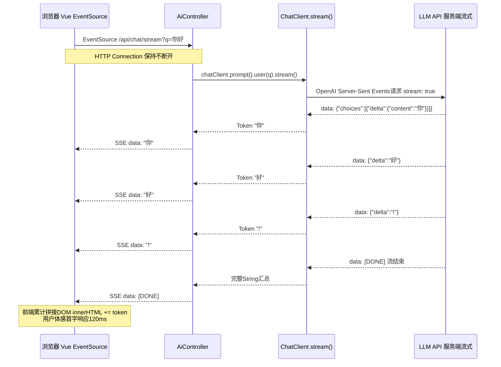
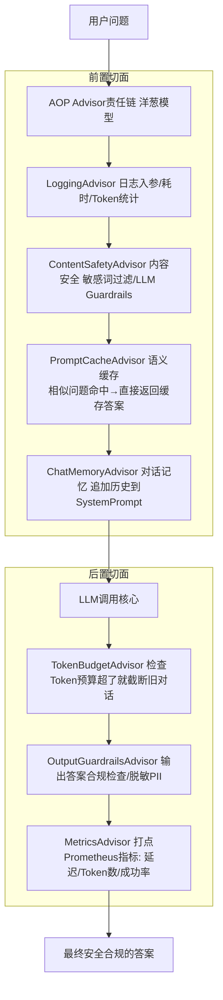

# Spring AI 流程图详解

> 位置: 05-java-ai/spring-ai/doc/
> 配套文档: SpringAI-LLM应用集成指南.md | SpringAI性能优化重难点.md | SpringAI面试题汇总.md

---

## 一、Spring AI 四大抽象架构图

```mermaid
flowchart TD
    subgraph BIZ业务代码
        Code1[你的Controller/Service]
        Code2[ChatClient流式API]
        Code3[RAGService知识库服务]
        Code4[FunctionCalling工具]
    end

    subgraph Spring AI核心抽象 可插拔可替换
        Code2 --> ChatModel[ChatModel接口<br/>聊天大模型抽象]
        Code3 --> E[EmbeddingModel接口<br/>文本向量化抽象]
        Code3 --> V[VectorStore接口<br/>向量数据库抽象]
        Code4 --> T[Tool/Functions接口<br/>函数调用抽象]
        Code2 --> Advisors[Advisor AOP切面体系<br/>日志/安全/记忆/压缩]
    end

    subgraph 多实现 零成本切换
        ChatModel --> OpenAI[OpenAI GPT-4o/mini]
        ChatModel --> Azure[Azure OpenAI]
        ChatModel --> Ollama[Ollama本地 Qwen/Llama3]
        ChatModel --> Zhipu[智谱AI/通义千问/文心一言]
        ChatModel --> Claude[Anthropic Claude 3.5]

        E --> OpenAIEmb[OpenAI text-embedding-3]
        E --> BgeEmb[本地Bge-M3 Ollama]

        V --> PG[(pgvector PostgreSQL)]
        V --> Milvus[(Milvus分布式)]
        V --> Redis[(Redis-Search)]
        V --> Pinecone[(Pinecone SaaS)]
        V --> Chroma[(Chroma嵌入式)]

        T --> Tool1[@Tool自定义方法<br/>getOrderById查订单]
        T --> Tool2[更多业务工具]
    end
```

---

## 二、完整RAG 7步流程 详细时序



---

## 三、Function Calling 工具调用完整链路

```mermaid
flowchart TD
    Start[Spring启动 扫描@Component类] --> ScanTool["扫描@Tool注解的方法<br/>class OrderTools{ getOrderById }"]
    ScanTool --> GenSchema[反射生成JSON Schema<br/>{<br/>  name: getOrderById,<br/>  description: 根据订单ID查详情<br/>  parameters:{type:object,properties:{orderId:{Long}}}<br/>}]
    GenSchema --> Register[注册到ChatClientBuilder.defaultTools]
    Register --> Build[构建ChatClient Bean单例]

    UserAsk[用户问 "我的订单123物流到哪了?"]
    UserAsk --> SendLLM[发请求到LLM]
    SendLLM --> SPrompt["System Prompt自动拼接<br/>工具JSON Schema给模型"]
    SPrompt --> LLMDecision{LLM判断: 我需要调用工具吗?}

    LLMDecision -->|不需要 直接答| DirectAnswer[直接输出物流答案]
    LLMDecision -->|需要| ToolJSON[返回特殊格式JSON:<br/>{"name":"getOrderById","arguments":{"orderId":"123"}}]

    ToolJSON --> Parse[Spring拦截 解析Tool JSON]
    Parse -->|参数合法| Reflect["反射调用OrderTools#getOrderById<br/>方法参数自动类型转换<br/>String→Long"]
    Parse -->|参数非法| Retry["返回参数错误提示给LLM 重试最多2次"]

    Reflect --> SQL[业务代码执行orderMapper.selectById(123)]
    SQL --> Result[返回OrderInfo Java对象]
    Result --> ToJson[自动序列化为JSON字符串]
    ToJson --> Resend[Tool结果作为User消息再次发给LLM]
    Resend --> FinalAns[LLM看到真实订单数据 → 生成自然语言回答]
```

---

## 四、SSE流式聊天 详细流程



---

## 五、Advisor AOP切面体系



---

## 六、Pgvector 混合检索 + 重排 流程

```mermaid
flowchart LR
    Q[用户问题: "2024年AI部门预算是多少?"]
    Q --> METAFILTER["步骤1: Metadata先过滤<br/>WHERE year=2024 AND dept='AI'<br/>先从100万条 → 缩到2万条符合范围"]

    METAFILTER --> VECSEARCH["步骤2: 向量相似度TopK=50<br/>ORDER BY embedding <=> query_vec LIMIT 50<br/>HNSW近似最近邻 1-3ms"]

    VECSEARCH --> BM25["步骤3: BM25关键词检索Top50<br/>tsvector全文GIN索引"]

    BM25 --> RRF["步骤4: RRF融合排序<br/>分数 = 1/(k+rank_vec) + 1/(k+rank_bm25)<br/>两个来源互补"]

    RRF --> TOP50[得到综合分数Top50]
    TOP50 --> RERANK["步骤5: Jina Reranker v2 精排<br/>50条 → 4条"]
    RERANK --> FINAL["最终4条最高质量上下文<br/>送给LLM生成答案"]
```