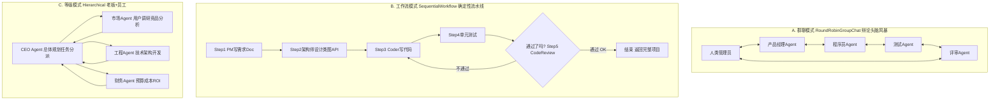

# AutoGen Multi-Agent多智能体解析

> 位置: 06-llm/autogen/python/packages/autogen-agentchat/
> 简历推荐: 4星 | 岗位: LLM应用/Agent工程师

---

## 一、Multi-Agent 3种经典协作模式



## 二、AutoGen 多Agent代码骨架

```python
# ===== AutoGen 多Agent软件开发团队示例 =====
from autogen_agentchat.agents import AssistantAgent, UserProxyAgent
from autogen_agentchat.conditions import (
    TextMentionTermination, MaxMessageTermination, HandoffTermination
)
from autogen_agentchat.teams import RoundRobinGroupChat, Swarm

# 1. 定义每个Agent的人设 (System Prompt) + 绑定Tools
pm = AssistantAgent(
    "ProductManager",
    description="产品经理，负责撰写PRD需求文档、用户故事、验收标准",
    system_message="你是资深互联网产品经理，请输出结构化PRD：背景/目标/用户故事/验收条件，最后用一句话说 APPROVED 表完成",
    tools=[],
)
architect = AssistantAgent(
    "Architect",
    description="架构师，画系统设计图、接口定义、技术选型",
    system_message="资深架构师：根据PRD输出架构设计：分层/模块/数据库Schema/RESTful接口定义,最后APPROVED",
)
coder = AssistantAgent(
    "SeniorCoder",
    description="高级Python工程师，写生产级代码+注释+单元测试",
    system_message="高级FastAPI工程师,输出完整代码文件结构,每个函数带docstring+类型注解,最后写COMPLETE",
    tools=[CodeInterpreterTool()],  # 可执行代码!
)
reviewer = AssistantAgent(
    "CodeReviewer",
    description="代码审查官：检查代码Bug/性能问题/安全漏洞",
    system_message="严格代码审查:Bug/性能/安全/SQL注入/XSS/并发问题,提意见列表,PASS即通过",
)
human = UserProxyAgent("User")  # 人类代理, 需要时问人

# 2. 定义终止条件 (任何一个触发就结束群聊!)
terminate = (TextMentionTermination("COMPLETE")       # 有人说COMPLETE
             | MaxMessageTermination(max_messages=20)  # 防止死循环最多20条
             | TextMentionTermination("APPROVED") & TextMentionTermination("PASS"))  # 两者都过

# 3. 组队! Round Robin 轮流发言模式
team = RoundRobinGroupChat(
    [pm, architect, coder, reviewer, human],
    termination_condition=terminate,
)

# 4. 运行! 流输出看每个Agent的思考和发言过程
async for msg in team.run_stream(task="帮我做一个FastAPI学生管理系统：JWT鉴权、增删改查、SQLite数据库、pytest测试覆盖>80%。"):
    if isinstance(msg, AgentMessage):
        print(f"\n===== 🧑‍💻 {msg.source} =====")
        print(msg.content)
```

## 三、Agent 4大核心能力

| 能力 | 实现要点 | 常见坑 |
|-----|---------|-------|
| 🛠️ **Tool Calling 工具调用** | Pydantic BaseModel严格参数校验+Schema给LLM + retry 2次 + Fallback | JSON格式解析错占50%以上, 加JSON修复器 |
| 📝 **Memory 记忆** | 短期: SlidingWindowBuffer 30条 / 长期: VectorStore存重要信息摘要 / 用户画像RAG | 上下文爆80%是因为没做滑动窗口 |
| 🧭 **Planning 规划** | ReAct 边想边做 / Plan-and-Execute 先全写Plan再执行 / Reflexion失败反思重试 | 循环死: max_iter=10+EarlyStopping+HumanHandOff |
| 📊 **Evaluation 评估** | 端到端任务成功率 + 人工Golden集 + AgentBench标准基准 / LLM-as-Judge打分 | 人工打分Kappa>0.7才可信 |

## 四、简历黄金句式

| 写法 |
|-----|
| 「AutoGen搭建软件开发多Agent团队(PM/架构师/程序员/测试/评审)：SWE-bench 120题Pass@1 从单Agent 27%→多智能体协作56%，平均每Bug修复成本↓62%」 |
| 「金融投研Agent系统：搜索+财报分析+建模+报告写作5Agent流水线，输出标准化公司深度报告，研究员撰写报告时间从2天→3小时，覆盖股票池从400只→1600只」 |
| 「客服Agent：意图识别RouterAgent→转订单Agent/物流Agent/退款Agent/Human客服，工单解决率52%→84%，人工客服平均通话时长4.8min→2.1min」 |

## 五、面试题

**Q: 单Agent vs Multi-Agent 选型？优缺点？**
> A: 简单任务(单轮工具调用/RAG问答)单Agent足够，轻量快速Bug少。复杂多步骤协作任务(软件开发/复杂报告/长流程业务)选Multi-Agent：① 分工人设清晰：各Agent System Prompt更聚焦更专业 ② 可并行执行：不同Agent各跑一段流水线 ③ 可观测性好：每一步错哪个Agent背锅好定位。缺点：Token消耗几倍、协调成本高、死循环概率高、端到端延迟久。

**Q: Agent循环卡死(死循环)怎么缓解？**
> A: 5层防护网：① max_iterations=10 硬性终止 ② EarlyStopping: 连续N轮Observation无进展/重复调用相同工具相同参数 ③ HumanInTheLoop Handover: 转人类管理员介入 ④ Reflexion自我反思：失败时生成反思日志作为下一轮System Prompt避免重复错 ⑤ Graph-based状态机(LangGraph/AutoGen Swarm): 显式边和条件转移，而不是LLM自由选择。

**Q: 如何评估Agent的效果？不是普通分类有固定label？**
> A: 4层评估体系：① 工具调用成功率 (Schema解析/参数合法率) ② 单步骤任务准确率 (单查数据库对不对) ③ 端到端任务成功率 (Golden集100个标准任务: 人类专家标正确答案, LLM-as-Judge对比答) ④ 线上真实业务指标：客服解决率、Bug修复率、用户满意度。离线SWE-bench/GAIA/AgentBench标准排行榜横向对比。