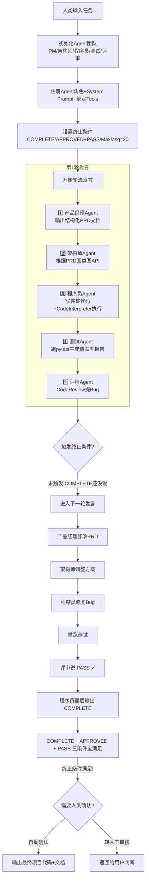
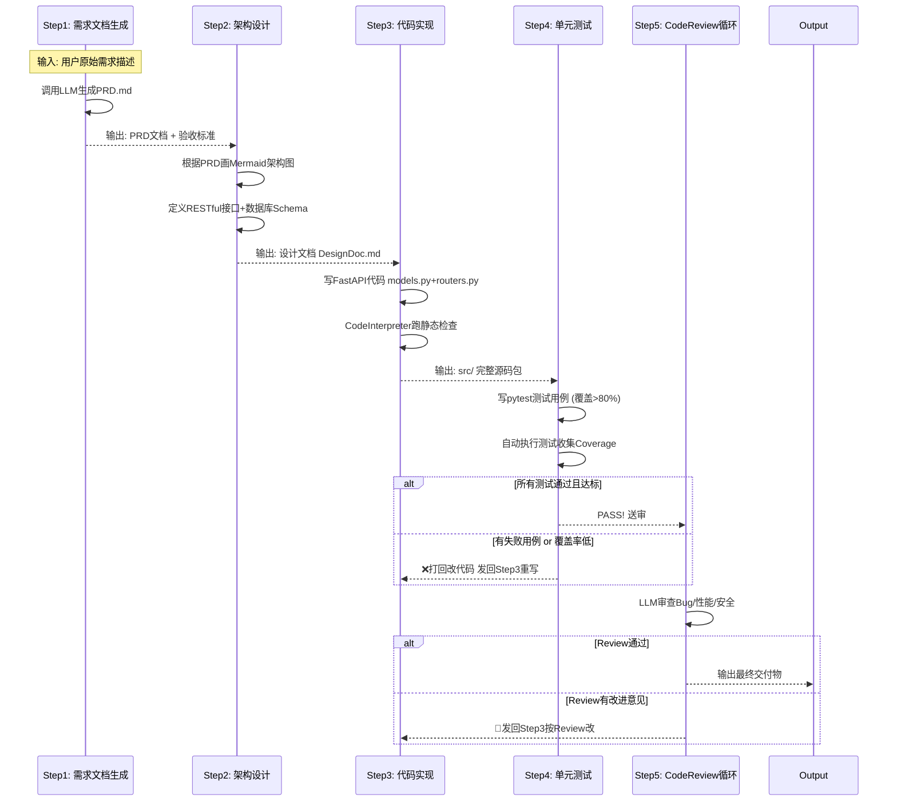
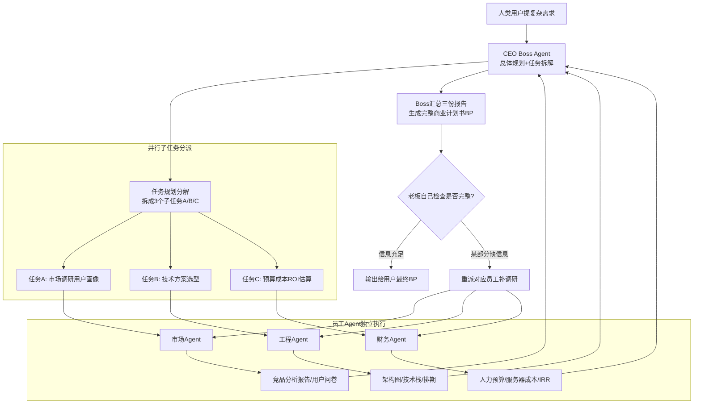
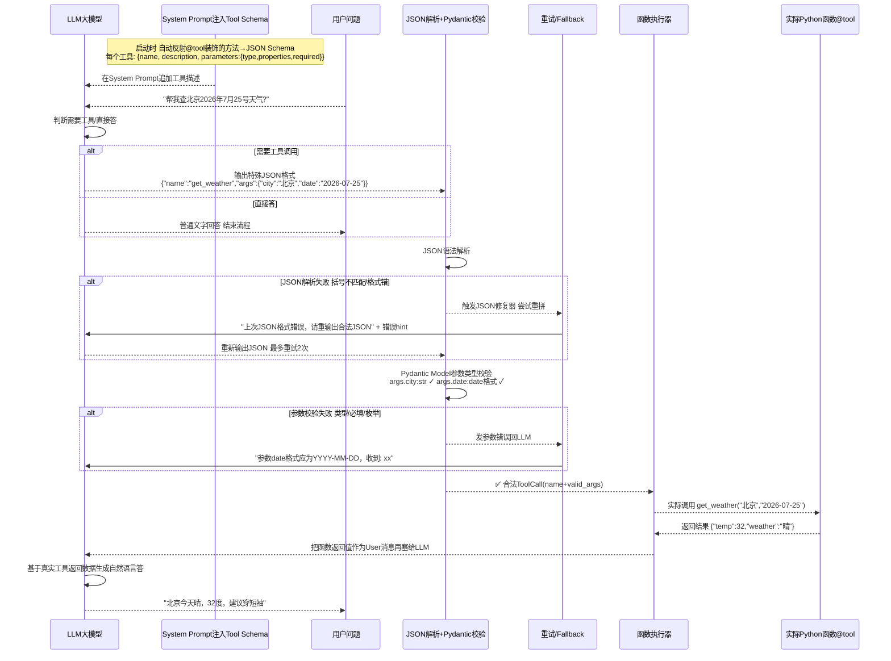
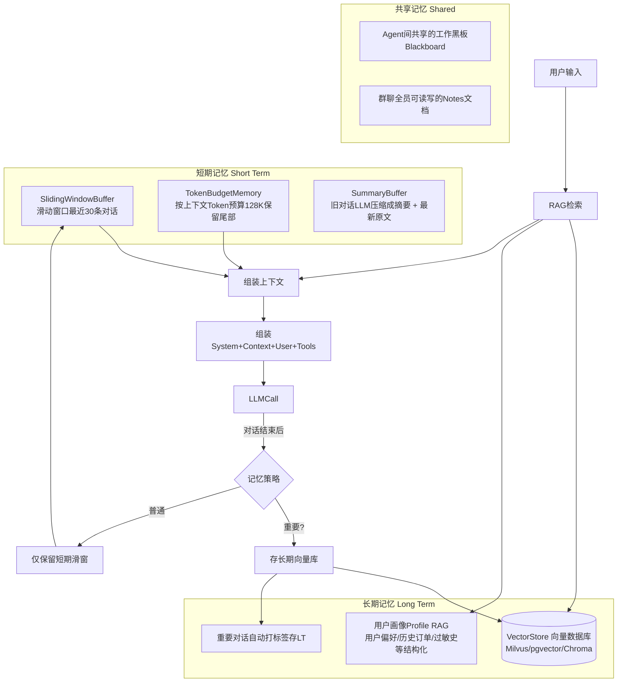
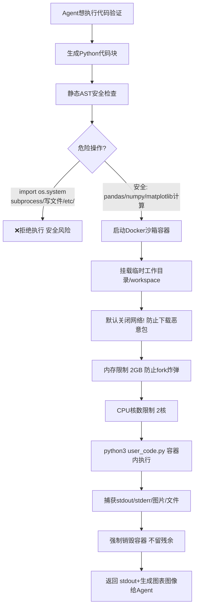

# AutoGen 流程图详解

> 位置: 06-llm/autogen/doc/
> 配套文档: AutoGen-MultiAgent协作框架.md | AutoGen性能优化重难点.md | AutoGen面试题汇总.md

---

## 一、Multi-Agent 三大协作模式流程

### 1.1 群聊模式 RoundRobinGroupChat (软件开发团队示例)



### 1.2 顺序工作流 SequentialWorkflow (确定性流水线)



### 1.3 等级模式 Hierarchical Swarm (老板+员工)



---

## 二、Agent核心能力实现流程

### 2.1 Tool Calling 工具调用完整链路



### 2.2 Memory 记忆系统三层架构



### 2.3 Planning 规划能力三种模式

```mermaid
flowchart LR
    subgraph 模式1 ReAct边想边做[最通用]
        T1[用户复杂任务] --> R1[Thought<br/>思考: "我需要先查API文档"]
        R1 --> A1[Action: 调用search_tool("FastAPI JWT")]
        A1 --> O1[Observation: 搜索结果...]
        O1 --> R2{是否解决?}
        R2 -->|否| R1
        R2 -->|是| Finish[Final Answer]
    end

    subgraph 模式2 Plan-and-Execute[大任务先拆解]
        T2[开发学生管理系统] --> P1[LLM生成完整执行计划<br/>1.建模型 2.写接口 3.鉴权 4.测试]
        P1 --> Ex1[Step1执行]
        Ex1 --> P2{步骤1完成?}
        P2 -->|重写| Ex1
        P2 -->|OK| Ex2[Step2执行...]
        Ex2 -->|全部步骤OK| Output2[交付最终结果]
    end

    subgraph 模式3 Reflexion自我反思[最聪明最耗时]
        T3[Bug修复任务] --> Try1[第一次尝试写patch]
        Try1 --> RunTest[运行单测 → 5失败]
        RunTest --> Reflect[Self-Reflection<br/>LLM自我反思: "为什么失败? 第3行逻辑反了!"]
        Reflect --> SelfCritic[自我批评+改进思路写进System Prompt]
        SelfCritic --> Try2[第二次尝试 换思路]
        Try2 --> Run2[测 → 2失败]
        Run2 --> MaxIter{迭代<max=10?}
        MaxIter -->|是| Reflect
        MaxIter -->|否| Human[转人工Handoff]
        Run2 -->|最终0失败| FinalOK[完成]
    end
```

---

## 三、软件开发多Agent团队完整执行流程

### 3.1 从需求到代码完整闭环

```mermaid
flowchart TD
    Input[用户: "做FastAPI学生管理系统 要求JWT+增删改查+pytest>80%"]

    Input --> PM[产品经理Agent]
    PM -->|写出| PRD[PRD.md<br/>背景/目标/UserStory×5/验收标准]
    PRD -->|含| Stories["US1: 学生POST创建<br/>US2: GET列表分页<br/>US3: JWT登录<br/>US4: PUT/PATCH更新<br/>US5: DELETE删除"]

    PM --> SayApproved[PM说: APPROVED 需求确认]

    SayApproved --> Arch[架构师Agent]
    Arch -->|输出| DesignDoc[DesignDoc.md]
    DesignDoc -->|包含| ArchStruct["三层架构: models/schemas/routers<br/>技术: FastAPI+SQLAlchemy+SQLite+PyJWT"]
    ArchStruct --> DBSchema["DB Schema: users(id,username,pass_hash)<br/>students(id,name,age,email,create_at)"]
    ArchStruct --> APIs[RESTful: 7个API路径+请求响应样例]

    Arch --> Say2[架构师说: APPROVED 设计完成]

    Say2 --> Coder[程序员Agent + CodeInterpreterTool]
    Coder --> File1[生成main.py应用入口]
    Coder --> File2[生成models.py SQLAlchemy模型]
    Coder --> File3[生成schemas.py Pydantic校验]
    Coder --> File4[生成routers/下auth.py students.py]
    Coder --> File5[生成requirements.txt]

    Coder --> RunPip[虚拟环境pip install依赖]
    RunPip --> StartServer[uvicorn跑起本地服务:8000]
    StartServer --> APITest[CodeInterpreter调用curl测试API]

    APITest --> CoderFix{测试失败}
    CoderFix -->|401未授权| FixAuth[修复JWT中间件逻辑]
    FixAuth --> APITest

    Coder --> Say3[程序员说: COMPLETE ✓ 代码+自测通过]

    Say3 --> Tester[测试Agent]
    Tester --> TestCases[生成test_students.py 30个用例]
    TestCases --> RunTests[pytest --cov=app 测覆盖率]
    RunTests --> CoverageReport[生成Coverage报告: 83% ✓ >80%]

    Tester --> Say4[测试Agent说: PASS 全绿覆盖率83%]

    Say4 --> Reviewer[代码审查官]
    Reviewer --> CheckList[审查: SQL注入/XSS/并发/PII/错误处理]
    CheckList --> Issues[Issue1: 用户密码hash强度弱 用bcrypt<br/>Issue2: /docs公开 产品环境要关]
    Issues --> LowRisk[风险中低 建议优化 不阻塞]
    Reviewer --> Say5[Reviewer说: PASS 可上线 + 改进建议清单]

    Say3 --> TriggerTerminate
    SayApproved --> TriggerTerminate
    Say4 --> TriggerTerminate
    Say5 --> TriggerTerminate

    TriggerTerminate[条件满足: COMPLETE+APPROVED+PASS ✓ ✓ ✓] --> Output[输出最终项目压缩包<br/>代码+PRD+设计+测试报告+覆盖率]
```

---

## 四、终止条件与安全防护流程

### 4.1 五层死循环防护网

```mermaid
flowchart TD
    AgentLoop[Agent执行循环] --> L1{层1: 硬迭代上限max_iter=10}
    L1 -->|>10次| STOP1[强制终止! 返回部分结果]

    L1 -->|OK| L2{层2: EarlyStopping连续3轮无进展}
    L2 -->|输出相同/相同工具调用| STOP2[终止: Agent陷入循环]
    L2 -->|有新信息| L3{层3: 相同工具+相同参数重复≥3次}
    L3 -->|重复调用同一个API| STOP3[终止: 可能是ToolError导致]

    L3 -->|OK| L4{层4: Token消耗超过MaxBudget=100K}
    L4 -->|超| STOP4[终止: Token超预算]

    L4 -->|OK| L5{层5: 人工介入Handoff触发}
    L5 -->|Agent说"I need human help"| HUMAN[转人工后台介入]
    L5 -->|OK| NextIter[进入下一轮迭代]

    STOP1 --> Log[记录退出原因+状态]
    STOP2 --> Log
    STOP3 --> Log
    STOP4 --> Log
    HUMAN --> Log
```

### 4.2 终止条件表达式

```python
# AutoGen 支持 | 和 & 逻辑运算符组合条件
from autogen_agentchat.conditions import (
    TextMentionTermination,   # 出现某关键词就终止
    MaxMessageTermination,    # 超过N条消息
    MaxTokensTermination,     # Token预算上限
    TimeoutTermination,       # 时间上限
    HandoffTermination,       # Agent转交给人类
)

# 软件开发场景的终止条件组合:
termination = (
    # 程序员说"COMPLETE" 或者 总消息超20条 硬防
    TextMentionTermination("COMPLETE") | MaxMessageTermination(20)
) & (  # 并且 同时满足
    # 产品经理APPROVED 加 评审PASS
    TextMentionTermination("APPROVED") & TextMentionTermination("PASS")
)
# 解读: 要同时满足 (有COMPLETE或消息爆20条) 并且 (APPROVED和PASS都说了)
# 相当于: 代码写完了(COMPLETE) 且需求确认了(APPROVED) 且审查通过了(PASS)
#          或者 强行到20条了 同时前面的APPROVED和PASS也齐了
```

---

## 五、工具执行与沙箱安全流程

### 5.1 Code Interpreter执行流程



### 5.2 Tool调用安全审计

```
每次工具调用都会记录的审计字段:
┌────────────────────────────────────────────┐
│ timestamp: 2026-07-25T12:30:00             │
│ agent: SeniorCoder                         │
│ tool_name: get_pII_order_by_id             │
│ args: {"order_id": 12345}                  │
│ user_has_permission: user.role∈[admin,op]  │
│ args_has_pii_leak: args.order_id合法 ✓     │
│ execution_latency_ms: 128                  │
│ return_value_length: 362字节               │
│ return_value_has_excessive_pii: 否 ✓       │
│ approved_by_policy: 是 ✓                   │
└────────────────────────────────────────────┘
```