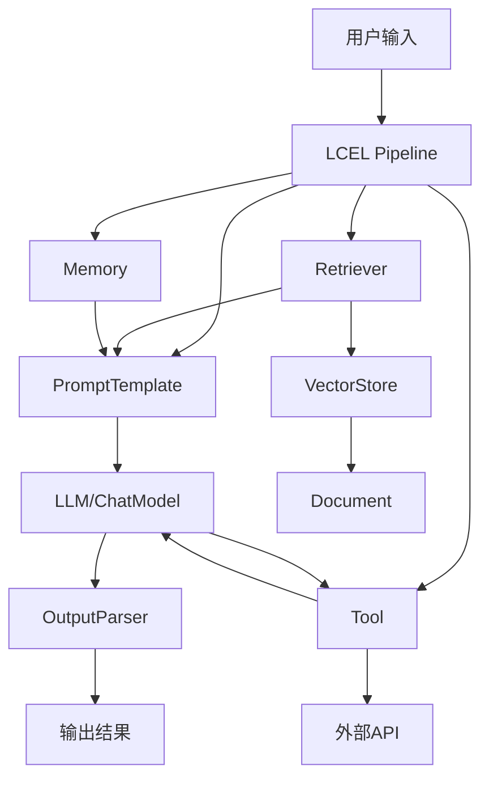
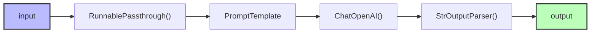
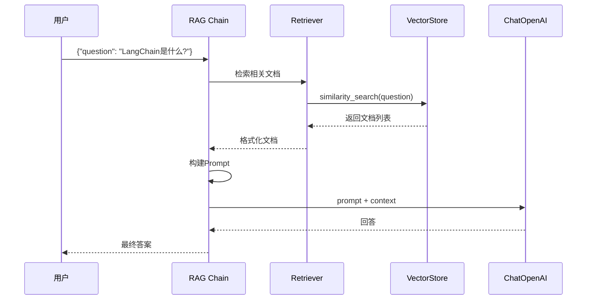
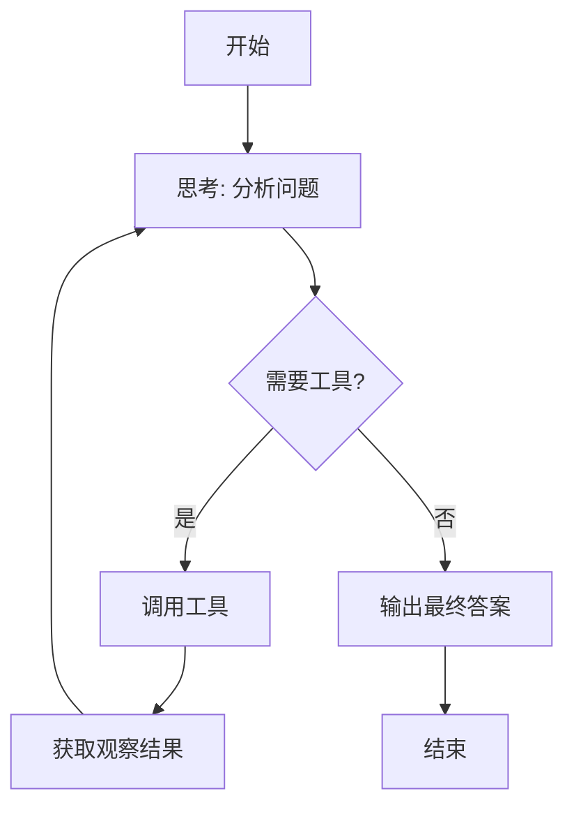
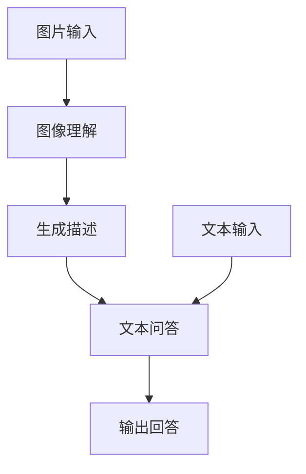

# LangChain LCEL 流程图详解

> 位置: 06-llm/langchain/libs/langchain/langchain/

---

## 一、LCEL架构全景图



## 二、LCEL管道符流程



```python
# LCEL基础示例
from langchain_core.prompts import ChatPromptTemplate
from langchain_core.output_parsers import StrOutputParser
from langchain_openai import ChatOpenAI

prompt = ChatPromptTemplate.from_messages([
    ("system", "你是一个有用的助手"),
    ("user", "{question}")
])

chain = prompt | ChatOpenAI(model="gpt-4o-mini") | StrOutputParser()

# 执行
result = chain.invoke({"question": "Hello!"})
```

## 三、RAG标准流程



```python
# RAG LCEL实现
from langchain_core.runnables import RunnablePassthrough

def format_docs(docs):
    return "\n\n".join(d.page_content for d in docs)

rag_chain = (
    {
        "context": retriever | format_docs,
        "question": RunnablePassthrough()
    }
    | prompt
    | ChatOpenAI()
    | StrOutputParser()
)
```

## 四、Agent ReAct循环



```python
# Agent实现
from langchain.agents import create_openai_tools_agent, AgentExecutor
from langchain.tools import tool

@tool
def search(query: str) -> str:
    """搜索信息"""
    return "搜索结果..."

agent = create_openai_tools_agent(ChatOpenAI(), [search], prompt)
agent_executor = AgentExecutor(agent=agent, tools=[search])

result = agent_executor.invoke({"input": "今天天气怎么样?"})
```

## 五、多模态流程



```python
# 多模态示例
from langchain_core.messages import HumanMessage

message = HumanMessage(
    content=[
        {"type": "text", "text": "描述这张图片:"},
        {"type": "image_url", "image_url": "https://example.com/image.jpg"}
    ]
)

result = ChatOpenAI(model="gpt-4o").invoke([message])
```