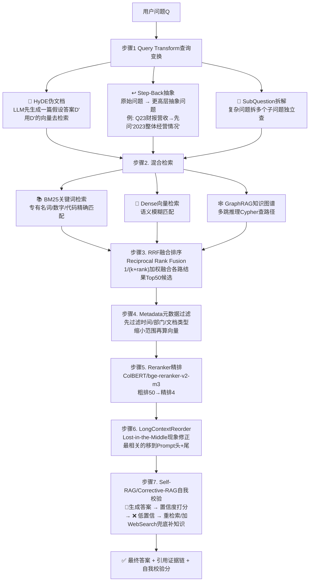
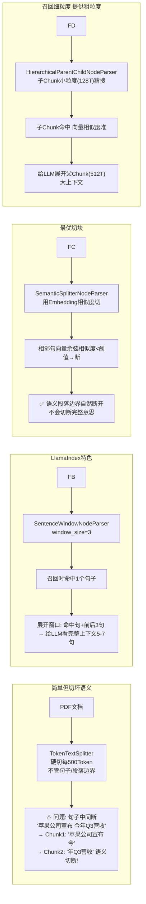
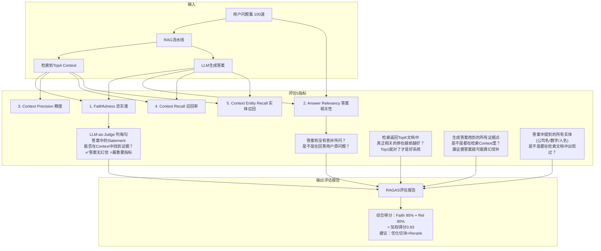
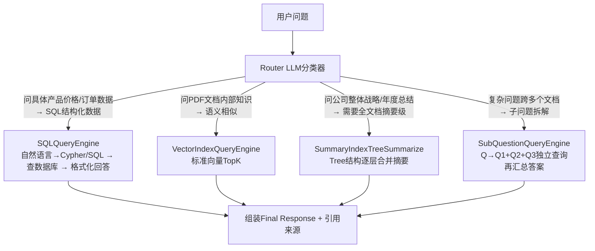
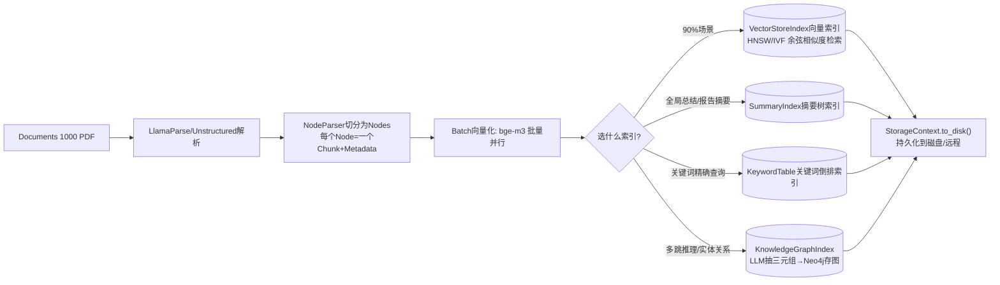

# LlamaIndex RAG流程图详解

> 位置: 06-llm/llama_index/doc/
> 配套文档: LlamaIndex-RAG索引引擎详解.md | LlamaIndex性能优化重难点.md | LlamaIndex面试题汇总.md

---

## 一、Naive-RAG 标准流程图 (三步经典)

```mermaid
flowchart TD
    subgraph Offline离线数据准备
        A1[源数据: PDF/Word/网页/Notion/DB]
        A1 --> A2[SimpleDirectoryReader/Connector 200+种]
        A2 --> A3[切分 Chunking: TokenTextSplitter<br/>默认Chunk=500 Token, 重叠=100]
        A3 --> A4[向量化 Embedding Model<br/>bge-small/text-embedding-3-small]
        A4 --> A5[(VectorStore向量数据库<br/>pgvector/Milvus/Chroma/Weaviate)]
    end

    subgraph Online在线查询
        B1[用户问题Query]
        B1 --> B2[Query也向量化]
        B2 --> B3[向量相似度检索TopK=4<br/>余弦距离/L2内积]
        B3 --> B4[拼Prompt模板<br/>Context: {Top4文档内容}<br/>Query: {用户问题}]
        B4 --> B5[LLM大模型生成答案]
        B5 --> B6[回答用户 + 附引用来源Chunk]
    end

    A5 --> B3
```

---

## 二、Advanced-RAG 七件套全流程优化



---

## 三、切块Chunking算法对比流程



---

## 四、RAGAS质量评估5指标流程



---

## 五、Router Query Engine 路由流程



---

## 六、索引构建全流程

