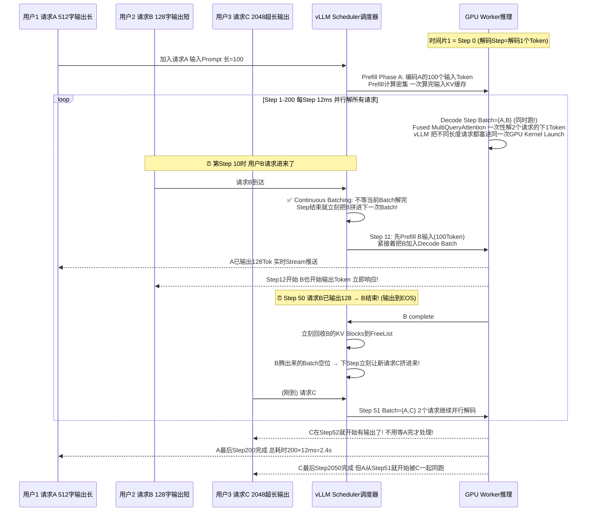
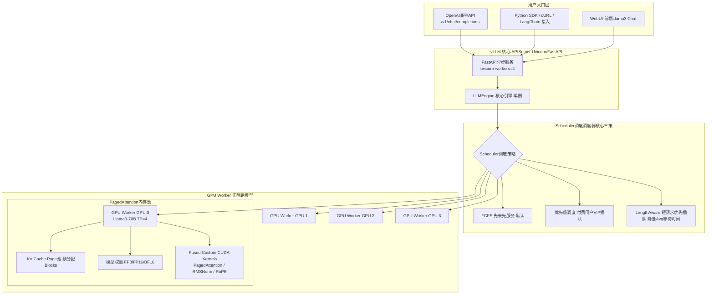
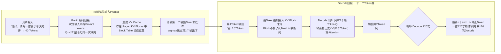
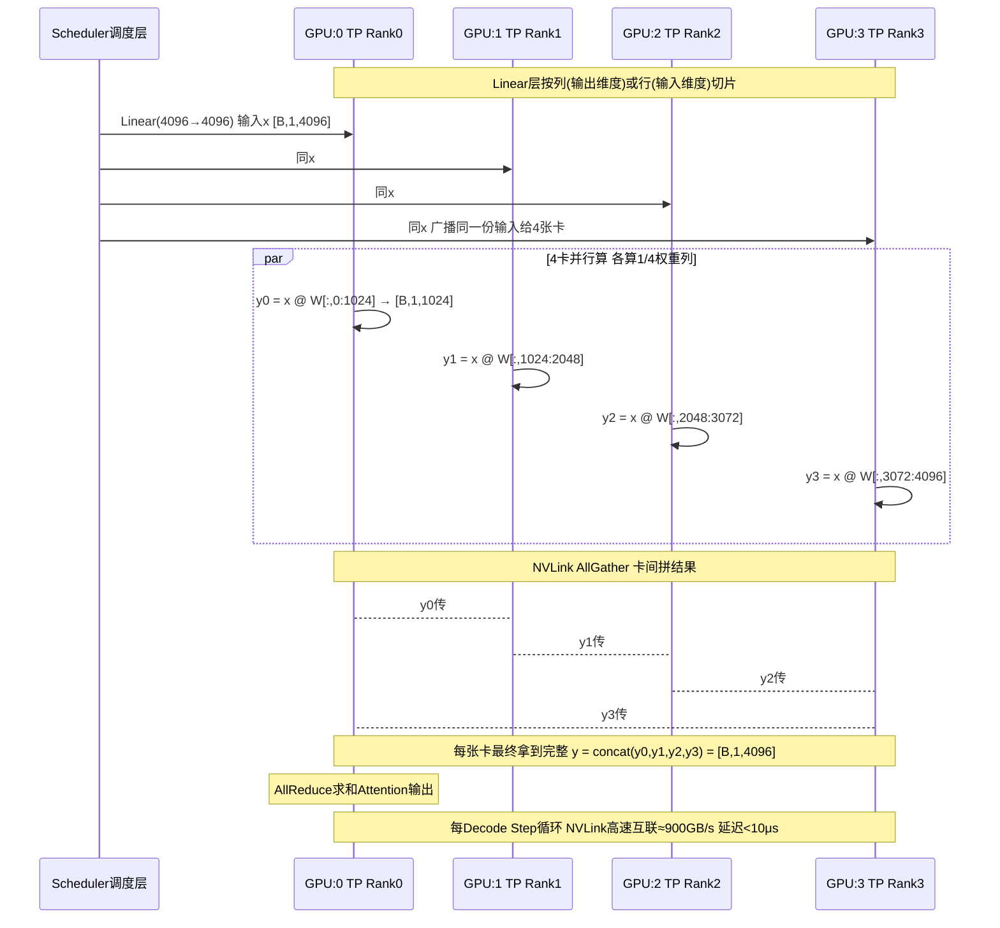

# vLLM 推理引擎流程图详解

> 位置: 06-llm/vllm/doc/
> 配套文档: vLLM高吞吐推理引擎.md | vLLM性能优化重难点.md | vLLM面试题汇总.md

---

## 一、vLLM PagedAttention 核心内存管理流程图

```mermaid
flowchart TD
    subgraph GPU显存问题现状 为什么HuggingFace原生慢
        PROBLEM["传统Transformers推理显存浪费<br/>KV Cache每个请求独立大Tensor<br/>BERT-base seq=4096 显存浪费×4 浪费75%!"]
        PROBLEM --> WHY["问题: 内部碎片! 请求长度差异大<br/>ReqA用200 Token剩下200空着浪费<br/>ReqB 4000Token刚好占满"]
    end

    subgraph 解法: PagedAttention = OS 虚拟内存页机制 翻版
        OS["操作系统虚拟内存页思路<br/>物理内存切4KB固定大小Page<br/>进程逻辑地址空间连续<br/>→ 映射到离散物理Page! 零碎片!"]

        OS --> COPY1["✅ 同样思路应用到LLM KV Cache!"]
        COPY1 --> PAGE["把KV Cache 切成固定大小的 KV Block<br/>每个Block存 K,V tokens=16个"]

        PAGE --> TABLE["🔑 每个Request维护 Block Table 页表<br/>req_id → [Block#3, Block#7, Block#1, Block#5...]<br/>逻辑上连续的tokens → 映射到显存中任意离散物理KV Block!"]
    end

    subgraph 显存池 KV Cache Pool
        POOL["GPU显存初始化时 预先切好<br/>N 个空闲 KV Block 放到 FreeList 链表"]
        FREE[("FreeList空闲链表<br/>[1,2,4,5,6,8,9,...]未用")]
        ALLOC[("已分配<br/>Block#3给Req1<br/>Block#7给Req1...")]
        POOL --> FREE
    end

    subgraph 动态分配回收 无碎片
        REQNEW[新请求来了 256 tokens]
        REQNEW --> NEED["256 / 每Block16 = 需要16个Blocks"]
        NEED --> GET["从FreeList取16个空闲Blocks"]
        FREE -- "取16" --> GET
        GET --> ADD["把Block号填到请求的Block Table页表"]
        ADD --> ALLOC

        COMPLETE["推理完的请求 释放KV占用"]
        COMPLETE --> RETURN["把它的Blocks全还回FreeList链表"]
        RETURN --> FREE
    end

    TABLE --> CALC["⭐Attention计算时<br/>按Block Table查找 拼出完整KV<br/>Block之间可以任意顺序/位置 → 照样正确算Attention!"]
```

---

## 二、Continuous Batching 动态批处理 时序图



---

## 三、vLLM 推理服务端整体架构



---

## 四、Prefill vs Decode 两阶段流水线



---

## 五、张量并行 TP=4 多卡协作时序

