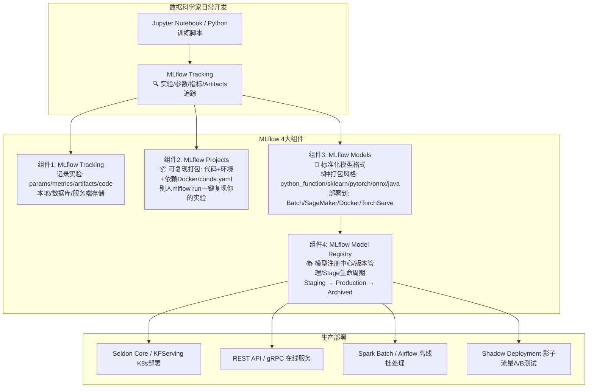
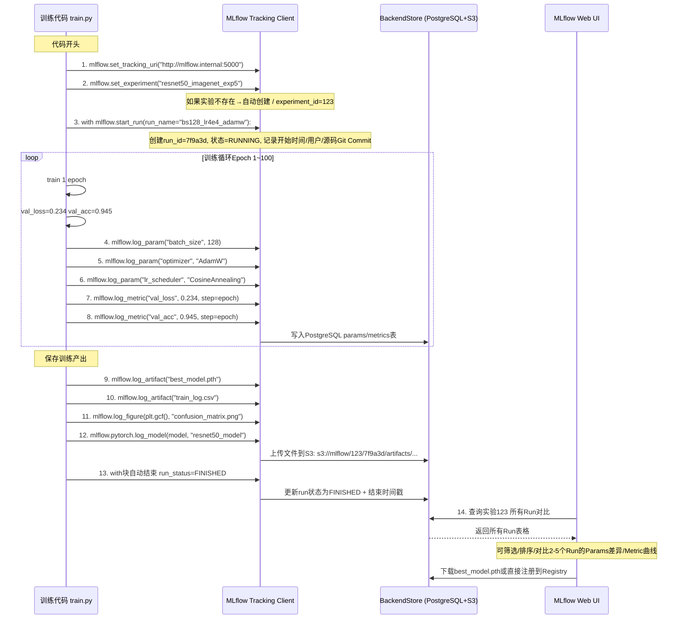
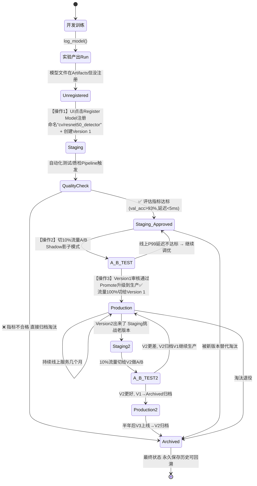
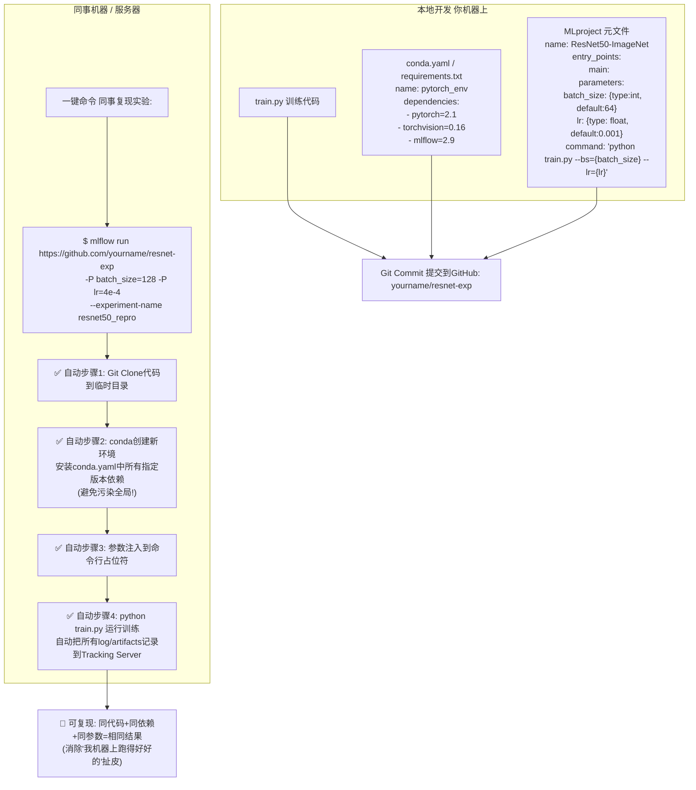
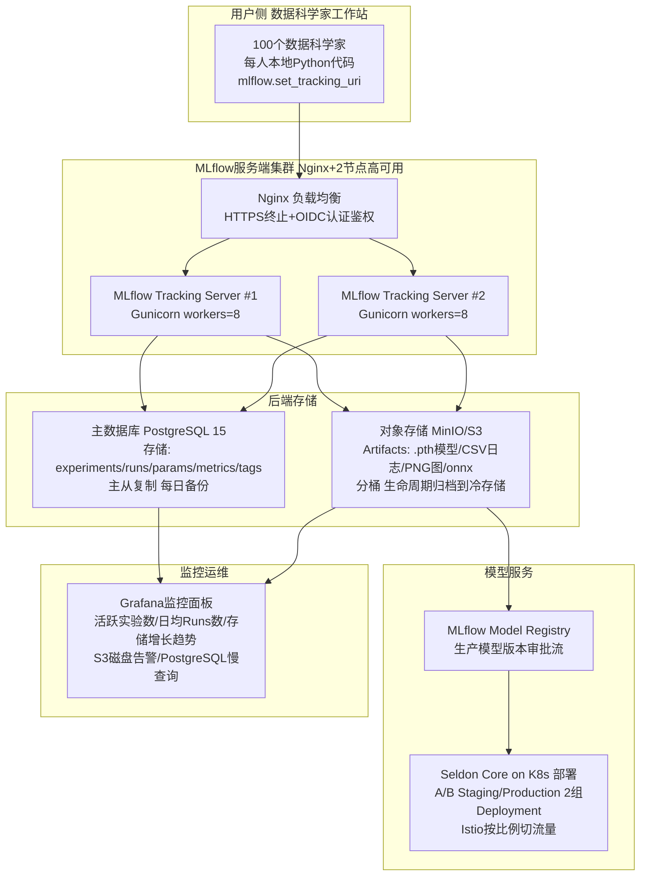
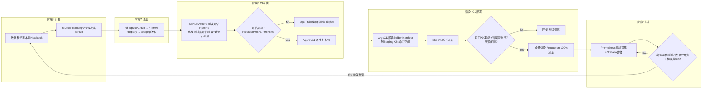

# MLflow 实验追踪与模型管理流程图详解

> 位置: 07-AI项目工程化/mlflow/doc/
> 配套文档: MLflow实验追踪与模型管理.md | MLflow性能优化重难点.md | MLflow面试题汇总.md

---

## 一、MLflow四大组件总览

---

## 二、MLflow Tracking 实验记录完整生命周期

---

## 三、Model Registry 模型注册生命周期状态机

---

## 四、MLflow Projects 可复现实验环境打包流程

---

## 五、部署架构 企业级 Tracking Server + 存储后端

---

## 六、模型从训练到生产的全流水线 CI/CD

