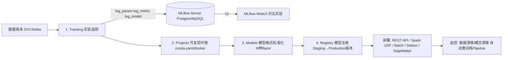

# MLflow MLOps全生命周期解析

> 位置: 08-mlops/mlflow/
> 简历推荐: 4星 | 岗位: MLOps/AI平台工程师

---

## 一、MLflow 四大组件



## 二、代码: 训练+追踪+注册全流程

```python
import mlflow, mlflow.xgboost
from sklearn.metrics import accuracy_score, f1_score, roc_auc_score
import xgboost as xgb

# ===== ① 设置实验 + autolog自动记录 =====
mlflow.set_tracking_uri("http://mlflow.internal:5000")
mlflow.set_experiment("fraud_detection_xgb_v3")
mlflow.xgboost.autolog()   # 自动记: 所有超参 + feature_importance图 + eval曲线!

with mlflow.start_run(run_name="xgb_gridsearch_cv5_depth8_lr0.05") as run:
    # 打标签 方便UI搜索
    mlflow.set_tag("owner", "zhangsan@corp.com")
    mlflow.set_tag("dataset_version", "2024-05-feature-v3")
    mlflow.set_tag("env", "staging")

    # ===== ② 你的训练代码 (不用任何改动!) =====
    X_train, X_test, y_train, y_test = train_test_split(X, y, test_size=0.2)
    params = {"max_depth":8, "learning_rate":0.05, "n_estimators":500, "subsample":0.8}
    model = xgb.XGBClassifier(**params)
    model.fit(X_train, y_train, eval_set=[(X_test, y_test)], verbose=False)

    # ===== ③ 手动记录自定义指标/文件 =====
    y_pred, y_prob = model.predict(X_test), model.predict_proba(X_test)[:,1]
    mlflow.log_metrics({
        "custom_f1_macro": f1_score(y_test, y_pred, average="macro"),
        "custom_auc": roc_auc_score(y_test, y_prob),
        "custom_ks": ks_statistic(y_test, y_prob),
    })
    mlflow.log_params(params)
    mlflow.log_artifact("confusion_matrix.png")      # 图片
    mlflow.log_artifact("src/preprocess.py")         # 代码可复现
    mlflow.log_dict({"feature_names": list(X.columns), "version": "v3.2"}, "meta.json")

    # ===== ④ 注册到Model Registry =====
    logged_model = mlflow.xgboost.log_model(model, artifact_path="xgb-model",
        registered_model_name="fraud-detection-xgb")
    mv = mlflow.register_model(logged_model.model_uri, "fraud-detection-xgb")
    # 版本号自动递增 v1→v2→v3... + Webhook触发CD部署Staging环境

# ===== ⑤ 生产加载Production版本 (一行!) =====
prod = mlflow.pyfunc.load_model("models:/fraud-detection-xgb/Production")
preds = prod.predict(X_new)  # pyfunc接口 不管底层是sklearn/tf/onnx/pytorch都是一样predict
```

## 三、MLflow vs 竞品对比

| 产品 | 开源 | Maturity | 特色 | 适用 |
|-----|------|----------|-----|-----|
| **MLflow** | ✅Apache2 | 极成熟 | 标准化格式+10+模型flavor | 90%公司首推 |
| Kubeflow | ✅Apache2 | 成熟 | K8s原生+Pipeline编排 | 已上K8s大厂 |
| Weights&Biases | ❌商业 | 成熟 | UI美+协作强 | 算法小团队 |
| ClearML | ✅混合 | 成长 | 全栈自托管免费 | 预算有限团队 |
| Neptune.ai | ❌商业 | 成长 | 实验管理优化 | 研究团队 |

## 四、简历黄金句式

| 写法 |
|-----|
| 「搭建MLflow实验追踪平台：5个项目组1200+次实验参数/指标/模型100%可追溯，模型从训练→上线流程从7天→1.5小时，上线事故率↓85%」 |
| 「Airflow + MLflow Registry CI/CD：新模型版本入库→自动Staging验证→A/B灰度10%流量→指标过线自动切Production，全自动无需人工介入」 |
| 「MLflow Model + Seldon Core部署：50+模型在线服务统一标准REST接口，平均上线从3天→15分钟，滚动升级零停机」 |

## 五、面试题

**Q MLflow 7种model flavor区别？pyfunc为什么是万能格式？**
> A: flavor = 模型保存格式。内置: python_function(pyfunc万能) / sklearn / xgboost / lightgbm / pytorch / tensorflow / onnx / llm / transformers 等10+种。pyfunc是万能中间格式：不管底层是什么模型都可包成 predict(input_df) → output的pyfunc接口，生产调用不用管底层，一行load_model通吃。

**Q Model Registry Stage: Staging/Production/Archived流转？**
> A: Staging=准生产测试环境(影子流量/离线评估), Production=生产全量流量, Archived=历史版本归档不在线但保留。流转一般配Webhook: 模型注册→Jenkins跑Staging评估→通过转Production→Archived旧版本+通知+CD部署。

**Q 数据漂移Data Drift/概念漂移Concept Drift怎么结合MLflow监控？**
> A: 线上输入特征分布每周dump→和训练分布做KS检验/Wasserstein距离→超阈值告警→自动触发MLflow Project运行Airflow重训练Pipeline→新模型Staging评估→通过自动灰度→切生产。MLflow Tracking记录每次漂移检测run的漂移分数+证据图。