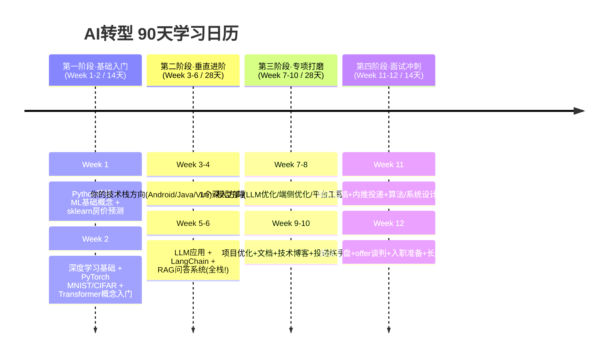

# 🧭 学习路线总览：3个月90天系统化规划

> 配套使用：[每日计划与执行模板](../99-求职辅助/时间规划与每日计划.md)
> 时间分配：工作日 2-3 小时/天，周末 6 小时/天，每周累计 22-28 小时

---

## 📅 整体四阶段规划

---

## 📊 每周详细拆解（高优先级任务 ⭐⭐⭐⭐⭐）

### 🟢 第一阶段：基础入门 (Week 1-2)

> 目标：**建立AI知识框架**，跑通两个完整的小项目。不要纠结数学推导！

| 周数 | 核心任务 | 必须完成 (⭐⭐⭐⭐⭐) | 选做加分 |
|-----|---------|-------------------|---------|
| **Week 1** | Python + 机器学习基础 | 1. Conda环境 + Jupyter配置   2. NumPy 10大操作 + Pandas核心   3. sklearn完成Iris分类+房价预测   4. 理解：过拟合/偏差方差/训练验证测试 | 做一下 pandas_exercises 前20题 |
| **Week 2** | 深度学习 + PyTorch + Transformer | 1. PyTorch 60分钟入门完成   2. 手写MNIST训练到98%+准确率   3. CIFAR-10简单CNN 70%+准确率   4. 理解：Attention公式 + QKV含义 + Transformer架构图 | 画一张 Transformer 架构图，标清每个模块 |

### 🟡 第二阶段：垂直进阶 + LLM (Week 3-6)

> 目标：完成 2-3 个**可以写进简历**的项目。这是最重要的阶段！

| 周数 | 核心任务 | 必须完成 (⭐⭐⭐⭐⭐) | 选做加分 |
|-----|---------|-------------------|---------|
| **Week 3** | 你的垂直方向A (端侧/Java/前端) | 📱 Android: TFLite图像分类App跑通   ☕ Java: Spring Boot + ONNX 推理API   💻 前端: Vue + TF.js 手势识别 Demo | 各方向项目优化：延迟/准确率/UI |
| **Week 4** | 垂直方向B + 模型优化 | 模型量化 INT8 对比实验 (大小/速度/精度)   模型导出 ONNX + 跨框架运行   写第一个"能拿出手"的项目README | CameraX实时视频流/批处理优化 |
| **Week 5** | LLM + LangChain + Prompt工程 | 1. 一个LLM API账号配置好并能调用   2. LangChain LCEL管道会写   3. 理解 Few-shot / CoT 思维链   4. 理解RAG完整流程(文档→向量→检索→回答) | 学一下 PromptPerfect 类的优化方法 |
| **Week 6** | RAG系统全栈项目 ⭐ | **项目：企业知识库RAG问答**   ① PyPDF/Unstructured 文档解析   ② BGE Embedding + FAISS/Qdrant 向量库   ③ LangChain Retrieval 检索链   ④ Vue前端 Chat UI + SSE流式输出 | 加上权重重排序 Cohere/bge-reranker |

### 🔴 第三阶段：专项深入 (Week 7-10)

> 目标：选定一个方向做**差异化竞争力**，把项目打磨到面试水平。

| 周数 | 方向A (LLM应用推荐选) | 方向B (端侧AI推荐选) | 方向C (平台工程推荐选) |
|-----|----------------------|----------------------|----------------------|
| **Week 7** | Agent + LangGraph / AutoGen   Tool Calling + ReAct 模式 | NCNN / MNN 高性能推理框架   Vulkan GPU 加速 | MLflow 实验追踪 + 模型注册   Docker 容器化模型服务 |
| **Week 8** | RAG评估 RAGAS 5指标   高级RAG(HyDE/重排/父文档) | 剪枝/蒸馏/量化 三板斧   自己训一个小模型+量化 | vLLM 推理引擎部署   PagedAttention 原理理解 |
| **Week 9** | 项目优化：加 Feature + 写技术博客   (掘金/知乎/Medium至少1篇) | 优化App：帧跟踪 + 内存泄露 + 耗电   做性能对比Benchmark表格 | 加监控：Prometheus+Grafana   加告警：延迟/错误率阈值告警 |
| **Week 10** | 简历项目包装(STAR+数字)   开始投小公司练手面试 | GitHub README 加截图/GIF动画   10分钟项目Demo录屏 | 自动化CI/CD训练流水线   模拟面试3次 |

### 🔵 第四阶段：面试冲刺 (Week 11-12)

| 周数 | 每天固定任务 | 关键里程碑 |
|-----|------------|-----------|
| **Week 11** | 1. 1-2 道 LeetCode 中等题保持手感   2. 面试题库 5-10 题背诵   3. 投递 5-10 家公司   4. 复盘当天面试不会的知识点 | 简历定稿 + 内推渠道全开   至少 3-5 个面试邀约 |
| **Week 12** | 1. 面试前1小时：刷对应公司面经   2. 面试后：立刻记录+复盘+补知识   3. 手里有2+ offer 开始谈判 | 拿到满意 offer   入职前技术栈预习 |

---

## ⚖️ 时间分配的黄金比例（避免无效学习）

很多同学容易陷入：**看了100小时视频，没写10行代码 = 0效果**

### ✅ 推荐的时间分配（高效学习）

| 学习活动 | 时间占比 | 说明 |
|---------|---------|------|
| 🖥️ **动手写代码 / 跑项目** | **50% ~ 60%** | 最核心！一定要手敲，不要光看教程。教程永远是"会了"，一写就废 |
| 📖 **原理学习（教程/视频/文档）** | **20% ~ 30%** | 不要超过1/3时间，遇到不懂的再回来看原理 |
| 🧪 **Debug / 踩坑 / 优化** | **10% ~ 15%** | 这是你简历上的"亮点"来源（优化了XX性能XX%） |
| ✍️ **记笔记 / 写博客 / 写简历** | **5% ~ 10%** | 防止看完就忘，也是面试准备的一部分 |

### ❌ 避免的无效学习陷阱

1. **视频收藏家陷阱**：收藏了200G课程，从Python到深度学习系统看了3个月，一行代码没写 → 停！
2. **数学原教旨主义**：每遇到公式就卡壳，非要自己推一遍才往下学 → 跳过！先会用再补原理
3. **教程地狱循环**：看完A教程看B教程，每个都从线性回归开始重复 → 做项目！项目中缺什么补什么

---

## 📐 知识掌握程度评估标准

学完每个方向后，可以用以下标准自评：

| 掌握程度 | 标准 | 对应面试水平 |
|---------|------|-------------|
| ⭐ L1 知道 | 听过名字，大概知道干什么用的 | 能答出面试第一问是什么 |
| ⭐⭐ L2 理解 | 能说出核心原理 + 优缺点 + 适用场景 | 能应付常规面试，不会太深入 |
| ⭐⭐⭐ L3 实战 | 自己动手跑过完整Demo/项目，能解决常见报错 | 面试加分项，有项目可聊 |
| ⭐⭐⭐⭐ L4 熟练 | 做过生产级项目，做过优化（性能/准确率） | 简历重点，面试官会深挖 |
| ⭐⭐⭐⭐⭐ L5 精通 | 看过源码，懂内部实现，能改源码解决定制需求 | 大厂P7+，加分题/面委 |

> 🎯 **面试求职目标**：公共基础（01-03）达到 ⭐⭐⭐ L3；你的垂直方向达到 ⭐⭐⭐⭐ L4；其他方向 L1-L2 够应付常规问题即可。

---

## 🎓 毕业标准（3个月后达到即可投递AI岗位）

满足下列 **5条中3条及以上**，就可以放心大胆投递简历了：

- [ ] ✅ 公共基础题（01-03 面试题库）正确率 ≥ 70%
- [ ] ✅ GitHub 上有 ≥ 3 个 AI 相关项目，有完整README和代码
- [ ] ✅ 至少有 1 个项目是全栈或端到端完整实现（有前后端+部署+文档）
- [ ] ✅ 你的垂直方向（04/05/06三选一）面试题库正确率 ≥ 80%
- [ ] ✅ LLM应用方向（07）能独立搭出RAG系统+Agent工具调用

> 不追求完美！先达到这个标准投递面试，面试过程中再查漏补缺比纯学更高效。