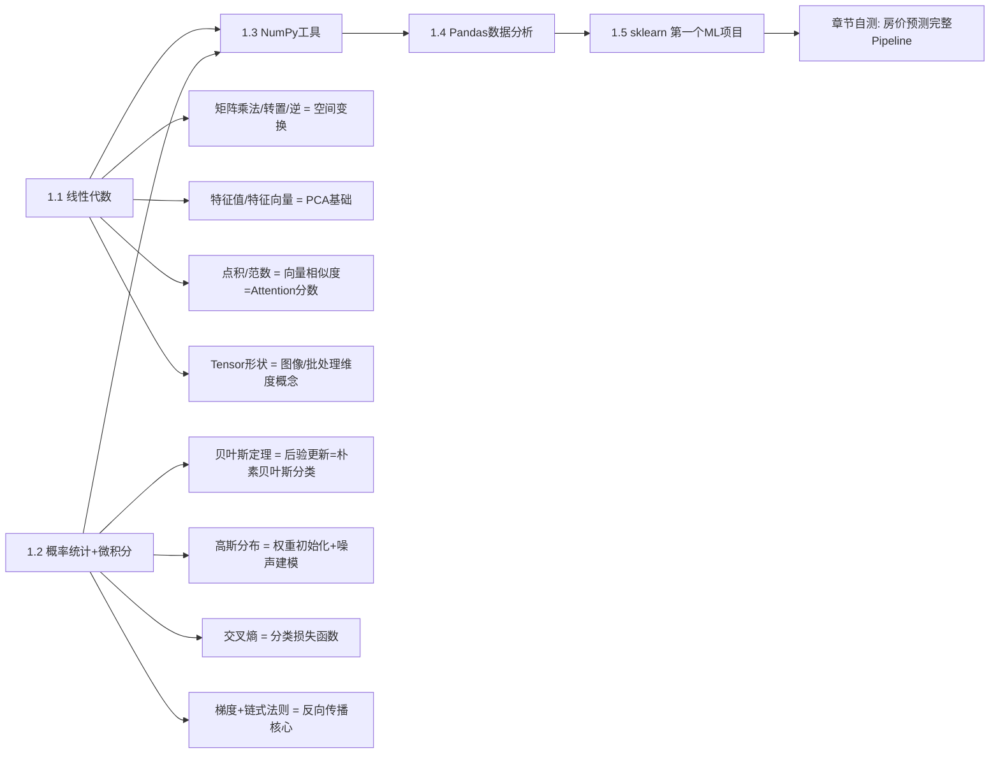

# 🧮 01 - 数学与Python基础 章节导览

> 基础中的基础，所有AI方向都必须学。不要纠结纯数学推导，重点理解**概念含义+代码怎么用**。
> 预计学习周期：2周 (14天) | 目标掌握度：⭐⭐⭐ L3实战级
> 配套项目路径：`../../01-math-python/{项目名}/doc/项目解析.md`

---

## 📚 本章节文件索引

| 文件名 | 内容重点 | 学习优先级 |
|-------|---------|-----------|
| **[README.md](./README.md)** (本文) | 本章学习路线 + 知识点框架 | ⭐⭐⭐ 先读我 |
| **[数学基础核心概念.md](./数学基础核心概念.md)** | 线性代数/概率/微积分 核心概念+直觉理解+与开发结合 | ⭐⭐⭐⭐⭐ 必学 |
| **[Python数据科学工具链.md](./Python数据科学工具链.md)** | NumPy/Pandas/Matplotlib/sklearn 高频操作+代码模板 | ⭐⭐⭐⭐⭐ 必学 |
| **[代码实战示例.md](./代码实战示例.md)** | 从零实现矩阵运算+线性回归+NumPy经典题 | ⭐⭐⭐⭐ 必做 |
| **[面试题库.md](./面试题库.md)** | 本章高频面试题50题+标准答案 | ⭐⭐⭐⭐⭐ 面试前背 |
| **[GitHub项目推荐.md](./GitHub项目推荐.md)** | 5个配套实战项目清单+clone命令+学习路线 | ⭐⭐⭐ 配套做 |

---

## 🧠 知识点学习路线图



---

## ⚡ 高优先级必学知识点（面试80%从这些出）

### ✅ 1. 线性代数（重点是"直觉"，不用行列式展开计算）

| 知识点 | 掌握标准（能回答下面问题就OK） |
|-------|-----------------------------|
| **矩阵乘法** | `(m,n) × (n,p) = (m,p)`。为什么Q·K^T能算注意力分数？因为每行和每列做点积=相似度 |
| **特征值/特征向量** | `Av = λv` 的几何意义：特征向量v经过A变换，方向不变，只缩放λ倍 → PCA找数据主轴 |
| **向量点积/范数** | `a·b = |a||b|cosθ` → θ越小越相似 → Embedding相似度计算的本质 |
| **张量 (Tensor)** | 0维=标量 1维=向量 2维=矩阵 3维=[RGB图] 4维=[Batch图片] → PyTorch shape操作 |

### ✅ 2. 概率统计

| 知识点 | 掌握标准 |
|-------|---------|
| **贝叶斯定理** | `P(A|B) = P(B|A)P(A)/P(B)`：先验+证据→后验。垃圾邮件分类的经典应用 |
| **交叉熵损失** | 为什么分类用CrossEntropy不用MSE？→ 预测准了(0.99)梯度小，预测错(0.01)梯度大，适合分类 |
| **Softmax函数** | `exp(x_i)/Σexp(x_j)` → 把任意实数向量变成概率分布(总和为1)。多分类输出层必用 |

### ✅ 3. 微积分（只需要"梯度"一个概念）

**梯度下降公式（背下来）：**
```
θ_{t+1} = θ_t - η·∇L(θ_t)
参数新值 = 旧值 - 学习率 × 损失对参数的梯度
```

- 梯度 = 指向损失**增加**最快的方向 → 减号就是朝损失**减小**最快方向走
- 学习率η：太大震荡发散，太小收敛慢 → 实际用Adam自适应优化器
- 3种梯度下降：BGD(全样本)/SGD(1个)/Mini-Batch(32~128个小批) **实际只用Mini-Batch**

### ✅ 4. NumPy / Pandas 必会操作（天天写）

**NumPy 高频5条：**
```python
import numpy as np
A = np.random.randn(4, 3)      # 4行3列高斯随机矩阵
B = np.random.randn(3, 5)
C = A @ B                      # 矩阵乘法 (4,3)@(3,5)=(4,5) 等价于 A.dot(B)
A_norm = (A - A.mean()) / A.std()  # 标准化，均值0方差1
A_sorted = np.sort(A, axis=0)  # 按列排序
```

**Pandas 高频5条：**
```python
import pandas as pd
df = pd.read_csv("data.csv")
print(df.isnull().sum())                           # 每列缺失值数量
df['age'] = df['age'].fillna(df['age'].median())   # 中位数填缺失值
df = pd.get_dummies(df, columns=['category'])      # 类别One-Hot编码
grouped = df.groupby('city')['price'].agg(['mean','median','count'])  # 分组聚合
```

---

## 🛠️ 配套项目实战（学完知识点立刻动手）

学完每个知识点马上做对应项目，1小时的项目比看3小时视频有效。

| 项目名 | 路径 | 重点学习内容 | 预计时间 |
|-------|------|-------------|---------|
| **ML-From-Scratch** ⭐⭐⭐⭐⭐ | `../../01-math-python/ML-From-Scratch/` | 纯NumPy手写线性回归/决策树/SVM，**最有效的理解算法方式** | 15h |
| **PythonDataScienceHandbook** | `../../01-math-python/PythonDataScienceHandbook/` | Jake Vanderplas经典教材配套Notebook，NumPy/Pandas/matplotlib完整 | 10h |
| **pandas_exercises** | (参考GitHub项目推荐.md) | 100+真实数据集Pandas练习，从易到难 | 10h |
| **numpy-100** | `../../01-math-python/numpy-100/` | 100道NumPy经典题，社区公认最好 | 5h |
| **algorithms** | `../../01-math-python/algorithms/` | 算法与数据结构，LeetCode题解，转岗算法面试必备 | 20h (碎片化) |

---

## 🎯 章节结业标准（达到就可以进入机器学习）

打✓就算过，不追求满分：

- [ ] ✅ 能手写梯度下降公式，说出3个变体区别
- [ ] ✅ 能解释矩阵乘法和向量点积在神经网络里的**两个应用场景**
- [ ] ✅ NumPy：矩阵乘法/广播/维度变换(reshape/transpose) 不看文档能写
- [ ] ✅ Pandas：读CSV/缺失值处理/One-Hot编码/分组聚合 4个操作熟练
- [ ] ✅ 能用sklearn完成**完整房价预测项目**：数据清洗→特征工程→训练→评估(R²)
- [ ] ✅ 面试题库[基础题部分] 正确率 ≥ 80%

> 💡 不要求的：矩阵行列式手算/特征值手算/微积分极限推导。这些工作中用不到，面试也几乎不会考纯数学计算。能说清**概念+为什么用在AI里**，就足够了。

---

## 🚀 常见学习误区避坑

| ❌ 错误做法 | ✅ 正确做法 |
|-----------|-----------|
| 从头看《线性代数应该这样学》完整教材花20天 | 花2天看完本章节核心概念，直接写代码，缺啥补啥 |
| 每个数学公式都要自己推导一遍才放心 | 记公式的**含义和输入输出关系**，如"交叉熵 = 分类预测好坏的惩罚" |
| 只看Python视频，手不敲代码 | 每个NumPy/Pandas函数亲手跑一遍，改参数看输出变化 |
| 觉得数学基础差就学不了AI | 90%的应用工程师工作中不需要手算数学，用框架自动算 |