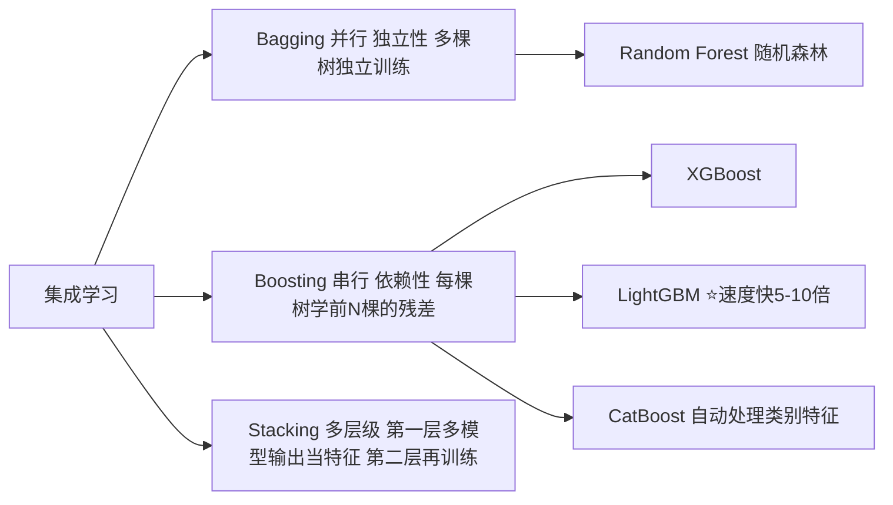

# 🤖 02 - 机器学习基础 - 监督学习算法详解

## 🎯 TOP 5 高频面试算法（按出现频率排序）

```
出现频率：
⭐⭐⭐⭐⭐ 1. XGBoost / LightGBM (工业界表格数据默认首选)
⭐⭐⭐⭐⭐ 2. 决策树 / 随机森林 (所有树模型基础)
⭐⭐⭐⭐  3. 逻辑回归 / 线性回归 (广义线性模型鼻祖)
⭐⭐⭐⭐  4. 支持向量机 SVM (核技巧的代表)
⭐⭐⭐    5. 模型评估指标 (AUC/F1/混淆矩阵 每面必问)
```

---

## 1. 决策树（Decision Tree）= 递归 if-else

**核心思想**：递归按特征阈值拆分数据集，让每个子节点的"纯度"越来越高（同一类/接近的数值占比高）。

### 三种分裂准则对比（面试必背）

| 算法 | 分裂准则公式 | 特点 | sklearn 默认？ |
|------|---------|------|--------------|
| ID3 | 信息增益 = H(parent) - Σ (n_child/n_parent)·H(child) <br>H(p) = -Σ p_i log p_i 熵 | ❌ 只处理离散特征；❌ 偏爱多值特征（选项多的特征看起来增益大） | 否 |
| C4.5 | 信息增益比 = 信息增益 / H_intrinsic <br> H_intrinsic = -Σ (|S_v|/S) log 惩罚多值 | ✅ 二分法处理连续特征；✅ 引入惩罚减少多值特征偏差 | 否 |
| **CART** ⭐⭐⭐⭐⭐ | **分类：Gini系数 G = 1 - Σ p_i²** <br>**回归：MSE均方误差** | ✅ 二叉树，结构统一；✅ 分类+回归都能做；✅ 训练快 | ✅ **sklearn默认实现** |

> 💡 传统开发灵感：**训练好的决策树 = 一堆 if-else 条件语句**。可以直接把sklearn导出的树结构翻译为 Java/Kotlin 的 if-else 链，在端侧零依赖运行，不需要任何推理框架，几微秒出结果！

### ⚠️ 过拟合解决方案（面试直接答3条）
1. **预剪枝（训练中限制）**：限制 `max_depth` 树深度；`min_samples_leaf` 叶子最少样本数；`min_impurity_decrease` 分裂最小增益阈值（更常用，效果好）
2. **后剪枝（训练完剪）**：训练完整树后，从下往上删收益不大的分支（sklearn ccp_alpha参数，实际少用）
3. **集成学习 Bagging**：多棵树集成（随机森林 / XGBoost 自动缓解过拟合）

---

## 2. 集成学习三大框架对比（工业界核心！）



### 🌳 随机森林（Random Forest = Bagging + 决策树）
**训练三随机**：
1. 样本随机：Bootstrap 有放回采样，每次训练样本不同（≈63%原始样本，袋外OOB=37%可当验证集）
2. 特征随机：每次分裂只在 √d（分类）或 d/3（回归）个随机特征子集选最优分裂
3. 分裂阈值随机（极端随机树 ExtraTrees）：不搜阈值直接随机，更抗过拟合更慢

✅ **优点**：多棵树方差抵消→抗过拟合；特征随机抗噪声；可并行训练快；对超参不敏感，不用怎么调。

---

## 3. XGBoost（eXtreme Gradient Boosting）⭐⭐⭐⭐⭐ 面试之王

> 面试答出这 5 个点 = 面试官认为你真的懂。

### 核心优化点（必背5条）

| # | 优化点 | 原理 + 解决什么问题 |
|---|-------|------------------|
| 1 | ⭐**L1 + L2 正则化** | 损失加 Ω(f_t) = γ·T + ½λ·Σ w_j² <br> T=叶子数；w=叶子权重。**防止过拟合独一份**！传统GBDT没有显式正则化，容易学太深。 |
| 2 | ⭐**二阶泰勒展开** | 损失 L(θ + Δθ) ≈ L(θ) + g·Δθ + ½ h·Δθ² <br> g=一阶梯度；h=二阶梯度(Hessian)。✅ 近似更精确，收敛更快，每一步走得更准。 |
| 3 | 近似分裂算法 + 直方图 | 预存每个特征的分位点（bin分桶），不用枚举每个分裂点候选，从O(n)搜→O(bins)≈256次，速度×10。LightGBM直方图差加速再省一半内存。 |
| 4 | 缺失值自动学习默认方向 | 对NaN/稀疏值不做均值填充，在每个节点自动尝试「默认分左/默认分右」取增益大的→天然处理稀疏+缺失，不用预处理。 |
| 5 | 工程优化 | Block分块按列存（适配CPU缓存行，cache-friendly）；多线程并行；分布式训练支持；缓存感知预取。 |

> 💰 **简历写法**：XGBoost 做信贷风控评分卡，引入 L1+L2 正则 + 二阶近似 + 直方图分桶，KS值0.36→0.44，AUC从0.81→0.89，坏账率降低27%

---

## 4. 逻辑回归（Logistic Regression = 线性回归 + Sigmoid）

### ⚠️ 面试高频：为什么"回归"做分类？
逻辑回归实际建模的是**对数几率（log-odds）**：
```
    p         T
ln(———) = w x + b     ← 这部分是线性回归！
   1-p
```
两边取指数，解出 p：
```
          1
p = ———————————— = σ(wᵀx + b)   ← Sigmoid压缩到[0,1]当正类概率
    1 + e^-(wᵀx+b)
```
→ p > 0.5 判正类；否则负类。

### 损失函数 = 交叉熵（负对数似然）
```
L = -(1/n) Σ [y log ŷ + (1-y) log (1-ŷ)]
```
y=1时只有 -log ŷ项：预测p越接近1损失越小；y=0时只有 -log(1-ŷ)项 → 物理意义明确。

> ✅ 传统开发友好：训练后就是一个权重向量w + 偏置b，**Java端推理一行代码**：`p = sigmoid(w · x + b)`，没有任何依赖，纳秒级完成。

---

## 5. SVM 支持向量机（核技巧的代表作）

**核心思想**：找到一个"超平面"让正负类的**几何间隔最大**。只有离超平面最近的几个样本（**支持向量 Support Vectors**）才决定超平面位置 → 其他样本根本不影响！

### 核函数 Kernel Trick（魔法操作）
**低维线性不可分** → 先把x映射到高维 φ(x) → **高维空间中线性可分了**！
```
直接算 φ(x)·φ(z) 太贵，✅ 用核函数 K(x,z) 替代，结果严格相等但算得飞快！
```

| 核函数 | K(x,z) = | 适用场景 |
|-------|---------|---------|
| 线性核 ⭐默认首选 | xᵀz | 特征多文本分类、高维稀疏，快+不容易过拟合 |
| RBF高斯核 ⭐最常用非线性 | exp(-γ·‖x-z‖²) | 中低维非线性强，默认γ=1/d_features试起 |
| 多项式核 | (γxᵀz + r)^d | 图像处理，有空间局部相关 |

> 💡 **核 vs 深度学习**：核是人工"升维"+线性；深度学习是自动学多层非线性表示。**小数据表格SVM+核依然能打，大数据复杂任务深度学习完胜。**

---

## 6. 模型评估指标（每面都问！表格数据+分类必背）

### ⚠️ 混淆矩阵（二分类基础）
|              | 预测=正类 | 预测=负类 |
|-------------|---------|---------|
| **真实=正类** | ✅ TP 真阳性（诊断出了有病） | ❌ FN 假阴性（有病漏诊！成本最高） |
| **真实=负类** | ❌ FP 假阳性（没病说有，虚惊） | ✅ TN 真阴性 |

### 指标公式速查 + 业务直觉

| 指标 | 公式 | 越高越好？ | 业务场景对应 |
|-----|------|---------|-----------|
| **准确率 Accuracy** | (TP+TN) / 全体 | ⚠️样本不平衡没用！ | 分类均衡如MNIST手写数字 |
| ⭐**精确率 Precision** | TP / (TP+FP) = "预测为正的里面，真的正比例" | ✅ | 搜索推荐：错推荐1个用户体验差→P要高；风控误杀好客户拒贷 |
| ⭐**召回率 Recall / Sensitivity / TPR** | TP / (TP+FN) = "所有真的正类里，被抓到了多少" | ✅ | 癌症筛查/欺诈检测：宁可错杀1000不可放过1个→R要高 |
| ⭐**F1分数** | 2·P·R / (P+R) = 调和平均 | ✅ | P和R都重要时综合评估；Kaggle分类常用 |
| ⭐⭐⭐**AUC-ROC** (面试第一问) | 「随机抽1个正1个负样本，正样本预测分数>负样本」的概率，值域[0.5, 1] | ✅ | ✅ **不受阈值影响、抗样本不平衡**！表格数据分类的黄金指标。AUC>0.7可用；>0.85优秀；>0.95非常好。 |
| **KS 值 (风控**)** | max(TPR - FPR) | ✅ 越大区分度越好 | 信贷风控评分卡：KS>0.3 及格，>0.4 优秀 |
| **MAE 回归** | (1/n)Σ\|ŷ-y\| | 越小越好 | 鲁棒，对异常值不敏感 |
| **RMSE 回归** | √((1/n)Σ(ŷ-y)²) | 越小越好 | 对大误差惩罚重（平方），业务上更关注大错用它 |
| **R² 决定系数** | 1 - SS_res / SS_tot | ✅ 接近1越好 | 线性回归拟合优度，1=完美，<0=还不如用均值预测 |

### ⚠️ 致命陷阱：样本不平衡！
比如 99% 正常用户，1% 欺诈。模型"全部预测正常"：
- Accuracy = 99% 看起来巨好 ✅
- 但 Recall 抓欺诈 = 0% 完全没用 ❌！
→ **不平衡场景一律看 AUC / Recall / F1，绝对不能只看 Accuracy！**

---

## 7. 特征工程 = 80% 的模型性能（数据科学家格言）

### 数值特征处理4板斧
| 方法 | 公式 | 用在哪 |
|-----|------|-------|
| Min-Max归一化 | (x-min)/(max-min) → [0,1] | SVM/KNN/NN距离敏感/输入要0-1时；⚠️被outlier拉歪 |
| Z-score标准化 ⭐首选 | (x-μ)/σ → 均值0方差1 | 逻辑回归/线性SVM假设正态；✅鲁棒不那么容易被outlier搞 |
| 对数变换 log(x+1) | 长尾收入/点击量→近似正态 | 右偏分布（大量小值+少量大值） |
| 分箱/离散化 pd.cut(qcut) | 连续→10个分桶 | 引入非线性，增强树模型效果 |

### 类别特征编码对比（高基数=类别数多时）
| 编码方式 | 原理 | ⚠️ 高基数问题？ |
|---------|------|--------------|
| One-Hot ⭐最常用 | 每个类别一列0/1 | ❌ 10万邮编→维度爆炸！别用 |
| Label Encoding | 0,1,2,...N-1 整数 | ✅ 维度不变；❌ 引入假序"邮编0<邮编1"→树模型可，LR不行 |
| ⭐**Target Encoding (工业界首选)** | 每个类别→该类样本目标均值（如 北京_平均收入=18K） | ✅ 1列搞定；⚠️ **容易泄漏！必须KFold交叉验证逐折编码** |
| Frequency / Count Encoding | 类别→出现次数/频率 | 简单快，当频率和目标相关时效果好 |

> 🏆 **Target Encoding K折CV正确写法（不泄漏）**：
> 5折KFold → 每折：用训练4折的groupby均值 → 映射到验证1折。绝对不能全量数据算均值然后映射回自己（标签泄漏，AUC虚高上线崩）。