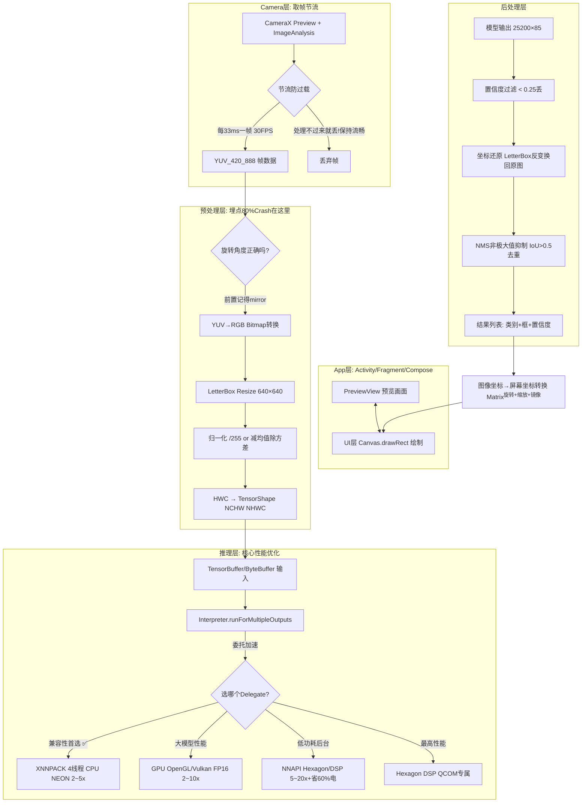

# 📱 04 - Android端侧AI开发 章节导览

> **垂直方向推荐度：⭐⭐⭐⭐⭐** (如果你的原有技术栈是Android，这是你和纯算法候选人竞争的差异化超级武器)
> 预计学习周期：2周 (14天) | 目标掌握度：⭐⭐⭐⭐ L4熟练级
> 配套项目路径：`../../04-android-ai/tensorflow-examples/` / `mlkit/` / `ncnn-android-yolov5/`

---

## 📚 本章节文件索引

| 文件名 | 核心内容 | 优先级 |
|-------|---------|--------|
| **README.md** (本文) | 技术全景+选型指南+性能优化路线 | ⭐⭐⭐ 先读 |
| **TFLite基础与使用.md** | Interpreter / Options / 4种Delegate性能对比表 | ⭐⭐⭐⭐⭐ 必学 |
| **ML Kit开箱即用方案.md** | 5行代码实现：人脸/OCR/条码/姿态/人体分割 | ⭐⭐⭐⭐ 快速上项目 |
| **NCNN高性能推理.md** | NDK C++ Vulkan/INT8量化/算子融合/Winograd加速 | ⭐⭐⭐⭐ 极致性能 |
| **端侧模型优化技术.md** | 三板斧：INT8量化+结构化剪枝+知识蒸馏 ⭐面试必考 | ⭐⭐⭐⭐⭐ 必学 |
| **实时相机处理架构.md** | CameraX YUV流转 + 帧节流 + 坐标转换矩阵(80%坑在这里) | ⭐⭐⭐⭐⭐ 项目必看 |
| **代码实战.md** | 4个完整Kotlin代码：图像分类/实时检测/人脸网格/OCR | ⭐⭐⭐⭐ 必做 |
| **面试题库.md** | 60道端侧AI面试题+标准答案 | ⭐⭐⭐⭐⭐ 必背 |
| **GitHub项目推荐.md** | 3个已下载项目 + 5个额外优质开源项目 | ⭐⭐⭐ 参考 |

---

## 🏗️ 端侧AI架构全景图



---

## ⚡ 性能优化 7招 (面试官一条条问你做了几个)

| # | 优化手段 | 原理 | 效果提升 | 实现复杂度 | 必做？ |
|---|---------|------|---------|-----------|--------|
| 1 | **Delegate 选对** | XNNPACK/GPU/NNAPI把算子下放到硬件加速 | 2~20×速度 | 一行配置addDelegate() | ✅ 必做 |
| 2 | **INT8 量化** | Float32权重→INT8：模型÷4 速度×2~4 | 4×内存+2.5×速度 | 用TFLite Model Optimizer 10行Python | ✅ 必做 |
| 3 | **帧节流 Throttle** | 相机30帧，但处理不过来就丢，不排队卡UI | 不卡顿+不发烫 | 时间戳比较 lastProcessTimeMs < 30ms就跳过 | ✅ 必做 |
| 4 | **预处理在C++做** | Kotlin/Java Bitmap处理慢10倍，NDK里libyuv/libjpeg-turbo | 预处理速度×5~10 | CMake加libyuv依赖，jni方法 | ⭐ 进阶做 |
| 5 | **算子融合+Fuse** | Conv+BN+ReLU合成一个算子，省中间内存读写 | 快10~20% | tflite/onnx optimize工具自动做 | ✅ 必做 |
| 6 | **零拷贝 BufferHandle** | AHardwareBuffer 图形缓冲区直接传GPU，不CPU拷贝 | 大输入图像×2~3 | setUseBufferHandle(true) Android 8.0+ | ⭐ 进阶做 |
| 7 | **模型结构改** | 换MobileNetV3/EfficientNet-Lite，不用ResNet50 | 同精度快5~10× | 重新训练/换预训练权重 | ✅ 先选对模型 |

---

## 📊 Delegate性能对比 (面试时掏出这个表 = 过)

| Delegate | 硬件 | 加速比 | 适用场景 | 坑/注意 |
|---------|------|--------|---------|---------|
| **XNNPACK (默认)** ⭐⭐⭐⭐⭐ | CPU ARM NEON | 2~5× vs 单线程 | 小模型+兼容性最高+所有机型 | 几乎无坑！生产首选 |
| GPU (OpenGL ES / Vulkan) | Mali/Adreno GPU | 2~10× | CNN大模型/图片≥512尺寸 | 部分算子不支持→自动fallback；Adreno驱动bug多机型黑名单 |
| **NNAPI HAL 3+** ⭐⭐⭐⭐ | 厂商NPU: 高通Hexagon/联发科APU/华为达芬奇 | 5~20× + 省电**60%+** | **后台长期运行/监控类App**（老人跌倒检测/睡眠监测） | Android 10+ (API 29)，各厂商实现千差万别，一定要加黑名单降级 |
| Hexagon DSP (直接绑定) | 高通骁龙DSP V66+ | 6~15× + 最省电 | 高通机型占比70%+国内市场 | `libhexagon_interface.so` 要打包进apk，增加200KB |

> 💡 生产最佳实践：**三级降级策略** → 先尝试NNAPI失败→降级GPU又失败→最终Fallback到XNNPACK兜底。**永远不要让用户崩溃！**

---

## 🔥 三大框架选型决策树

```
你要做的功能:
├─► 是 通用功能(人脸/OCR/条码/姿态/分割)?
│     └─ ✅ 用 ML Kit (5行代码搞定 不用训模型 Google兜底)
│
├─► 否, 是 自定义模型(TFLite格式)？
│     ├─ 要简单+跨平台+官方支持
│     │     └─ ✅ TensorFlow Lite (80%常规场景首选)
│     │
│     └─ 要 极致性能/包体极小(<2MB)/国内无GMS
│           ├─ 腾讯系/视频流/实时
│           │     └─ ✅ NCNN Vulkan支持最好
│           │
│           └─ 阿里系/端侧还要微调训练
│                 └─ ✅ MNN
│
└─► 否, 是 PyTorch训练的模型不想转TFLite
      └─ ✅ PyTorch Mobile (Facebook官方，包体略大)
```

---

## 🛠️ 30行Kotlin代码 = TFLite图像分类 (复制能跑)

```kotlin
// build.gradle (Module level)
dependencies {
    implementation 'org.tensorflow:tensorflow-lite:2.16.1'
    implementation 'org.tensorflow:tensorflow-lite-support:0.4.4'       // 自动预处理！
    implementation 'org.tensorflow:tensorflow-lite-xnnpack:2.16.1'     // XNNPACK delegate
    implementation 'org.tensorflow:tensorflow-lite-gpu:2.16.1'         // GPU delegate
}
// assets/ 下放 mobilenet_v2.tflite + labels.txt (1000类名一行一个)

class ImageClassifier(context: Context) {
    // 1. 初始化 Interpreter + Options ⭐ 配置决定性能
    private val modelFile = FileUtil.loadMappedFile(context, "mobilenet_v2.tflite")
    private val options = Interpreter.Options().apply {
        setNumThreads(Runtime.getRuntime().availableProcessors() / 2)  // 大核数！不要写满(发热)
        setUseXNNPACK(true)
        runCatching { addDelegate(GpuDelegate(GpuDelegate.Options()
            .setPrecisionLossAllowed(true)
            .setInferencePreference(INFERENCE_PREFERENCE_SUSTAINED_SPEED))) }
        setAllowFp16PrecisionForFp32(true)
    }
    private val tflite = Interpreter(modelFile, options)
    private val labels = FileUtil.loadLabels(context, "labels.txt")

    // 2. 预处理 Processor (自动Resize/Normalize 不用自己写)
    private val processor = ImageProcessor.Builder()
        .add(ResizeOp(224, 224, ResizeOp.ResizeMethod.BILINEAR))
        .add(NormalizeOp(floatArrayOf(127.5f,127.5f,127.5f), floatArrayOf(127.5f,127.5f,127.5f)))
        .build()

    // 3. 推理 + 后处理 Top5结果
    fun classify(bitmap: Bitmap): List<Pair<String, Float>> {
        var image = TensorImage(DataType.FLOAT32).apply { load(bitmap) }
        image = processor.process(image)
        val output = TensorBuffer.createFixedSize(intArrayOf(1, 1001), DataType.FLOAT32)
        tflite.run(image.buffer, output.buffer)  // 实际推理！
        return TensorLabel(labels, output).mapWithFloatValue
            .toList().sortedByDescending { it.second }.take(5)
    }

    fun close() = tflite.close()
}
```

---

## 🎯 配套项目实战

| 项目 | 路径 | 重点学习内容 | 时间 |
|-----|------|-------------|------|
| **tensorflow-examples TFLite** ⭐⭐⭐⭐⭐ | `../../04-android-ai/tensorflow-examples/lite/examples/` | image_classification / object_detection / pose_estimation 三个完整项目 | 15h |
| **ML Kit** ⭐⭐⭐⭐ | `../../04-android-ai/mlkit/android/` | 5行代码：468点人脸网格/中文OCR/条码/姿态/自拍抠图 | 8h |
| **ncnn-android-yolov5** ⭐⭐⭐⭐ | `../../04-android-ai/ncnn-android-yolov5/` | NDK C++ 三阶段代码：LetterBox → ncnn Extractor(Vulkan) → NMS | 12h |

---

## ✅ 章节结业标准

- [ ] 能回答4种Delegate的选型对比表和各自坑
- [ ] 能说出INT8 PTQ vs QAT的区别，校准数据集要多少张什么样的图
- [ ] 能解释CameraX ImageAnalysis节流怎么做，为什么不能排队处理
- [ ] 能写出图像→模型→结果的完整Pipeline，尤其注意**旋转角度**和**坐标转换**两坑
- [ ] 能独立完成一个实时物体检测Android App，30FPS不卡顿
- [ ] 面试题库正确率 ≥ 75%