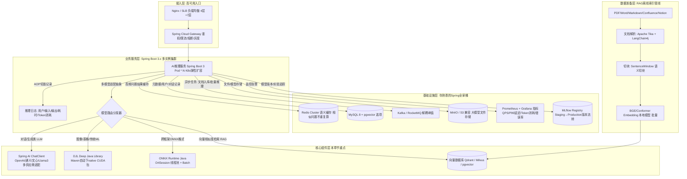

# ☕ 05 - Java后端AI服务 章节导览

> **垂直方向推荐度：⭐⭐⭐⭐⭐** (Java后端庞大存量市场 + AI服务化需求爆发，岗位数量最多)
> 预计学习周期：2.5周 (17天) | 目标掌握度：⭐⭐⭐⭐ L4熟练级
> 配套项目路径：`../../05-java-ai/spring-ai/` / `djl-demo/`

---

## 📚 本章节文件索引

| 文件名 | 内容 | 优先级 |
|-------|------|--------|
| **README.md** (本文) | 架构全景+选型指南+性能优化 | ⭐⭐⭐ 先读 |
| **Spring AI深度实战.md** ⭐⭐⭐⭐⭐ | ChatClient/RAG/Function Calling/Prompt/LLM供应商抽象 (Spring官方) | ⭐⭐⭐⭐⭐ 必学 |
| **DJL Java推理框架.md** | 亚马逊开源，Maven加依赖就能跑PyTorch/CUDA模型 不用JNI！ | ⭐⭐⭐⭐⭐ 必学 |
| **ONNX Runtime Java.md** | C++原生绑定高性能 + 跨框架(PyTorch/TF/sklearn通吃) | ⭐⭐⭐⭐ 性能需求高选 |
| **向量数据库与RAG架构.md** | Qdrant/Milvus/pgvector选型 + HNSW索引原理 + RAG服务化设计 | ⭐⭐⭐⭐⭐ 企业级必做 |
| **代码实战.md** | Spring Boot + RAG问答系统 完整项目代码 复制能跑 | ⭐⭐⭐⭐ 必做 |
| **面试题库.md** | 70道Java AI后端面试题+标准答案 | ⭐⭐⭐⭐⭐ 必背 |
| **GitHub项目推荐.md** | Spring AI/DJL/LangChain4j等核心项目源码阅读路线 | ⭐⭐⭐ 参考 |

---

## 🏗️ Java AI 服务通用架构 (生产级)



---

## 🥊 Java AI 三架马车选型对照 (面试选型题必出)

| 选型维度 | **Spring AI** ⭐⭐⭐⭐⭐ | **DJL 亚马逊** ⭐⭐⭐⭐ | **ONNX Runtime Java** ⭐⭐⭐⭐ |
|---------|---------------------|----------------------|---------------------------|
| **最佳适用场景** | **LLM大模型应用 (RAG/Agent/Chat)** | 部署PyTorch训练的CV/NLP模型 (ResNet/BERT/YOLO) | 跨框架任意模型 极致推理性能要求 |
| **底层支持模型** | Chat Completion API (任何LLM供应商) | PyTorch / TensorFlow / MXNet / ONNX 多Engine | 只要能导出ONNX格式 = 100%支持 |
| **Spring Boot集成** | ✅ 官方@Bean自动装配 starter | ✅ 自己写@Configuration封装 | ✅ 自己写Configuration，灵活性高 |
| **GPU/CUDA支持** | 取决于LLM供应商(云端GPU) | ✅ Maven加`pytorch-engine-cu121` 自动下载1.8G CUDA包 零配置 | ✅ `com.microsoft.onnxruntime:onnxruntime-gpu` |
| **安装部署复杂度** | 极低！1个starter就搞定 | 中。大模型第一次启动下载native包几分钟 | 低。但CUDA包要自己确认版本匹配 |
| **生产稳定性** | 极高(Spring官方维护) | 高(亚马逊AWS内部用) | 极高(微软维护) |
| **典型简历项目** | RAG企业知识库问答 / AI客服Agent | YOLO商品质检 / 内容审核图像分类 | XGBoost风控模型 + ONNX推理高并发 |
| **学习曲线** | ⭐ 最平 2天上手 | ⭐⭐⭐ 中等 1周上手 | ⭐⭐⭐⭐ 高 需要懂Session线程安全 |

> 💡 **岗位推荐搭配**：
> LLM应用工程师 = **Spring AI 80% + (Qdrant + LangChain4j) 20%**
> AI平台/推理优化工程师 = **DJL 40% + ONNX Runtime 40% + Spring Boot封装20%**
> 简历两个都写 = 通吃

---

## ⚡ Java AI性能优化8招 (面试官逐条问)

| # | 优化手段 | 原理 | 效果提升 | 代码示例 |
|---|---------|------|---------|---------|
| 1 | **Predictor池化** | DJL Predictor / ONNX Session不是线程安全的！不要每次new (创建成本×100) | 吞吐量×5~10 | `ThreadLocal<Predictor>` 或 Apache GenericObjectPool |
| 2 | **Batch推理 攒批** | GPU一次算8张图 比8次单张快3~5倍。排队毫秒窗口攒小批量 | GPU吞吐×3~5 | `LinkedBlockingQueue` + 定时线程 10ms窗口满8条就推理 |
| 3 | **多线程并行** | OrtSessionOptions.setIntraOpNumThreads(CPU大核数) | 单请求延迟÷2~4 | `options.setIntraOpNumThreads(8)` |
| 4 | **结果语义缓存** | 相似问题Embedding余弦相似度>0.98直接返回缓存结果 不重复调用LLM | Token成本↓70% | Redis存Vector+结果，ANN检索缓存 |
| 5 | **选择正确的量化** | Float32→FP16(快×1.5)/INT8(快×2~4) 精度几乎不降 | 延迟÷3 显存÷4 | DJL: optEngineOptions("torch量化") ORT: save_quantized |
| 6 | **Direct Buffer堆外** | 输入输出用ByteBuffer.allocateDirect() 不经过JVM GC→少拷贝 | 延迟↓20% Full GC↓80% | 大Tensor必须用堆外内存 |
| 7 | **多模型串行流水线** | Disruptor LMAX无锁队列 分阶段(预处理→推理→后处理) | 高并发稳定性↑N倍 | 不要一个请求一个线程一把梭 |
| 8 | **K8s HPA弹性扩缩** | GPU节点池基于QPS/平均延迟，高峰期自动加Pod | 成本↓50% 峰值不崩 | KEDA基于Prometheus自定义指标扩缩 |

---

## 🧪 50行代码 = Spring Boot + Spring AI RAG系统 (抄到你项目里)

```java
// pom.xml spring-boot-starter-parent 3.2+
<dependencies>
    <dependency>
        <groupId>org.springframework.ai</groupId>
        <artifactId>spring-ai-starter-openai</artifactId>  <!-- 或通义/qwen -->
    </dependency>
    <dependency>
        <groupId>org.springframework.ai</groupId>
        <artifactId>spring-ai-pgvector-store-spring-boot-starter</artifactId>
    </dependency>
    <dependency>
        <groupId>org.springframework.boot</groupId>
        <artifactId>spring-boot-starter-webflux</artifactId>  <!-- SSE流式必须webflux -->
    </dependency>
</dependencies>

// application.yml
spring:
  ai:
    openai:
      api-key: ${OPENAI_API_KEY:sk-xxx}
      chat: options: model: gpt-4o-mini, temperature: 0.1
    vectorstore:
      pgvector:
        index-type: HNSW
        dimensions: 1536

// ===== 核心服务 RAGService =====
@Service
public class RagService {
    private final VectorStore vectorStore;
    private final ChatClient chatClient;

    public RagService(VectorStore vs, ChatClient.Builder b) {
        this.vectorStore = vs;
        this.chatClient = b.defaultSystem("""
            你是企业知识库助手。请严格基于以下Context资料回答,不知道就说"资料不足":
            {context}
            """).build();
    }

    // 1. 文档入库接口: PDF→切块→Embedding→PGVector
    @Transactional
    public void ingestPdf(String path) throws IOException {
        var docs = new TokenTextSplitter(600, 80).apply(
            new PagePdfDocumentReader(path).read()
        );
        vectorStore.add(docs);  // 自动向量化+HNSW索引建立
    }

    // 2. 普通问答
    public String answer(String q) {
        var relDocs = vectorStore.similaritySearch(
            SearchRequest.query(q).withTopK(5).withSimilarityThreshold(0.7));
        String context = relDocs.stream().map(Document::getContent)
            .collect(Collectors.joining("\n---\n"));
        return chatClient.prompt()
            .system(s -> s.param("context", context))
            .user(q).call().content();
    }

    // 3. ⭐流式SSE 打字机效果 (前端必备,否则等5秒用户跑了)
    public Flux<String> answerStream(String q) {
        var relDocs = vectorStore.similaritySearch(SearchRequest.query(q).withTopK(5));
        String context = relDocs.stream().map(Document::getContent)
            .collect(Collectors.joining("\n---\n"));
        return chatClient.prompt()
            .system(s -> s.param("context", context))
            .user(q).stream().content();  // 直接返回Flux<String> = 流式SSE
    }
}

// Controller层 SSE流式端点
@RestController @RequestMapping("/api/ai")
public class RagController {
    @GetMapping(value = "/chat/stream", produces = MediaType.TEXT_EVENT_STREAM_VALUE)
    public Flux<String> chatStream(@RequestParam String q) {
        return ragService.answerStream(q);
    }
}
```

---

## 🎯 配套项目 + 结业标准

| 项目 | 路径 | 必看 | 耗时 |
|-----|------|------|------|
| **Spring AI** ⭐⭐⭐⭐⭐ | `../../05-java-ai/spring-ai/` | `RagService.java` + ChatClient + Function Calling示例 | 15h |
| **djl-demo** ⭐⭐⭐⭐ | `../../05-java-ai/djl-demo/` | `DjlConfig.java` 单例ZooModel + Predictor池化 + ResNet推理 | 10h |
| **LangChain4j** (参考) | GitHub langchain4j | AiServices接口 + Tools + ChatMemory | 8h |

✅ 章节结业 (8/10过)：
- [ ] 能说出Spring AI vs DJL vs ONNX Runtime三者选型场景
- [ ] 能写出Predictor为什么不是线程安全 + 怎么池化
- [ ] 能独立搭出Spring AI RAG系统：PDF入库 + 检索 + SSE流式输出
- [ ] 能解释Batch攒批 + Disruptor流水线在Java推理的作用
- [ ] 向量数据库: HNSW索引原理 + PGVector vs Qdrant vs Milvus选型
- [ ] 面试题库正确率 ≥ 75%