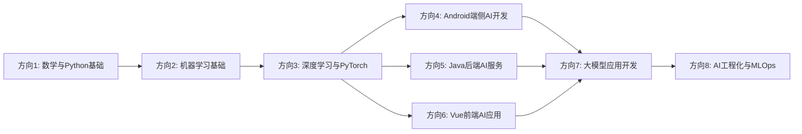

# AI转岗学习路线与面试准备（按技术分类版）

> 版本 v2.0 · 按8个技术方向独立组织 · 目标：2年开发经验，熟练掌握 Android（Java/Kotlin）、Vue.js、Java后端，了解Python基础 → 转AI相关岗位

> 📌 **核心策略：不丢弃原有技术栈，以AI赋能Android/前端/Java开发**

---

## 目录索引

| 章节 | 技术方向 | 文件 | 状态 |
|------|---------|------|------|
| 01 | 数学与Python基础 | [08-01_数学与Python基础.md](./08-01_数学与Python基础.md) | ✅ |
| 02 | 机器学习基础 | [08-02_机器学习基础.md](./08-02_机器学习基础.md) | ✅ |
| 03 | 深度学习与PyTorch | [08-03_深度学习与PyTorch.md](./08-03_深度学习与PyTorch.md) | ✅ |
| 04 | Android端侧AI开发 | [08-04_Android端侧AI开发.md](./08-04_Android端侧AI开发.md) | ✅ |
| 05 | Java后端AI服务 | [08-05_Java后端AI服务.md](./08-05_Java后端AI服务.md) | ✅ |
| 06 | Vue前端AI应用 | [08-06_Vue前端AI应用.md](./08-06_Vue前端AI应用.md) | ✅ |
| 07 | 大模型应用开发（LLM/RAG/Agent） | [08-07_大模型应用开发.md](./08-07_大模型应用开发.md) | ✅ |
| 08 | AI工程化与MLOps | [08-08_AI工程化与MLOps.md](./08-08_AI工程化与MLOps.md) | ✅ |

---

## 每个文件的章节结构

每个技术方向文件包含以下内容：

1. **1.1 知识点展开详解** - 理论知识 + 公式 + 直觉理解 + 与传统开发结合点
2. **1.2 GitHub项目推荐** - 至少5个项目，每个含 clone 命令 + 学习价值
3. **1.3 完整可运行代码示例** - Python/Java/Kotlin/JavaScript完整代码
4. **1.4 面试题库** - 20-40题，含难度分级

---

## 学习顺序建议

**说明：**
- 方向1-3为基础必学，按顺序学习
- 方向4-6根据你的现有技术栈（Android/Java/Vue）并行学习或重点突破
- 方向7是当前AI热点，建议在有一定基础后重点投入
- 方向8是进阶工程化，面试高阶岗位必备