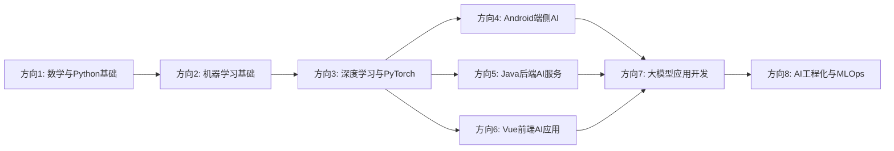

# AI转岗学习路线与面试准备（按技术分类版）- 总索引

> **背景**：2年开发经验，熟练掌握 Android（Java/Kotlin）、Vue.js、Java后端，了解 Python 基础
>
> **目标岗位**：端侧AI开发工程师 / AI应用开发工程师 / 大模型应用开发工程师 / ML工程/AI工程化工程师
>
> **核心策略**：不丢弃原有技术栈，以 AI 赋能 Android / 前端 / Java 开发

---

## 📚 目录索引

| 章节 | 技术方向 | 文件 | 学习优先级 |
|------|---------|------|-----------|
| 01 | **数学与Python基础** | `08-01_数学与Python基础.md` | ⭐⭐⭐⭐⭐ (基础必学) |
| 02 | **机器学习基础** | `08-02_机器学习基础.md` | ⭐⭐⭐⭐⭐ (基础必学) |
| 03 | **深度学习与PyTorch** | `08-03_深度学习与PyTorch.md` | ⭐⭐⭐⭐⭐ (基础必学) |
| 04 | **Android端侧AI开发** | `08-04_Android端侧AI.md` | ⭐⭐⭐⭐ (结合现有Android经验) |
| 05 | **Java后端AI服务** | `08-05_Java后端AI服务.md` | ⭐⭐⭐⭐ (结合现有Java经验) |
| 06 | **Vue前端AI应用** | `08-06_Vue前端AI.md` | ⭐⭐⭐ (结合现有Vue经验) |
| 07 | **大模型应用开发 (LLM/RAG/Agent)** | `08-07_大模型应用.md` | ⭐⭐⭐⭐⭐ (当前热点) |
| 08 | **AI工程化与MLOps** | `08-08_AI工程化.md` | ⭐⭐⭐⭐ (高阶，面试加分) |
| 09 | **简历优化与项目包装** | `09-简历优化与项目包装.md` | ⭐⭐⭐⭐⭐ (面试必备) |
| 10 | **时间规划与自检清单** | `10-时间规划与自检清单.md` | ⭐⭐⭐⭐ (学习指导) |

---

## 📖 每个文件包含的内容

每个技术方向文件均包含：
- **1.1 知识点展开详解**：理论知识 + 公式 + 直觉理解 + 与传统开发的结合点
- **1.2 GitHub项目推荐**：5-8个精选项目，含 clone 命令 + 学习价值
- **1.3 完整可运行代码示例**：Python / Java / Kotlin / JavaScript / Vue 代码
- **1.4 面试题库**：20-40题，含理论题、代码题、系统设计题、与传统开发结合题

---

## 🎯 推荐学习顺序

**学习阶段说明**：
- **阶段1（基础巩固）**：方向1-3，约 2-3 周
  - 掌握 NumPy/Pandas 数据处理
  - 理解 ML 算法原理与 sklearn Pipeline
  - 掌握 PyTorch + Transformer 核心概念
- **阶段2（技术栈融合）**：方向4-6并行，每方向 1-2 周
  - Android: TensorFlow Lite + CameraX 实时推理
  - Java: DJL + Spring Boot 推理服务
  - Vue: TF.js 浏览器推理 + 流式输出
- **阶段3（热点攻坚）**：方向7，约 2-3 周
  - RAG 完整链路 + LangChain4j 企业级集成
  - Agent（ReAct）模式 + 工具调用
  - vLLM 高吞吐量部署
- **阶段4（工程化高阶）**：方向8，约 1-2 周
  - MLflow 实验追踪 + 模型注册
  - 模型量化、部署、监控完整闭环
  - CI/CD for ML

---

## 📊 学习时间规划（总计 8-12 周）

| 阶段 | 技术方向 | 预计时长 | 每周目标 |
|------|---------|---------|---------|
| 基础 | 1-3 | 4-6周 | 每周完成约1个方向的理论+1个小项目 |
| 融合 | 4-6 | 3-4周 | 每1-2周完成一个技术栈融合 |
| 热点 | 7 | 2-3周 | 构建完整RAG应用 |
| 高阶 | 8 | 1-2周 | 搭建MLflow+训练+部署完整流水线 |

---

## 🎓 简历项目包装建议

面试时至少准备 3 个不同技术栈的项目：

1. **Android端侧**：实时图像分类App（CameraX + TFLite + MobileNet）
2. **Java后端**：企业级推理服务（Spring Boot + DJL + ONNX）
3. **大模型应用**：RAG知识库问答系统（Vue前端 + FastAPI + LangChain + 向量数据库）
4. **MLOps高阶加分**：MLflow + Optuna + CI/CD 自动化训练部署管线

---

## 📝 面试准备建议

| 面试环节 | 准备内容 | 重点关注文件 |
|---------|---------|-------------|
| 算法/理论题 | 方向1-3的理论题 + 与传统开发结合题 | 08-01, 08-02, 08-03 |
| 代码实现题 | Python/Java/Kotlin/JavaScript 的实现题 | 08-01 ~ 08-07 |
| 系统设计题 | Agent系统/RAG平台/推理服务设计 | 08-05, 08-07, 08-08 |
| 项目经历包装 | 将现有项目改造成AI赋能版本 | 09-简历优化, 每个文件的项目部分 |

---

## 📦 项目下载

运行 `download_projects.bat` 一键下载所有推荐项目到 `C:\ai_learning_projects\` 目录。

---

> ✅ **开始学习**：从 `08-01_数学与Python基础.md` 开始，按顺序学习