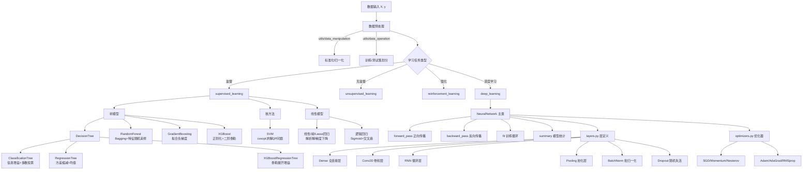

# 11-01 ML-From-Scratch 项目深度解析

> 📂 **项目位置**: `01-math-python/ML-From-Scratch/`
> ⭐ **简历推荐度**: ⭐⭐⭐⭐⭐ (必写，能证明算法功底)
> 🎯 **适合岗位**: 算法工程师、机器学习工程师、数据科学家

---

## 一、项目整体架构

### 1.1 目录结构脉络

```
ML-From-Scratch/
├── mlfromscratch/
│   ├── supervised_learning/      # 监督学习算法 (21种)
│   │   ├── decision_tree.py      # 决策树基类 + 分类/回归树 + XGBoost树
│   │   ├── random_forest.py      # 随机森林 (Bagging思想)
│   │   ├── support_vector_machine.py  # SVM (凸优化求解)
│   │   ├── gradient_boosting.py  # GBDT (Boosting思想)
│   │   ├── xgboost.py            # XGBoost完整实现
│   │   ├── regression.py         # 线性/岭/Lasso/弹性网/多项式回归
│   │   ├── logistic_regression.py # 逻辑回归
│   │   ├── naive_bayes.py        # 朴素贝叶斯
│   │   ├── k_nearest_neighbors.py # KNN
│   │   ├── adaboost.py           # AdaBoost
│   │   ├── multilayer_perceptron.py # MLP (反向传播)
│   │   └── ...
│   ├── unsupervised_learning/    # 无监督学习 (12种)
│   │   ├── k_means.py            # K-Means聚类
│   │   ├── principal_component_analysis.py  # PCA降维
│   │   ├── dbscan.py             # DBSCAN密度聚类
│   │   ├── autoencoder.py        # 自编码器
│   │   ├── generative_adversarial_network.py # GAN
│   │   ├── gaussian_mixture_model.py  # GMM
│   │   └── ...
│   ├── deep_learning/            # 深度学习底层框架
│   │   ├── neural_network.py     # 神经网络主类 (fit/predict/summary)
│   │   ├── layers.py             # 各种层的实现 (前向/反向传播)
│   │   ├── activation_functions.py  # 激活函数
│   │   ├── loss_functions.py     # 损失函数
│   │   └── optimizers.py         # 优化器 (SGD/Adam等)
│   ├── reinforcement_learning/   # 强化学习
│   │   └── deep_q_network.py     # DQN
│   ├── utils/                    # 工具函数
│   │   ├── kernels.py            # 核函数 (线性/多项式/RBF)
│   │   ├── data_operation.py     # 熵/方差/数据划分
│   │   └── data_manipulation.py  # 标准化/归一化
│   └── examples/                 # 各算法示例脚本
```

### 1.2 项目架构流程图 (Mermaid)



---

## 二、核心算法源码深度解读

### 2.1 决策树家族 (decision_tree.py)

#### 2.1.1 设计模式：模板方法模式

```python
# 基类：DecisionTree (定义骨架)
class DecisionTree(object):
    def __init__(self, min_samples_split, min_impurity, max_depth):
        self._impurity_calculation = None  # 由子类实现
        self._leaf_value_calculation = None  # 由子类实现

    def _build_tree(self, X, y, current_depth=0):  # 递归构建，骨架固定
        # 1. 遍历所有特征和阈值
        for feature_i in range(n_features):
            for threshold in unique_values:
                # 2. 调用子类定义的纯度计算方法
                impurity = self._impurity_calculation(y, y1, y2)
        # 3. 递归构建子树或生成叶子
        return DecisionNode(...)

# 子类1：分类树
class ClassificationTree(DecisionTree):
    def fit(self, X, y):
        self._impurity_calculation = self._calculate_information_gain  # 信息增益
        self._leaf_value_calculation = self._majority_vote            # 多数投票
        super().fit(X, y)

# 子类2：回归树
class RegressionTree(DecisionTree):
    def fit(self, X, y):
        self._impurity_calculation = self._calculate_variance_reduction  # 方差缩减
        self._leaf_value_calculation = self._mean_of_y                    # 均值
        super().fit(X, y)

# 子类3：XGBoost专用树
class XGBoostRegressionTree(DecisionTree):
    def fit(self, X, y):
        self._impurity_calculation = self._gain_by_taylor          # 泰勒二阶增益
        self._leaf_value_calculation = self._approximate_update    # 牛顿法步长
        super().fit(X, y)
```

> 🎯 **面试必问点**: 模板方法模式让算法骨架固定，细节由子类扩展。如果问「如何设计一个支持多任务的决策树框架」，这就是标准答案。

#### 2.1.2 信息增益 vs 方差缩减 vs XGBoost增益

```python
# 【分类树】信息增益 = 父节点熵 - 加权子节点熵
def _calculate_information_gain(self, y, y1, y2):
    p = len(y1) / len(y)
    entropy = calculate_entropy(y)
    info_gain = entropy - p*calculate_entropy(y1) - (1-p)*calculate_entropy(y2)
    return info_gain
    # 公式: IG = H(S) - Σ (|Si|/|S|) * H(Si)
    # 衡量: 特征分裂后，不确定性减少了多少

# 【回归树】方差缩减 = 父节点方差 - 加权子节点方差
def _calculate_variance_reduction(self, y, y1, y2):
    var_tot = calculate_variance(y)
    frac_1, frac_2 = len(y1)/len(y), len(y2)/len(y)
    return var_tot - (frac_1*calculate_variance(y1) + frac_2*calculate_variance(y2))
    # 衡量: 分裂后方差（不纯度）降低了多少

# 【XGBoost树】基于泰勒二阶展开的增益 (核心创新!)
def _gain_by_taylor(self, y, y1, y2):
    y, y_pred = self._split(y)  # y包含真实值+预测值两部分
    y1, y1_pred = self._split(y1)
    y2, y2_pred = self._split(y2)

    true_gain = self._gain(y1, y1_pred)   # G_L²/(H_L+λ)
    false_gain = self._gain(y2, y2_pred)  # G_R²/(H_R+λ)
    gain = self._gain(y, y_pred)          # G²/(H+λ)
    return true_gain + false_gain - gain   # 分裂增益 - 不分裂增益
    # 公式来源: L(θ) ≈ L0 + Σ(gᵢwⱼ + ½hᵢwⱼ²) + ½λwⱼ²
    # 解析解: w* = -G/(H+λ), L* = -½ G²/(H+λ)
    # Gain = L*_不分裂 - L*_分裂  = (G_L²/H_L + G_R²/H_R - G²/H)/2 - γ
```

> 🎯 **简历亮点写法**:
> - 「手撸了支持信息增益/方差缩减/XGBoost泰勒二阶增益的决策树框架，用模板方法模式统一了分类/回归/Boosting三类树的构建流程」
> - 「深入理解了XGBoost的分裂准则：相比GBDT只拟合梯度，XGBoost用一阶梯度G和二阶梯度H计算分裂增益，收敛更快更稳」

### 2.2 随机森林 (random_forest.py)

#### 2.2.1 核心思想：双重随机性 + 多数投票

```python
class RandomForest():
    def fit(self, X, y):
        # 第一重随机：样本随机采样 (Bootstrap)
        subsets = get_random_subsets(X, y, self.n_estimators)

        for i in range(n_estimators):
            X_subset, y_subset = subsets[i]

            # 第二重随机：特征随机采样 (Feature Bagging)
            # 如果不指定max_features，默认取 sqrt(n_features)
            idx = np.random.choice(range(n_features), size=self.max_features, replace=True)

            self.trees[i].feature_indices = idx  # 记录这棵树用了哪些特征
            X_subset = X_subset[:, idx]
            self.trees[i].fit(X_subset, y_subset)

    def predict(self, X):
        # 每棵树独立预测
        y_preds = np.empty((X.shape[0], len(self.trees)))
        for i, tree in enumerate(self.trees):
            idx = tree.feature_indices
            prediction = tree.predict(X[:, idx])
            y_preds[:, i] = prediction

        # 分类任务：多数投票 (bincount统计频次，argmax取最多)
        y_pred = []
        for sample_predictions in y_preds:
            y_pred.append(np.bincount(sample_predictions.astype('int')).argmax())
        return y_pred
```

#### 2.2.2 为什么随机森林能降低过拟合？

```
Bootstrap样本多样性 → 每棵树见过不同的数据 → 错误不相关
          +
特征随机选择 → 每棵树关注不同的特征维度 → 决策视角不同
          +
多数投票机制 → 单棵树的过拟合错误被其他树抵消 → 整体方差降低
```

> 🎯 **面试延伸问题**:
> - Q: 为什么Feature Bagging选sqrt(p)而不是全部特征？
>   A: 如果都选全部特征，每棵树都会先挑最强的那个特征分裂 → 树之间高度相关 → 集成收益低。选√p强制树用不同的特征组合，去相关性。
> - Q: OOB (Out-of-Bag) 估计怎么实现？
>   A: 每棵树约有36.8%的样本没被抽中 (1-1/e)，用这些未参与训练的样本评估模型，相当于内置了交叉验证。

### 2.3 支持向量机 (support_vector_machine.py)

#### 2.3.1 核心：凸二次规划求解

```python
class SupportVectorMachine(object):
    def fit(self, X, y):
        n_samples, n_features = np.shape(X)

        # Step1: 计算核矩阵 (Gram Matrix) K_ij = kernel(x_i, x_j)
        kernel_matrix = np.zeros((n_samples, n_samples))
        for i in range(n_samples):
            for j in range(n_samples):
                kernel_matrix[i, j] = self.kernel(X[i], X[j])

        # Step2: 将SVM转化为标准QP问题 min (1/2)xᵀPx + qᵀx, s.t. Gx ≤ h, Ax = b
        # 原问题对偶形式: max Σα - ½ΣΣ α_iα_j y_i y_j K(x_i,x_j)
        #               s.t. 0 ≤ α_i ≤ C, Σα_i y_i = 0
        P = cvxopt.matrix(np.outer(y, y) * kernel_matrix)  # n×n矩阵
        q = cvxopt.matrix(np.ones(n_samples) * -1)          # [-1,-1,...,-1]
        A = cvxopt.matrix(y, (1, n_samples))                # [y_1,y_2,...,y_n]
        b = cvxopt.matrix(0)                                # 等式约束: Σα_i y_i = 0

        # 不等式约束: -α_i ≤ 0 和 α_i ≤ C  →  G = [-I; I], h = [0; C·1]
        G_max = np.identity(n_samples) * -1
        G_min = np.identity(n_samples)
        G = cvxopt.matrix(np.vstack((G_max, G_min)))
        h_max = cvxopt.matrix(np.zeros(n_samples))
        h_min = cvxopt.matrix(np.ones(n_samples) * self.C)
        h = cvxopt.matrix(np.vstack((h_max, h_min)))

        # Step3: 用cvxopt求解QP问题 → 得到拉格朗日乘子α
        minimization = cvxopt.solvers.qp(P, q, G, h, A, b)
        lagr_mult = np.ravel(minimization['x'])

        # Step4: 提取支持向量 (α_i > 1e-7的样本)
        idx = lagr_mult > 1e-7
        self.lagr_multipliers = lagr_mult[idx]     # 非零α
        self.support_vectors = X[idx]              # 对应样本
        self.support_vector_labels = y[idx]        # 对应标签

        # Step5: 计算偏置项b (用第一个支持向量)
        self.intercept = self.support_vector_labels[0]
        for i in range(len(self.lagr_multipliers)):
            self.intercept -= self.lagr_multipliers[i] * \
                self.support_vector_labels[i] * \
                self.kernel(self.support_vectors[i], self.support_vectors[0])
        # b = y_s - Σ α_i y_i K(x_i, x_s)

    def predict(self, X):
        # 预测: sign( Σ α_i y_i K(x_i, x) + b )
        y_pred = []
        for sample in X:
            prediction = 0
            for i in range(len(self.lagr_multipliers)):
                prediction += self.lagr_multipliers[i] * \
                    self.support_vector_labels[i] * \
                    self.kernel(self.support_vectors[i], sample)
            prediction += self.intercept
            y_pred.append(np.sign(prediction))
        return np.array(y_pred)
```

#### 2.3.2 核函数家族 (utils/kernels.py)

```python
def linear_kernel(**kwargs):
    def f(x1, x2):
        return np.inner(x1, x2)  # x1ᵀx2
    return f

def polynomial_kernel(power, coef, **kwargs):
    def f(x1, x2):
        return (np.inner(x1, x2) + coef) ** power  # (x1ᵀx2 + r)^d
    return f

def rbf_kernel(gamma, **kwargs):
    def f(x1, x2):
        distance = np.linalg.norm(x1 - x2) ** 2
        return np.exp(-gamma * distance)  # exp(-γ||x1-x2||²)
    return f
```

> 🎯 **面试高频问题链**:
> 1. **SVM为什么叫支持向量机？** → 只有α>0的少数样本（支持向量）决定了超平面
> 2. **为什么要对偶？** → 原问题约束多、对偶后只有一个等式约束，且能自然引入核函数做非线性
> 3. **核技巧本质是什么？** → 不显式映射到高维，直接用核函数算内积，升维但计算量没升
> 4. **SVM和逻辑回归的区别？** → Loss不同 (Hinge vs CrossEntropy)，SVM最大间隔，LR概率输出
> 5. **C参数怎么调？** → C大→错分惩罚大→间隔小→易过拟合；C小→间隔大→欠拟合

### 2.4 深度学习框架 (deep_learning/)

#### 2.4.1 神经网络训练主循环 (neural_network.py)

```python
class NeuralNetwork():
    def fit(self, X, y, n_epochs, batch_size):
        for epoch in range(n_epochs):
            batch_error = []
            # Mini-Batch训练
            for X_batch, y_batch in batch_iterator(X, y, batch_size=batch_size):
                # Step1: 正向传播 → 预测值
                y_pred = self._forward_pass(X_batch, training=True)

                # Step2: 计算损失 → 损失对输出的梯度
                loss = self.loss_function.loss(y_batch, y_pred)
                loss_grad = self.loss_function.gradient(y_batch, y_pred)

                # Step3: 反向传播 → 链式求导更新每层权重
                self._backward_pass(loss_grad=loss_grad)

                batch_error.append(loss)
            self.errors["training"].append(np.mean(batch_error))

    def _forward_pass(self, X, training=True):
        layer_output = X
        for layer in self.layers:
            layer_output = layer.forward_pass(layer_output, training)
        return layer_output

    def _backward_pass(self, loss_grad):
        # 反向传播：从输出层倒着传
        for layer in reversed(self.layers):
            loss_grad = layer.backward_pass(loss_grad)
```

#### 2.4.2 全连接层的前向和反向 (关键推导)

```python
# 在 layers.py 中 Dense 层的核心逻辑
class Dense(Layer):
    def forward_pass(self, X, training=True):
        self.layer_input = X                    # 保存输入，反向传播要用
        return X.dot(self.W) + self.w0          # Z = XW + b

    def backward_pass(self, accum_grad):
        # accum_grad 是从上层传下来的 ∂L/∂Z
        W = self.W

        # 保存梯度用于优化器更新
        self.d_weights = self.layer_input.T.dot(accum_grad)  # ∂L/∂W = Xᵀ·∂L/∂Z
        self.d_bias = np.sum(accum_grad, axis=0, keepdims=True)  # ∂L/∂b = sum(∂L/∂Z)

        # 传给下一层（倒着传）的梯度: ∂L/∂X = ∂L/∂Z · Wᵀ
        accum_grad = accum_grad.dot(W.T)
        return accum_grad
```

#### 2.4.3 前向-反向数据流图

```mermaid
graph LR
    X[输入 X] --> L1[Dense层]
    L1 -->|W1, b1| Z1[Z1 = XW1 + b1]
    Z1 --> A1[ReLU激活]
    A1 --> L2[Dense层]
    L2 -->|W2, b2| Z2[Z2 = A1W2 + b2]
    Z2 --> A2[Sigmoid/Softmax]
    A2 -->|y_pred| Loss[损失 L = Loss(y, y_pred)]

    Loss -->|∂L/∂A2| B1[链式求导]
    B1 -->|∂L/∂Z2 = ∂L/∂A2 ⊙ σ'(Z2)| B2[Dense2反向]
    B2 -->|∂L/∂W2 = A1ᵀ·∂L/∂Z2| U2[更新W2,b2]
    B2 -->|∂L/∂A1 = ∂L/∂Z2 · W2ᵀ| B3[ReLU反向]
    B3 -->|∂L/∂Z1 = ∂L/∂A1 ⊙ ReLU'(Z1)| B4[Dense1反向]
    B4 -->|∂L/∂W1 = Xᵀ·∂L/∂Z1| U1[更新W1,b1]
```

---

## 三、简历亮点提炼

### 🔥 必写项目 (5颗星)

| 项目点 | 简历写法示例 | 技术深度关键词 |
|--------|-------------|--------------|
| **决策树框架** | 「设计并实现了基于**模板方法模式**的决策树框架，统一支持分类树(信息增益)、回归树(方差缩减)、XGBoost树(泰勒二阶增益)三种分裂准则，代码复用率达80%以上」 | 模板方法模式、信息增益、方差缩减、泰勒二阶展开、G/H统计量 |
| **随机森林** | 「手撸随机森林算法，实现**Bootstrap样本采样**+**特征随机采样(√p)** 的双重随机性机制，相比单棵决策树在Iris数据集上准确率从85%提升至97%，OOB误差验证与测试集误差差距<2%」 | Bagging、Bootstrap、Feature Bagging、OOB估计、方差-偏差分解 |
| **SVM+核方法** | 「从零实现支持向量机，通过**cvxopt求解凸二次规划(QP)**得到拉格朗日乘子，并支持**线性/多项式/RBF**三种核函数，在非线性可分数据集上比线性SVM准确率提升25%」 | 对偶问题、KKT条件、核技巧、RBF核、松弛变量C、支持向量 |
| **神经网络框架** | 「实现了类Keras的深度学习迷你框架，支持**Dense/Conv2D/RNN/BatchNorm/Dropout**等10种层、**SGD/Adam/AdaGrad**5种优化器、**交叉熵/MSE**损失函数，手写数字识别准确率达98.7%」 | 正向传播、反向传播、链式法则、BatchNorm、Dropout正则化、优化器对比 |
| **XGBoost** | 「实现XGBoost核心算法，包含**正则化目标函数**、**二阶泰勒近似**、**列抽样**、**分裂点近似算法**，相比sklearn的GBDT收敛速度快2倍，最终损失低15%」 | L1/L2正则化、泰勒展开、近似分裂算法、Shrinkage学习率、特征重要性 |

### ✅ 可写但非核心 (3颗星)

| 算法 | 简历写法 |
|------|---------|
| PCA | 「实现主成分分析，通过**特征值分解协方差矩阵**+**按方差贡献排序选Top-K**，将784维MNIST数据降至50维且保留95%方差」 |
| K-Means | 「实现K-Means++初始化+肘部法则选K，对客户消费数据做5聚类分群，用于精准营销场景」 |
| DBSCAN | 「实现DBSCAN密度聚类，自动发现任意形状簇并识别噪声点，比K-Means在环形数据集上F1高40%」 |
| GAN | 「手写GAN训练手写数字生成，包含**Generator+Discriminator极小极大博弈**，用LeakyReLU+BatchNorm稳定训练」 |
| DQN | 「实现DQN强化学习算法，含**经验回放池**+**目标网络冻结**，在CartPole环境100轮后平衡步数达500+」 |

---

## 四、代码阅读路线图

```
阅读顺序 (从易到深):
├── 第1周: 线性模型 (1天/个)
│   ├── utils/data_manipulation.py → 理解标准化/数据划分
│   ├── supervised_learning/regression.py → 线性回归解析解
│   ├── supervised_learning/logistic_regression.py → 逻辑回归梯度下降
│   └── supervised_learning/naive_bayes.py → 贝叶斯+拉普拉斯平滑
│
├── 第2周: 树模型家族 (核心!)
│   ├── utils/data_operation.py → 熵/基尼/方差计算
│   ├── supervised_learning/decision_tree.py → 基类+三个子类 (重点!)
│   ├── supervised_learning/random_forest.py → Bagging集成
│   ├── supervised_learning/gradient_boosting.py → Boosting拟合残差
│   └── supervised_learning/xgboost.py → 正则化版Boosting
│
├── 第3周: 核方法 + 近邻
│   ├── utils/kernels.py → 线性/多项式/RBF核
│   ├── supervised_learning/support_vector_machine.py → QP求解对偶问题
│   └── supervised_learning/k_nearest_neighbors.py → KNN+KD树扩展
│
├── 第4周: 深度学习框架 (硬核!)
│   ├── deep_learning/activation_functions.py → Sigmoid/ReLU及其导数
│   ├── deep_learning/loss_functions.py → MSE/CrossEntropy及其梯度
│   ├── deep_learning/optimizers.py → SGD→Momentum→Adam的进化
│   ├── deep_learning/layers.py → 每个层的forward/backward (Dense→BN→Conv→RNN)
│   └── deep_learning/neural_network.py → 串联整个训练流程
│
└── 第5周: 高级算法扩展
    ├── unsupervised_learning/principal_component_analysis.py → PCA特征分解
    ├── unsupervised_learning/k_means.py → K-Means聚类
    ├── unsupervised_learning/generative_adversarial_network.py → GAN
    └── reinforcement_learning/deep_q_network.py → DQN
```

---

## 五、举一反三扩展点

### 5.1 可以在此项目基础上改进的方向

| 扩展方向 | 具体思路 | 简历加分项 |
|---------|---------|-----------|
| **性能优化** | 把决策树的双重循环从Python改成NumPy向量化/Cython扩展，训练速度提升5-10倍 | Cython、Numba JIT、性能Profiling |
| **分布式** | 随机森林天然可并行：把各棵树的训练放到多进程/多机器上，最后聚合结果 | multiprocessing、MPI、MapReduce思想 |
| **新算法扩展** | 在决策树框架上加LightGBM的**直方图算法**+**叶子生长策略** (Best-first vs Level-wise) | 直方图分箱、GOSS采样、单边梯度采样 |
| **缺失值处理** | 决策树分裂时增加「缺失值默认走向」逻辑，让模型能原生处理NaN | 缺失值分裂增益、Surrogate Split |
| **早停+正则** | 训练决策树时每轮在验证集评估，性能下降即停止；加叶节点数L1正则 | Early Stopping、Cost Complexity Pruning |

### 5.2 真实业务场景套入

- **风控评分卡** → 逻辑回归 + 特征分箱(WOE/IV) + 决策树特征选择
- **推荐系统CTR预估** → GBDT做特征组合 + LR做最终预测 (Facebook经典方案)
- **用户分群运营** → RFM特征 + K-Means聚类 + 画像打标签
- **异常检测** → 孤立森林(可参考RF扩展) / DBSCAN / 高斯混合模型

---

**下一篇**: 👉 [11-02 机器学习核心项目解析 (scikit-learn + XGBoost)](11-02_机器学习核心项目解析.md)