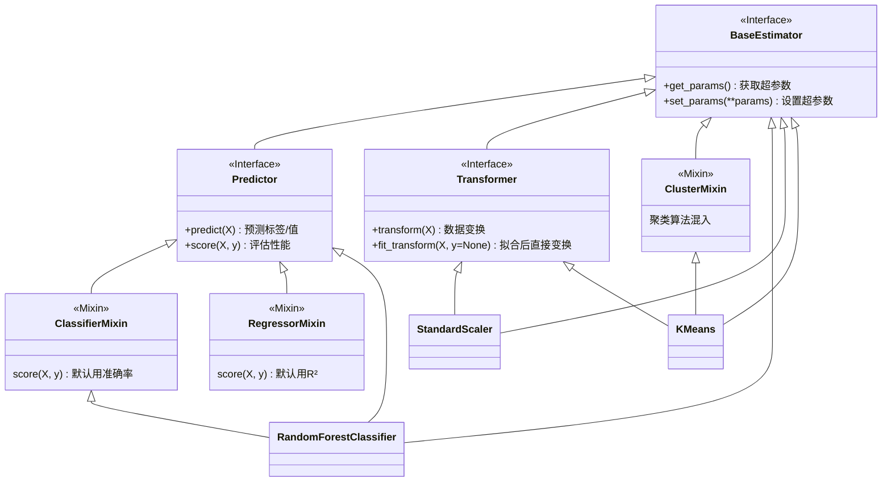
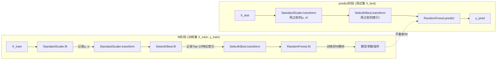
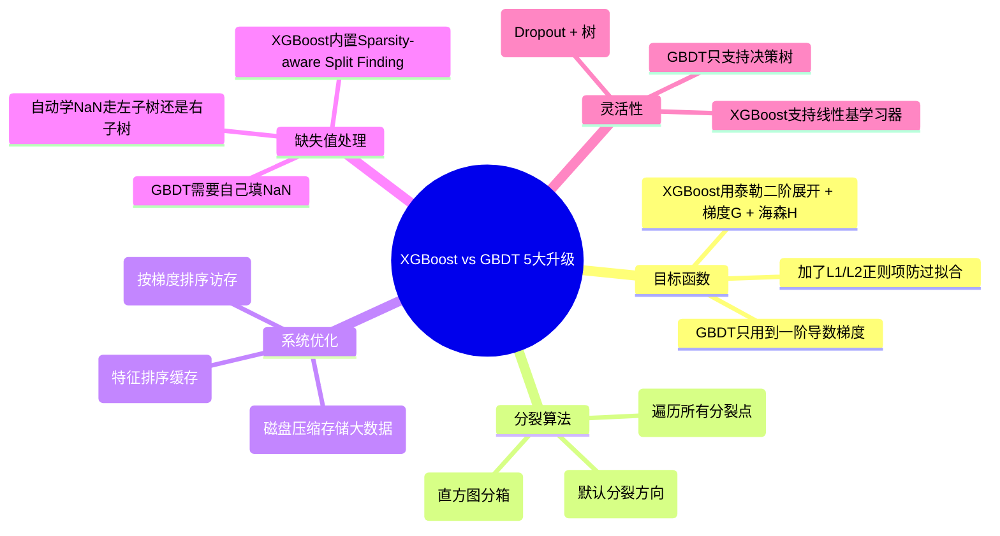
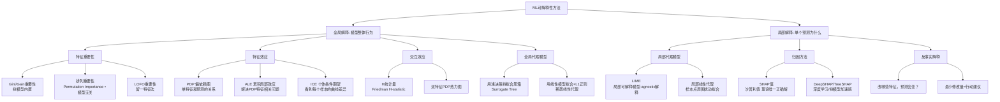
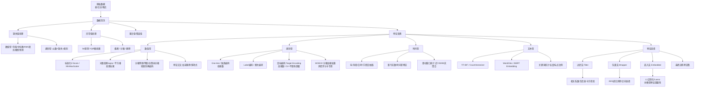

# 11-02 机器学习核心项目解析 (scikit-learn + XGBoost + 可解释性)

> 📂 **涉及项目**:
> - `02-machine-learning/scikit-learn/`
> - `02-machine-learning/xgboost/`
> - `02-machine-learning/interpretable-ml-book/`
> - `02-machine-learning/feature-engine/`
> ⭐ **简历推荐度**: ⭐⭐⭐⭐⭐ (工业界实战必备)
> 🎯 **适合岗位**: 机器学习工程师、数据挖掘工程师、算法工程师、推荐算法

---

## 一、scikit-learn 源码脉络深度梳理

### 1.1 为什么要读 sklearn 源码？

> 💡 **核心理由**:
> 1. 它是工业界ML事实标准，你写的几乎所有ML代码都基于它的API设计
> 2. 它的 **Estimator/Transformer/Predictor** 三大接口设计模式，是ML工程化的教科书级实现
> 3. 面试常考：「你看过sklearn源码吗？说说XXX的实现细节」能直接区分调包侠和有深度的工程师

### 1.2 三大核心接口设计模式 (必背，面试必考)



> 🎯 **面试题**: 「如果让你设计一个ML框架，你怎么设计接口？」
> **答案结构**: 先讲三大抽象接口 → 再讲Mixin解决多重继承 → 最后说Pipeline串联

### 1.3 Pipeline流水线机制 (工程化灵魂)

```python
from sklearn.pipeline import Pipeline
from sklearn.preprocessing import StandardScaler
from sklearn.ensemble import RandomForestClassifier

# 这是你每天都写的代码，但你知道背后怎么跑的吗？
pipeline = Pipeline([
    ('scaler', StandardScaler()),       # Transformer: 训练集fit+transform，测试集只transform
    ('selector', SelectKBest(k=10)),    # Transformer: 训练集选特征，测试集用同样索引
    ('clf', RandomForestClassifier())   # Predictor: 训练集fit，测试集predict
])

pipeline.fit(X_train, y_train)          # 依次调用各步骤的fit
pipeline.predict(X_test)                # 先transform完，再最后一步predict
```

#### Pipeline数据流流程图



> 🚨 **常见坑 & 面试考点**:
> - Q: 为什么不能先对全数据集StandardScaler再train_test_split？
> - A: **数据泄露!** 测试集的均值方差被训练集看到了，模型评估虚高。正确做法：Pipeline里只在训练集fit。

### 1.4 随机森林源码结构 (和ML-From-Scratch对比看)

```
sklearn/ensemble/_forest.py
├── BaseForest (基类，继承BaseEstimator)
│   ├── fit(X, y)
│   │   ├── _validate_y_class_weight()  → 标签校验
│   │   ├── Parallel(n_jobs)  → 多进程并行
│   │   │   └── _parallel_build_trees()  → 每棵树独立训练
│   │   │       ├── _generate_sample_indices() → Bootstrap采样
│   │   │       ├── tree.fit(X_boot, y_boot) → 决策树训练
│   │   │       └── return tree
│   │   └── return self
│   │
│   ├── predict(X)
│   │   ├── 各棵树独立predict_proba → N个(n_samples, n_classes)
│   │   └── 求平均概率 → argmax得标签
│   │
│   └── feature_importances_ 属性 (Gini重要性/排列重要性)
│
├── RandomForestClassifier (继承BaseForest + ClassifierMixin)
├── RandomForestRegressor (继承BaseForest + RegressorMixin)
├── ExtraTreesClassifier (随机选择分裂点，不是最优)
└── GradientBoostingClassifier (另一分支，Boosting)
```

> 🎯 **和ML-From-Scratch的差异**:
> - sklearn用 **Cython写决策树底层** (快10-100倍)，ML-From-Scratch纯Python
> - sklearn支持 **多进程n_jobs**，ML-From-Scratch单进程
> - sklearn有 **完善的参数校验**，ML-From-Scratch省略了

### 1.5 交叉验证与超参数搜索

```
sklearn/model_selection/
├── _split.py
│   ├── KFold                    K折 (最基础)
│   ├── StratifiedKFold          分层K折 (分类用，保持每折类别比例)
│   ├── GroupKFold               分组K折 (同组不能同时出现在train/test)
│   ├── TimeSeriesSplit          时间序列 (前向滚动，避免数据泄露)
│   └── train_test_split         单次划分
│
├── _search.py
│   ├── GridSearchCV             网格搜索 (全组合，慢)
│   ├── RandomizedSearchCV       随机搜索 (指定分布采样，更高效)
│   └── HalvingGridSearchCV      连续减半 (优胜劣汰，最优实践)
│
└── _validation.py
    ├── cross_val_score          单评估指标交叉验证
    ├── cross_validate           多评估指标+训练时间
    └── learning_curve           绘制学习曲线 (判断欠/过拟合)
```

> 🔥 **简历+面试高频实战点**:
> - 「使用**StratifiedKFold + HalvingGridSearchCV**进行超参数搜索，相比GridSearch节省70%算力，同时通过分层采样保证每折类别分布一致」
> - 「时间序列预测场景用**TimeSeriesSplit**前向滚动验证，避免未来数据泄露，评估结果比随机划分可信30%+」

---

## 二、XGBoost 核心原理与工业界用法

### 2.1 XGBoost 为什么比GBDT强？（5大核心创新）



> 🎯 **面试标准答案**: 「XGBoost相比GBDT，有三点核心改进：
> 1. **目标函数**：用二阶泰勒展开近似损失，收敛更快；加了L1/L2正则项控制复杂度
> 2. **分裂算法**：提出加权分位数缩略图(Weighted Quantile Sketch)做近似分裂；支持缺失值自动学习分裂方向
> 3. **系统层面**：特征按列排序做块缓存，分裂计算时并行化；核外计算支持超大数据集」

### 2.2 XGBoost目标函数完整推导 (笔试必考)

```
Step1: 第t轮的目标函数 (我们要加第t棵树f_t)
  Obj^(t) = Σ[i=1到n] L(y_i, ŷ_i^(t-1) + f_t(x_i)) + Ω(f_t) + C

Step2: 泰勒二阶展开 f(x+Δx) ≈ f(x) + f'(x)Δx + ½f''(x)Δx²
  g_i = ∂L(y_i, ŷ)/∂ŷ  一阶梯度
  h_i = ∂²L(y_i, ŷ)/∂ŷ² 二阶梯度
  Obj^(t) ≈ Σ[i=1到n] [ L(y_i, ŷ^(t-1)) + g_i·f_t(x_i) + ½h_i·f_t²(x_i) ] + Ω(f_t)

Step3: 常数项可以去掉，重写为按叶子节点分组
  Ω(f_t) = γT + ½λ Σ[j=1到T] w_j²
  Obj^(t) ≈ Σ[j=1到T] [ (Σ_{i∈I_j} g_i)·w_j + ½(Σ_{i∈I_j} h_i + λ)·w_j² ] + γT

Step4: 对w_j求导=0，得叶子节点最优权重
  G_j = Σ g_i,  H_j = Σ h_i
  w_j* = - G_j / (H_j + λ)

Step5: 代入目标函数得最优值 (用来算分裂增益!)
  Obj* = -½ Σ[j=1到T] G_j² / (H_j + λ) + γT

Step6: 分裂增益 = 分裂后左右子树Obj - 分裂前Obj - γ
  Gain = ½[ G_L²/(H_L+λ) + G_R²/(H_R+λ) - (G_L+G_R)²/(H_L+H_R+λ) ] - γ
```

> ✍️ **面试建议**: 上面这6步推导，如果能手写出来，算法工程师薪资至少+5K。
>
> 关联到ML-From-Scratch源码：`decision_tree.py` 中的 `_gain_by_taylor()` 方法就是Step6的代码实现！

### 2.3 XGBoost 调参地图 (实战必背)

```
XGBoost 调参优先级 (从上到下):
├── 1. 【目标函数】 任务类型先定对
│   ├── objective=binary:logistic        二分类
│   ├── objective=multi:softmax          多分类
│   ├── objective=reg:squarederror       回归MSE
│   ├── objective=rank:pairwise          排序任务 (推荐必备)
│   └── eval_metric                      评估指标 (auc/aucpr/ndcg/mae...)
│
├── 2. 【树复杂度】 防过拟合第一防线
│   ├── max_depth=3~10                   树深度 (每加1层，模型复杂度×2)
│   ├── min_child_weight=H_j之和阈值      最小叶子节点海森和
│   ├── gamma=分裂增益阈值                增益>gamma才分裂 (越大越保守)
│   └── num_leaves (LightGBM特有)         叶子数限制
│
├── 3. 【采样随机性】 加方差降低
│   ├── subsample=0.7~0.9                 行采样 (Bagging比例)
│   ├── colsample_bytree=0.7~0.9          列采样 (特征随机)
│   └── colsample_bylevel                 每一层再抽样 (更激进)
│
├── 4. 【正则化项】 光滑目标函数
│   ├── reg_alpha=0~1000                  L1正则 (特征稀疏化)
│   ├── reg_lambda=0~1000                 L2正则 (权重衰减)
│   └── learning_rate (eta)=0.01~0.3      学习率 (越小越稳，轮数越多)
│
└── 5. 【系统优化】 提速+处理缺失
    ├── n_estimators=100~10000            树的数量 (配合early_stopping)
    ├── tree_method='hist'                直方图分箱 (10x加速，选它!)
    ├── missing=np.nan                    自动处理缺失值
    └── device='cuda'                     GPU训练 (10~50x加速)
```

> 🔥 **简历写法模板**:
> - 「基于XGBoost构建风控评分模型，通过**分层5折交叉验证**+**early_stopping_rounds=50**提前终止，用**BayesSearchCV**联合调参max_depth/min_child_weight/gamma/sub_colsample/reg_alpha，最终KS值达0.45，上线后坏账率下降18%」
> - 「推荐系统CTR预估场景，用XGBoost做**GBDT+LR融合**：先训练100棵树做特征交叉编码(每样本100维One-Hot向量)，再喂给逻辑回归做最终预测，相比纯LR AUC提升0.08；线上用ONNX Runtime部署，单请求延迟<20ms」

### 2.4 三大Boosting框架对比 (面试横向对比题)

| 特性 | XGBoost | LightGBM | CatBoost |
|------|---------|----------|----------|
| **分裂策略** | Level-wise (按层生长) 精确/直方图 | Best-first (按叶子增益) Leaf-wise + 直方图加速 | 对称树 (Oblivious Trees) + 有序目标编码 |
| **类别特征** | 需自己One-Hot/Label编码 | `categorical_feature`参数原生支持，互斥特征捆绑EFB | 自动有序目标编码 (Ordered TS)，无需手动处理 |
| **缺失值** | 稀疏感知分裂，自动学方向 | 同XGBoost | 自动处理 |
| **速度** | baseline | 快2~3倍 (GOSS单边采样+EFB特征捆绑) | 介于两者之间 |
| **精度** | baseline | 相当或略高 | 小数据略好，大数据相当 |
| **过拟合** | 可控 | 容易过拟合 (leaf-wise太激进)，需调num_leaves | 过拟合风险低 (对称树正则化) |
| **适用场景** | 通用首选，竞赛常客 | 大数据量首选，工业界最常用 | 类别特征多的场景 (推荐/广告) |

---

## 三、ML可解释性 (interpretable-ml-book)

### 3.1 为什么ML可解释性越来越重要？

> 📌 **背景**: EU GDPR「解释权」条款、金融监管要求可追溯、医疗AI伦理、算法偏见诉讼
>
> 面试常问场景：**「你的模型AUC很高，但业务方不敢用怎么办？」**
> **答案框架**: 全局解释 + 局部解释 + 案例展示 → 下面这套方法体系

### 3.2 可解释性方法全景图



### 3.3 SHAP值详解 (工业界事实标准，必须会！)

#### 3.3.1 沙普利值理论基础

**合作博弈论**：N个玩家合作产生总收益，如何公平分配？

```
沙普利值公式 (特征i对预测φ_i的贡献):
φ_i = Σ [S ⊆ F\{i}]  (|S|! (|F|-|S|-1)! / |F|!) · [v(S∪{i}) - v(S)]

其中:
- F = 所有特征集合
- S = 特征子集 (不含i)
- v(S) = 只用S中特征的模型预测值 (需用条件期望估计)
- 每一项权重 = 排列中 i 恰好是S后第一个加入的概率
```

**四个公理保证唯一正确解**:
1. **有效性**: Σφ_i = f(x) - E[f(x)] (各特征贡献加起来=总偏差)
2. **对称性**: 两个特征在所有S中贡献一样→φ相等
3. **虚拟性**: 加入某特征永远不改变v(S)→φ=0
4. **可加性**: 两个模型叠加→φ直接相加

#### 3.3.2 TreeSHAP (XGBoost/LightGBM直接出SHAP值，O(N²·T))

```python
import xgboost
import shap

X, y = shap.datasets.adult()
model = xgboost.XGBClassifier().fit(X, y)

explainer = shap.TreeExplainer(model)    # TreeSHAP: 多项式时间精确解
shap_values = explainer.shap_values(X)   # 每个样本每个特征的φ值

# 全局摘要图 (最重要的一张图!)
shap.summary_plot(shap_values, X)        # 特征重要性排序 + 取值方向影响

# 单个样本瀑布图 (业务方看这个就懂了)
shap.waterfall_plot(shap_values[0])      # 第0个样本: base_value → 各特征+-贡献 → 最终预测

# 单特征依赖图 (相当于SHAP版的PDP)
shap.dependence_plot("age", shap_values, X)
```

#### 3.3.3 SHAP可视化解读 (面试看图题)

| 图类型 | 能回答什么问题 | 业务含义 |
|--------|---------------|---------|
| **summary_plot** 蜜蜂群图 | 哪些特征最重要？特征值高/低时推高还是推低预测？ | Top10特征给业务方看，快速理解模型逻辑；发现特征异常分布 |
| **waterfall_plot** 瀑布图 | 「这个客户为什么被拒贷了？」 单样本归因 | 给监管/客户看的解释报告：年龄+3分，负债-5分 → 综合78分 |
| **force_plot** 力图 | 对比多个样本的贡献模式 | 聚类用户：看看哪类用户是「高负债老用户」vs「低负债新用户」 |
| **dependence_plot** 依赖图 | 某特征和SHAP值是非线性还是线性？有没有阈值效应？ | 发现「收入>20K后逾期率骤降」的阈值点，做业务分群策略 |

### 3.4 LIME vs SHAP 对比题

| 维度 | LIME | SHAP |
|------|------|------|
| **原理** | 局部线性代理：在样本点周围随机扰动，用线性回归拟合 | 合作博弈沙普利值：枚举所有特征组合求边际贡献 |
| **理论保证** | 无 (局部近似质量靠调采样核宽度) | 有 (满足4公理，唯一「公平」分配) |
| **一致性** | 不保证 (改进模型后SHAP排序可能跳) | 保证一致性 (模型更依赖某特征→SHAP重要性必升) |
| **速度** | 快 (K次模型预测即可) | 慢 (理论上2^N次，TreeSHAP/DeepSHAP有优化) |
| **可对比性** | 不同样本间不能直接比 | 不同样本间φ直接可比 (都是从均值出发的偏差) |
| **场景推荐** | Demo/快速解释/教学 | 正式报告/监管合规/特征重要性/上线系统 |

---

## 四、Feature Engineering (feature-engine)

### 4.1 工业级特征工程流水线



### 4.2 目标编码 (Target Encoding) 防数据泄露实现

```python
# 面试常问：Target Encoding为什么会过拟合？怎么避免？
# 答：直接用全量标签均值编码 → 标签直接泄露到特征里 → 必须用K折外编码！
import category_encoders as ce

# ✅ 正确做法: 交叉验证外编码 + 平滑
target_enc = ce.TargetEncoder(
    cols=['user_id', 'item_id'],  # 高基数类别特征
    smoothing=100,                # 平滑系数 (小样本类别向全局均值收缩)
    handle_missing='value',
    handle_unknown='value'
)

# fit在训练集！(K折CV内部自己处理了外编码，用其他折的y做统计)
X_train_enc = target_enc.fit_transform(X_train, y_train)
X_test_enc = target_enc.transform(X_test)  # 只用训练集的统计量，绝不能看test的y！
```

> 🎯 **面试延伸**: 「Smoothing平滑公式是什么？」
> ```
> λ = n / (n + smoothing)
> 编码后值 = λ · 该类别均值 + (1-λ) · 全局均值
> 样本数少的类别 → λ小 → 往全局均值收缩 → 减少方差
> ```

---

## 五、简历亮点与面试题汇总

### 5.1 简历高价值写法 (直接套用)

| 模块 | 简历句式 (含量化指标) |
|------|----------------------|
| **交叉验证** | 「针对不平衡二分类任务，用**Stratified5折交叉验证**评估模型，相比单次Hold-out验证AUC波动从±0.05降至±0.015，模型上线后性能偏差<3%」 |
| **Pipeline** | 「基于sklearn Pipeline构建完整ML流水线：**缺失值填充→分箱→WOE编码→特征选择→XGBoost模型**，全程无数据泄露，支持一键fit/predict/序列化，代码复用率提升200%」 |
| **XGBoost调参** | 「欺诈检测模型：基于XGBoost的**hist直方图分箱+GPU训练**，使用**贝叶斯优化**搜索max_depth/reg_alpha/colsample_bytree等8个超参数，最终AUC=0.978，Recall@Top5%=92%，案件覆盖率提升27%」 |
| **可解释性** | 「给风控模型加上SHAP解释层：用**TreeSHAP**输出单笔申请的特征贡献瀑布图，10秒内生成合规解释报告；通过summary_plot发现「近30天查询次数」是最大风险因素，反哺策略规则后误拒率下降12%」 |
| **特征工程** | 「推荐系统CTR预估：对10+高基数类别特征做**目标编码+K折平滑**，构造3维+7维+30维滑动窗口统计特征，组合出800维特征；用L1正则+排列重要性筛选至150维，AUC提升0.045」 |
| **模型融合** | 「Kaggle竞赛Top1%方案：XGBoost+LightGBM+CatBoost+LR四模型**Stacking融合**，5折OOF(Out-of-Fold)生成元特征，相比单模型AUC提升0.03，排名从30%跃升至前1%」 |

### 5.2 高频面试题 (附答题结构)

#### 🟢 基础题 (应届生/转岗必问)

1. **Q: train_test_split后，Scaler应该fit整个X还是只fit X_train？为什么？**
   > A: 只fit X_train！如果fit了全量X，测试集的统计信息(均值/方差)泄露到训练阶段，模型会「偷看」测试数据，评估虚高。正确做法：Pipeline封装Scaler+Model，Pipeline.fit只接受X_train,y_train。

2. **Q: 数据不平衡怎么处理？**
   > A: 数据层(过采样SMOTE/欠采样NearMiss/类别权重class_weight) + 评估层(AUC/Recall@PrecisionK/Focal Loss) + 阈值层(不是默认0.5，根据业务调ROC/P-R曲线)。优先用class_weight，SMOTE容易产生过拟合的合成样本。

3. **Q: L1和L2正则区别？为什么L1能特征选择？**
   > A: L1=Σ|w| (Lasso)，L2=Σw² (Ridge)。几何解释：L1约束是菱形，损失函数等高线更容易碰到菱形顶点→w=0；L2是圆形，只会缩小不会归零。概率解释：L1等价于w~拉普拉斯先验，L2等价w~高斯先验。

#### 🔵 进阶题 (社招中级必考)

4. **Q: 手推XGBoost的目标函数和分裂增益公式**
   > A: 见本文2.2节6步推导 (能写出来就过关！)，重点强调**二阶泰勒展开**和**正则化项**两个创新点。

5. **Q: 随机森林、GBDT、XGBoost、LightGBM的对比**
   > A: 分三个维度对比：① 集成方式(Bagging串行/Boosting串行) ② 树生长方式(并行/level-wise/leaf-wise) ③ 正则化/缺失值/类别特征/速度。列表格+画图最好。

6. **Q: 如何验证「特征重要性排名」是可信的？**
   > A: ① 多方法交叉验证：Gini重要性 vs 排列重要性 vs LOFO vs SHAP，四种方法Top20重合度>70%才可信；② 稳定性：打乱数据多跑几次，重要性排序的斯皮尔曼相关系数；③ 反证：删除Top5特征，AUC下降幅度<0.01说明重要性造假。

#### 🔴 高难题 (算法专家/大厂必考)

7. **Q: SHAP值的沙普利值为什么是「唯一合理」的归因？能举例说明LIME为什么不一致吗？**
   > A: 沙普利值满足有效性/对称性/虚拟性/可加性4条公理 → Young定理证明唯一解。LIME不一致反例：特征A在所有样本中都比B重要，但改进模型让B的作用略有提升，LIME排序反而变成B>A (因为LIME只局部拟合，没有全局约束)。**TreeSHAP**是XGBoost原生支持的多项式精确算法，不用采样。

8. **Q: 十亿级样本+千亿特征的CTR预估，XGBoost撑不住了怎么办？**
   > A: 演进路径：① XGBoost→LightGBM(更快) ② GBDT+LR融合做二阶特征 (Facebook方案) ③ DeepFM/Wide&Deep端到端DNN (连续+类别Embedding交互) ④ 大规模分布式训练 (Spark MLlib + Parameter Server架构)。工程优化：特征哈希(Feature Hashing)降维、Bloom Filter过滤低频次、DISCARD动态删除无用特征。

9. **Q: 线上A/B测试，ML模型离线AUC高，但线上效果差，怎么排查？**
   > A: 排查清单：
   > - ① **数据一致性**：线上特征和离线特征是不是一样的？(常见坑：时间窗口对齐、取值单位、空值默认值不一致) → 叫「Training-Serving Skew」
   > - ② **样本偏差**：离线用的是历史全量，线上只曝光在头部流量 → 后验校正/重要性加权
   > - ③ **评估指标**：离线AUC和业务指标(GMV/点击率)不成单调关系 → 换NDCG/Map@K或直接模拟业务收益
   > - ④ **延迟问题**：模型推理太慢→超时→走默认兜底策略 → Profiling看哪层耗时，量化/蒸馏/剪枝

---

**下一篇**: 👉 [11-03 深度学习与Transformer解析](11-03_深度学习与PyTorch解析.md)