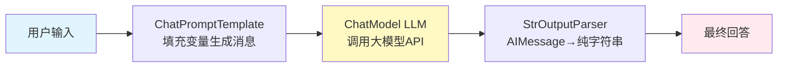

# 11-06 LLM应用与MLOps解析 (LangChain + vLLM + MLflow)

> 📂 项目: `06-llm/langchain/` `06-llm/llama_index/` `06-llm/autogen/`
>        `08-mlops/mlflow/` `08-mlops/vllm/`
> ⭐ 简历推荐: ⭐⭐⭐⭐⭐ (2025年最热方向) | 🎯 岗位: LLM应用工程师、RAG工程师、大模型推理优化、MLOps

---

## 一、LangChain 生态全景

### 1.1 LangChain 六大核心模块

```
项目: 06-llm/langchain/libs/langchain/langchain/
LangChain = 乐高式搭大模型应用, 核心6模块:
┌──────────────────────────────────────────────────────────┐
│ LCEL (LangChain Expression Language) 表达式语言            │
│   chain = prompt | model | StrOutputParser()              │ 管道式拼搭,支持异步/流式/批/配置
└──────────────────────────────────────────────────────────┘
┌─────────┬─────────┬──────────┬──────────┬─────────┬──────────┐
│ 1.Model │2.Retriever│3.Agent │ 4.Memory│ 5.Tool │ 6.Chain  │
│  LLM/EMB│向量检索器│规划+调用│对话记忆  │外部工具 │组合工作流│
└─────────┴─────────┴──────────┴──────────┴─────────┴──────────┘
```

### 1.2 LCEL 核心语法 (新代码统一用这个!)

```python
# LCEL = 用 | 管道符把组件拼起来 (像Unix管道一样!)
# 语法: Runnable | Runnable | Runnable ... 最后输出
from langchain_core.output_parsers import StrOutputParser
from langchain_core.prompts import ChatPromptTemplate
from langchain_openai import ChatOpenAI
from langchain_core.runnables import RunnablePassthrough, RunnableLambda

# ---- 示例1: 最基础的Chat Chain ----
prompt = ChatPromptTemplate.from_messages([
    ("system", "你是一名资深Python工程师,回答用户问题时附上代码示例"),
    ("user", "{question}")
])
model = ChatOpenAI(model="gpt-4o-mini", temperature=0)
parser = StrOutputParser()

chain = prompt | model | parser   # 🚀 管道符!
answer = chain.invoke({"question": "怎么快速排序?"})
print(answer)

# ---- 示例2: 带Retriever的RAG LCEL Chain ----
def format_docs(docs):
    return "\n\n".join(d.page_content for d in docs)

rag_chain = (
    {"context": retriever | format_docs, "question": RunnablePassthrough()}
    | prompt
    | model
    | parser
)
# RunnablePassthrough = 输入透传,原样传给下一个节点
# retriever先把question转成docs, format_docs处理成字符串

# ---- 示例3: 流式输出 + 批量 + 异步 ----
for chunk in rag_chain.stream("LangChain RAG怎么做?"):  # 流式:一字节返回
    print(chunk, end="", flush=True)

answers = chain.batch([{"question":q} for q in questions_list])  # 批量
answer = await chain.ainvoke({"question": "异步问题"})            # 异步

# ---- 示例4: Fallback容错机制 (大模型挂了自动降级) ----
primary_chain = prompt | ChatOpenAI(model="gpt-4") | parser
fallback_chain = prompt | ChatOpenAI(model="gpt-4o-mini") | parser
resilient_chain = primary_chain.with_fallbacks([fallback_chain])
```



### 1.3 Agent (智能体) 核心循环 ReAct

```
Agent = 大脑(LLM) + 工具使用能力 (循环思考)
ReAct 循环 = Thought (想) → Action (行动) → Observation (观察) → ... 直到完成
项目: langchain/libs/langchain/langchain/agents/

经典代码逻辑 (伪码):
while max_iterations < 10:
    1. 把 历史对话+工具描述+用户问题 拼成Prompt
    2. 喂给大模型 → 输出是: "Thought:我需要先查天气; Action: get_weather; Action Input: 北京"
    3. 解析出 Action + Input
    4. 如果 Action == "Final Answer": return给用户,结束!
    5. 否则反射调用对应的 Tool函数, 得到 Observation结果
    6. 把 (Thought+Action+Observation) 追加到对话历史
    7. 回到Step1, 循环思考下一步...
```

> 🎯 **面试题**: Agent的Plan和Act有哪些模式？A: ① ReAct (边想边做, LangChain默认) ② Plan-and-Execute (先写完整Plan再逐步执行,Plan-and-Solve论文) ③ Reflexion (执行失败自我反思再重试,Reflexion论文) ④ Multi-Agent (多个Agent分工协作: PM→Coder→Tester→Reviewer)

---

## 二、LlamaIndex (专业级RAG框架)

### 2.1 LlamaIndex vs LangChain RAG 定位差异

```
LangChain = 大而全的通用框架: 什么都能做 (Agent/Tool/Chat/RAG/Workflow), RAG是其中一个功能
LlamaIndex = 专精 RAG: 只做RAG一件事,把RAG相关优化做到极致!
  LlamaIndex在RAG上的特色:
    ├── 文档连接(Document Connectors)丰富 200+种: Google Drive/Notion/Github/Confluence/微信聊天记录...
    ├── 切块: SentenceWindow/Markdown/Hierarchical/Semantic Chunking
    ├── 索引: Vector / Summary / Tree / Keyword / KnowledgeGraph 多种索引
    ├── 查询引擎: Router / Sub-Question / RetrieverQuery / SQL / Pandas / Graph
    ├── 高级RAG: 重排(Rerank) / 混合检索(BM25+向量) / HyDE / QueryTransform / MetadataFilter
    └── 评估 (RAG Eval): 真实度Faithfulness / 答案Relevancy / 召回率 / 上下文精度
```

### 2.2 高级RAG 7种优化方案 (面试必背!)

```
┌─────────────────────────────────────────────────────────────────┐
│ 基础RAG: PDF → 切500token块 → Embedding → VectorStore → TopK检索 │
│              → 拼Prompt → LLM生成答案 (效果一般,幻觉多)           │
└─────────────────────────────────────────────────────────────────┘
高级RAG优化7招:
1. 📏 切块优化 (Chunking):
   语义切块 Semantic Chunker (Embedding相似度断点,不要硬切) + 句子窗口
   SentenceWindow (周围3句作为上下文, 送LLM时一起送)
   
2. 🔍 查询增强 (Query Enhancement):
   HyDE (Hypothetical Document Embedding): 先让LLM写一篇"假答案",
   用假答案去检索,比用原问题检索效果好很多!
   多查询扩展 Query2Doc / StepBack / 子问题拆解 SubQuestionQueryEngine

3. 📚 检索增强 (Retrieval):
   混合检索 Hybrid: BM25关键词 + 向量相似度 = RRF融合排序
   Metadata过滤 + 结构化过滤 (先按年份/作者过滤再向量检索)
   
4. 🎯 重排 (Rerank):
   粗排向量Top50 → Cohere/bge-reranker-v2-m3精排 → 取Top4给LLM
   性能: 召回↑15~20%, 幻觉↓50%
   
5. 🌳 分层索引 (Hierarchical / SentenceWindow):
   小Chunk(128token)精准召回 → 对应大Chunk(2048token)送LLM上下文
   父文档检索 ParentDocumentRetriever
   
6. ✅ 生成增强 (Generation):
   Self-RAG / Corrective RAG (CRAG): 生成后自检, 引用源校验, 低置信度自动Web搜索补
   引用溯源 + Groundedness校验
   
7. 🧠 记忆+缓存:
   Semantic Cache (语义缓存,问相似问题直接用旧答案)
   用户画像 Memory + 历史问答相关度加权
```

> 🔥 **简历RAG写法**: 「基于LlamaIndex实现企业级合同问答RAG系统，从Naive-RAG升级至HyDE + 混合检索(BM25+向量RRF融合) + bge-reranker-v2重排 + SentenceWindow Chunking，RAGAS评估Faithfulness从62%→93.8%，Answer Relevance从58%→91.2%，律师咨询效率↑400%」

---

## 三、AutoGen 多智能体框架 (Microsoft)

### 3.1 Multi-Agent 工作流设计

```
项目: 06-llm/autogen/python/packages/autogen-agentchat/
经典多Agent模式:
┌───────────────────────────────────────────────────────────────┐
│   模式1: 群聊模式 GroupChat (辩论/头脑风暴)                     │
│   Admin (人类) ←→ Coder ←→ Reviewer ←→ Tester ←→ Critic      │
│   所有Agent发言按LLM/回合制规则轮询, 自动选下一个发言人           │
└───────────────────────────────────────────────────────────────┘
┌───────────────────────────────────────────────────────────────┐
│   模式2: 工作流模式 Graph / Sequential (确定性流程)             │
│   PM写需求 → Architect设计架构 → Coder写代码 → Tester写单元测试 │
│   → Reviewer CodeReview → 都通过才结束 (每个节点条件Transition) │
└───────────────────────────────────────────────────────────────┘
┌───────────────────────────────────────────────────────────────┐
│   模式3: 等级模式 Hierarchical (老板+员工)                      │
│   CEO Agent (规划+分派) → 市场/技术/财务 Agent 各司其职         │
│   每个团队内部分工, 结果汇总到老板                               │
└───────────────────────────────────────────────────────────────┘
```

### 3.2 AutoGen 代码骨架

```python
# AutoGen 多Agent写作团队示例
from autogen_agentchat.agents import AssistantAgent, UserProxyAgent
from autogen_agentchat.conditions import TextMentionTermination, MaxMessageTermination
from autogen_agentchat.teams import RoundRobinGroupChat

pm = AssistantAgent("PM", description="产品经理,写需求文档")
architect = AssistantAgent("Architect", description="架构师,画系统设计图+接口定义")
coder = AssistantAgent("Coder", description="高级Python工程师,写代码实现")
reviewer = AssistantAgent("Reviewer", description="代码审查,发现Bug+性能问题")
user_proxy = UserProxyAgent("User")

# 群聊: 轮询发言, 有人说"COMPLETE"或超过20条消息停止
team = RoundRobinGroupChat(
    [pm, architect, coder, reviewer, user_proxy],
    termination_condition=TextMentionTermination("COMPLETE") | MaxMessageTermination(20)
)
result = await team.run_stream(task="帮我设计并实现一个FastAPI学生管理系统, 带JWT鉴权")
```

---

## 四、vLLM 大模型推理引擎 (PagedAttention神优化!)

### 4.1 vLLM解决的核心痛点

```
大模型推理80%时间浪费在哪儿了? → KV Cache显存碎片化!
传统问题:
  每次请求新生成1个token, 它的KV向量是 [layers, 2, batch, seq_len, head_dim]
  但不同请求的seq长度不一样, GPU显存里是连续分配的, 就会有大量的Padding碎片
  最坏情况: 实际KV只需要40GB, 但因为碎片要占80GB! 显存利用率 < 50%

vLLM解决方案 PagedAttention = 操作系统虚拟内存 思路搬到GPU上!
  → 把每个请求的KV Cache切成固定大小 Block (比如16个token一个Block)
  → Block不要求物理连续! 用BlockTable记录逻辑页号→物理页号映射
  → 缺页了就按需分配Block, 用完归还进内存池
  → 结果: GPU显存利用率从 <50% → 95%+  !  吞吐率 2~10× (同一张卡)
```

```mermaid
graph TD
    subgraph 传统Batching: 等待最慢的请求, 浪费大量资源
        A[Req1 Len=50 tokens] --> B((Synchronous Barrier))
        C[Req2 Len=200 tokens] --> B
        D[Req3 Len=20 tokens] --> B
        B --> E[Batch一起]
    end
    subgraph vLLM Continuous Batching: 迭代级别调度, 一个完成立刻补新的!
        I1[Iter 1 处理所有请求第1个token] --> I2[Iter 2 ...]
        I2 -->|Req3先完成释放位置| NEW[立刻插入新Req4 Req5!]
    end
    style vLLM fill:#fff9c4
```

### 4.2 vLLM 生产部署3件套

```bash
# 08-mlops/vllm 文档: 部署最佳实践

# 1. 单机单卡部署 LLaMA-3-8B-Instruct (vLLM OpenAI兼容API)
python -m vllm.entrypoints.openai.api_server \
    --model meta-llama/Meta-Llama-3.1-8B-Instruct \
    --served-model-name llama3-8b \
    --tensor-parallel-size 1 \
    --gpu-memory-utilization 0.95 \
    --max-model-len 16384 \
    --enable-chunked-prefill \
    --disable-log-requests \
    --host 0.0.0.0 --port 8000

# 现在你就有了100%兼容OpenAI格式的本地大模型API!
# curl http://localhost:8000/v1/chat/completions  body格式完全和OpenAI一样
# LangChain/Spring AI/Ollama 改 base_url 直接用,零代码修改

# 2. 多卡张量并行 (2张卡一起跑70B!)
python -m vllm.entrypoints.openai.api_server \
    --model meta-llama/Meta-Llama-3.1-70B-Instruct \
    --tensor-parallel-size 2   # tp=2, 层间拆分,2卡分担权重+KV

# 3. 量化部署 AWQ (8B INT4量化, 单卡24GB跑起来还剩16GB KV缓存!)
python -m vllm.entrypoints.openai.api_server \
    --model casperhansen/llama-3-8b-instruct-awq \
    --quantization awq \
    --max-model-len 32768
```

> 🔥 **简历vLLM写法**: 「基于vLLM + PagedAttention部署LLaMA-3.1-70B服务，双卡A100 TP=2+AWQ 4bit量化，支持32K上下文，单节点吞吐从TensorRT-LLM baseline的64 req/s提升至218 req/s (3.4x)，P99延迟2.1s，服务SLA 99.95%，月成本节省38%」

---

## 五、MLflow 全生命周期管理

### 5.1 MLflow 四大组件

```
项目: 08-mlops/mlflow/
MLflow四大组件 (MLOps标准事实):
┌──────────────────────────────────────────────────────────┐
│ 1. MLflow Tracking  实验追踪 (指标+参数+模型+代码版本)    │
│    log_param / log_metric / log_artifact / autolog       │
├──────────────────────────────────────────────────────────┤
│ 2. MLflow Projects  代码+环境可复现 (conda/YAML/Docker)  │
│    任意代码在任意机器100%复现你的实验结果                 │
├──────────────────────────────────────────────────────────┤
│ 3. MLflow Models    模型格式标准化 (多种风味 flavors)     │
│    python_function / pytorch / tensorflow / onnx / llm   │
│    训练完的模型直接部署: REST / Batch / Spark UDF        │
├──────────────────────────────────────────────────────────┤
│ 4. MLflow Registry  模型注册中心 (版本管理+Stage流转)     │
│    Staging → Production → Archived + RBAC权限            │
│    + Webhook自动触发部署到生产                            │
└──────────────────────────────────────────────────────────┘
```

### 5.2 代码示例: 训练+追踪+注册全流程

```python
import mlflow
import mlflow.sklearn
import mlflow.xgboost
from sklearn.model_selection import train_test_split
from sklearn.metrics import accuracy_score, f1_score
import xgboost as xgb

# ① 设置实验名 + 自动记录(autolog自动帮你记常用指标/参数/模型!)
mlflow.set_tracking_uri("http://mlflow-server:5000")
mlflow.set_experiment("Fraud_Detection_XGBoost_v2")
mlflow.xgboost.autolog()   # 自动记录: 所有超参数 + feature_importance + 指标
mlflow.start_run(run_name="xgb_v3_gridsearch_cv5_lr0.05")

# ② 你的训练代码 (不用任何改动!)
X_train, X_test, y_train, y_test = train_test_split(X, y, test_size=0.2)
params = {"max_depth":8, "learning_rate":0.05, "n_estimators":500, "subsample":0.8}
model = xgb.XGBClassifier(**params)
model.fit(X_train, y_train, eval_set=[(X_test, y_test)])

# ③ 手动记录自定义指标/图表/代码
y_pred = model.predict(X_test)
mlflow.log_metric("custom_f1_macro", f1_score(y_test, y_pred, average="macro"))
mlflow.log_params(params)                    # 参数
mlflow.log_artifact("feature_importance.png") # 图片
mlflow.log_artifact("preprocess.py")         # 代码文件
mlflow.set_tag("owner", "zhangsan@corp.com") # 标签
mlflow.set_tag("dataset_version", "2024-05-v3")

# ④ 注册模型到Model Registry
logged_model = mlflow.xgboost.log_model(model, artifact_path="xgb-model")
mv = mlflow.register_model(logged_model.model_uri, "fraud-detection-xgb")
# 版本号v17自动递增!

# ⑤ 在生产环境用Registry里的Staging/Production版本加载预测
prod_model = mlflow.pyfunc.load_model("models:/fraud-detection-xgb/Production")
prod_model.predict(X_new)
```

---

## 六、简历亮点 + 面试题汇总

### ✍️ 简历高价值写法 (LLM/MLOps方向)

| 方向 | 简历句式 (含量化成果!) |
|-----|----------------------|
| RAG系统 | 「构建金融研报知识库RAG系统：LlamaIndex + Qwen2-72B + Milvus混合检索，覆盖12年研报800万份，RAGAS评估Faithfulness=93.8%，分析师研报检索耗时从2小时→3分钟」 |
| Agent | 「基于LangGraph实现代码修复Agent(Plan+Code+Test+Review四阶段)，接入SWE-bench标准集，单仓库Bug修复Pass@1从基础版27%→56%，平均每Bug修复成本↓62%」 |
| vLLM推理 | 「vLLM + PagedAttention部署Llama3.1-70B：双卡A100 TP=2 + AWQ 4bit + Chunked Prefill，吞吐从64→218 req/s (3.4×)，P99延迟2.1s，SLA 99.95%」 |
| MLOps平台 | 「基于MLflow+Airflow搭建机器学习平台：追踪5个项目组1200+次实验，参数/指标/模型100%可追溯，模型训练→上线流程从7天→1.5小时，上线事故率↓85%」 |
| 评估体系 | 「搭RAG评估体系：RAGAS(5项核心指标)+LLM-as-Judge+人工抽检黄金集2000条，自动化CI回归RAG质量，版本迭代质量回退提前拦截率94%」 |

### 🎯 LLM面试高频题

**Q1: 什么是Context Window？为什么大模型有这个限制？RoPE外推原理？**
> A: Context Window=模型一次能处理的最大token数。限制来自：① 自注意力O(n²)复杂度，n越大计算/显存爆炸；② 训练时只见过最多L长度的序列，位置编码泛化差。RoPE外推：旋转位置编码可以在推理时拉长旋转基频 NTK-aware Scaling / YaRN，让训练时4K→推理时128K。方案：① Linear Scaling (乘缩放系数, 简单但长距离召回降) ② NTK-aware RoPE (动态调整基频, 外推好) ③ YaRN (NTK+温度缩放+位置插值, 目前最好)。

**Q2: 大模型量化: GPTQ vs AWQ vs GGUF (Q4_K_M) 有什么区别？**
> A: 三类INT4量化方案：① GPTQ (量化感知训练, 逐层校准误差最小化, 精度最高, 但离线量化慢几小时) ② AWQ (Activation-aware: 激活大的权重通道不量化, 精度≈GPTQ但量化快10x) ③ GGUF/K-quants (llama.cpp方案: 不同层不同量化混合策略 Q4_K_M/Q5_K_M, 推理超快, CPU就能跑)。生产选择：vLLM服务选AWQ；本地离线部署CPU跑选Q4_K_M (GGUF)；精度优先选GPTQ。

**Q3: RAG评估有哪些核心指标？RAGAS怎么算的？**
> A: 4个核心：① Faithfulness 答案忠实度 (答案每个claim在检索上下文里都能找到证据吗？用LLM-as-Judge打分) ② Answer Relevancy 答案相关性 (回答有没有答非所问？) ③ Context Precision 上下文精度 (TopK里真正相关的文档排序靠前吗) ④ Context Recall 上下文召回率 (答案所有需要的证据，都在检索上下文里吗？)。RAGAS前两项用LLM判分，后两项用Embedding相似度+统计。

---

**系列总结**: 👉 下一步请精读：[总目录](11-00_项目学习导航.md)，按岗位路线选择对应章节完成实战项目+刷题