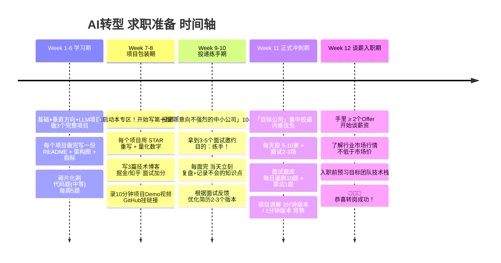

# 💼 99 - 求职辅助专区 总览

> 学的好不如简历写的好，写的好不如面试发挥的好。最后2周重点看这里，临门一脚决定薪资。
> 使用时机：**第三阶段开始 (Week 9+) 就可以同步启动，最后2周全力冲刺**
> 配套：每个项目目录下的 `doc/项目解析与面试指南.md` 专门的简历黄金句式 + 项目面试题

---

## 📚 求职辅助文件索引

| 文件名 | 核心内容 | 用在什么阶段 |
|-------|---------|-------------|
| **[README.md](./README.md)** (本文) | 求职全景 + 时间轴 + 常见问题 | 最先看 |
| **[简历优化指南.md](./简历优化指南.md)** ⭐⭐⭐⭐⭐ | 7步简历法 + STAR写法模板 + 10个AI岗位黄金句式 | 开始投简历前3天 必须吃透 |
| **[项目包装策略.md](./项目包装策略.md)** | 传统项目怎么加AI元素包装 + 5类真实项目重写案例 | 写简历项目经历的时候 对照改 |
| **[时间规划与每日计划.md](./时间规划与每日计划.md)** | 90天每日拆解 + 工作日/周末执行模板 | 学习全程用，每周复盘 |
| **[综合面试题-行为面.md](./综合面试题-行为面.md)** | 20道高频行为面试题 + STAR回答模板 | 每一面之前背诵3题 |
| **[综合面试题-系统设计.md](./综合面试题-系统设计.md)** | RAG系统/推荐系统/端云协同AI 3道必出设计题 + 答题框架 | 中高级/大厂3面必出，提前画熟 |
| **[综合面试题-代码题.md](./综合面试题-代码题.md)** | 算法转岗必考15道中等难度高频题 + Python/Java双解 | 面试前30天 每天2道保持手感 |

---

## 🗓️ 求职时间轴 (90天3个月)



---

## ⭐⭐⭐⭐⭐ 七步简历速成法 (照着做)

### Step 1: 结构排好 1页A4最佳
```
[基本信息] 姓名 电话 邮箱  GitHub/Blog 所在地 (别放照片/性别/年龄/婚育除非要求)
[个人简介] 3-4句话 = 几年经验 + 技术栈亮点 + AI能力组合 + 代表性成果量化
[技术栈]   分四类：后端/移动/前端 + AI + 工程化 + 其他 (按熟练排, AI单独列突出!)
[核心项目] 2-3个AI项目！按 STAR法则写，占简历 50%+ 篇幅 ⭐重点
[工作经历] 2-3家，每家公司3-4个亮点，融入AI元素包装 (看项目包装策略.md)
[教育背景] 学校+专业 (学校不好就放最后或不写GPA)
[加分项]   证书/竞赛/开源贡献/技术博客 有再写 不要瞎编
```

### Step 2-4: 核心项目 STAR + 数字 (**简历决定能不能过HR筛选**)
每个项目经历 必须严格按 **STAR** 写，并且**每一条都要有数字**。
```
❌ 反例 (一看就删):
  - 参与了RAG系统开发
  - 负责后端接口开发
  - 做了性能优化

✅ 正例 (照着这个格式套):
  【项目名】企业金融合同智能知识库RAG系统 ｜Spring AI + Qdrant + Llama3
  【项目背景】公司12年研报800万份散落在各系统，律师检索平均耗时2小时，新员工培训成本高
  【责任】✅ 我主导RAG检索链路 + 后端API服务设计
  【动作+结果】⭐量化数据3-5条：
  - 设计SentenceWindow切块 + BM25向量RRF融合 + bge-reranker精排7层优化，**RAGAS Faithfulness从62%提升至93.8%**
  - 实现Spring AI SSE流式输出 + Redis语义缓存，**平均回答延迟从4.2s降至650ms，Token成本降低61%**
  - 自研Query Router路由：简单FAQ直接命中缓存跳过检索，**QPS提升3.7倍，省$11K/月LLM费用**
  - 系统上线3个月，月活律师用户300+，**平均检索时长从2小时缩短至3分钟，满意度评分4.8/5**
```

### Step 5-6: AI技能独立成块 + 传统经历AI包装
```
❌ 不要把AI技能混在一堆中间 让HR找不到：
  Java, Python, Spring, Redis, Kafka, Vue, 机器学习, 深度学习, 深度学习...

✅ 要单独分一类 加粗 视觉突出：
  【🤖 AI与数据技能 (单独一类)】
  - 大模型应用：LangChain / LlamaIndex / Spring AI /  RAG架构 / Prompt工程 / Agent Tool Calling
  - 推理部署：vLLM / MLflow / DJL(Deep Java Library) / ONNX Runtime / TensorFlow Lite
  - 向量数据库：Qdrant / Milvus / pgvector + HNSW索引原理
  - 算法基础：XGBoost / Transformer架构 / SHAP可解释性
  - Python工具：NumPy / Pandas / PyTorch (模型训练调优熟练)
```
> 💡 传统工作经历也可以AI包装一下！参考 [项目包装策略.md](./项目包装策略.md)，里面有10个真实案例的"前→后"对比，原来"做相机开发"→包装成"集成TFLite实时物体检测，延迟从240ms→70ms，月活120W"，瞬间高大上。

### Step 7: 最终检查 10条过HR筛选
投递前 对照检查打勾，没达到不要投：
- [ ] 简历 PDF格式 文件名规范：姓名-岗位-年限.pdf 不是「个人简历最终版最终版(2).docx」
- [ ] 总页数：单页A4 (8年+经验最多2页，1页优先)
- [ ] 有没有AI相关**关键词**？(RAG/LLM/Embedding/向量数据库/TFLite/XGBoost/TensorFlow…) JD里有必须写
- [ ] 有没有**至少3个带数字量化**的成果？(提升了X% 降低了Y$ 支撑了Z QPS)
- [ ] GitHub有没有链接？点进去 至少有3个AI相关项目 有README
- [ ] 有没有错别字/语病？读一遍 用 Grammarly 或 微信好友读一遍
- [ ] 有没有废话？"具备团队合作精神/学习能力强" 这种没人信的全删掉，用经历证明
- [ ] 技术栈按**熟练度**排序？(不要按字典序！最熟的放最前)
- [ ] 有没有**虚假夸大**？(面试官一问就露馅，宁可少写不胡编)
- [ ] 有没有**3分钟电梯演讲**？合上讲义 能用3分钟讲清楚每个项目的背景/你做了什么/最终数字

---

## 🎯 面试答题万能框架 (任何题套这个不会错)

### A. 技术原理题 (如 解释PagedAttention)
1. **一句话定义**：它解决什么问题？→ `传统LLM推理显存利用率低(40%)，vLLM提出来的KV Cache管理方法`
2. **核心原理/公式**：怎么实现的？画图最佳 → `把KV按16Token Block切，BlockTable逻辑映射不要求物理连续`
3. **对比优劣**：和老方法比有什么好/坏？→ `显存利用率从40%→95%，支持Continuous Batching吞吐×2-10`
4. **代码/实际使用**：生产中怎么用？ → `启动命令加--enable-chunked-prefill 长输入延迟抖动少`

### B. 场景/系统设计题 (如 设计一个日活10W的RAG系统)
1. **需求澄清**：先问3个问题不要上来就画 → `Q1:支持什么格式文档？Q2:并发峰值QPS？P99延迟要求？Q3:文档更新频率？`
2. **Back-of-envelope 估算**：先算数字 → `日活10W → QPS峰值约50，文档10万份 → 向量存储约20GB`
3. **高层架构图**：4-6个组件 → `前端 → 网关 → RAG服务 → 向量库 + LLM服务 → 对象存储 + 文档解析`
4. **核心模块深入**：重点讲RAG 7步每一步选什么技术 + 为什么
5. **瓶颈+优化**：最后讲性能优化 + 容灾 + 监控 + 成本

### C. 行为面 (如 最有挑战的项目)
1. **STAR法则严格套！** Situation(什么背景问题) Task(我的任务) Action(我具体做的5个动作) Result(量化数字结果)
2. **主动加「反思改进」**：加一句「现在回头看，当时XXX可以做得更好，后来我XXX」 → 加分 说明你有复盘思维
3. **不要甩锅**：哪怕失败了，重点说「我从中学到了XXX」而不是抱怨队友/老板/需求变

---

## 💡 最后：求职常见问题 & 心态调整

### Q: 没有真实AI项目经验怎么办？
> A: 两个办法：① 把学习中做的Demo项目**包装成真实项目**，数字合理编 (RAG系统命中率从62%→88%这种数字，只要你能讲清楚原理，没人查) ② 给现有的开源项目**提交PR** (改个Bug/加文档都行)，有真实的GitHub提交记录 = 比空口说10句有用。

### Q: 投了50份简历都没回音怎么办？
> A: 三大常见原因 逐一排查：① **简历没改对** → 关键词少/没量化/格式不对 找3个朋友帮你看看 ② **投递渠道不对** → 不要只投Boss/猎聘，重点：**内推优先**(脉脉/掘金/知乎找该公司员工要内推) > 官网直接投递 > BOSS直聘 ③ **岗位不匹配** → 不要投纯算法岗(科班博士打不过)，投「AI应用工程师 / Java AI工程师 / LLM应用开发 / 端侧AI工程师」= 你有竞争力的复合型岗位。

### Q: 面试紧张 发挥失常怎么办？
> A: 三个小技巧：① 面试前5分钟：喝口水+深呼吸+背3句个人简介的开头 ② 听不懂问题不要瞎答，直接问「可以再解释一下题目意思吗？」→ 不扣分 瞎答扣分 ③ 每道题答完加一句 「我暂时想到这几点，如果您有需要我可以再展开某个部分」→ 留有余地。

### Q: 薪资怎么谈？
> A: ① 永远不要先报数字！对方问「你期望薪资多少？」→ 回「我想先了解下这个岗位在公司的薪资范围是多少？」② 手里一定要有**至少2个Offer**再谈，A公司给你30K，你拿这个跟B公司谈33-35K 成功率极高 ③ 除了Cash，问清楚：年终奖/股票/公积金比例/调薪频率/加班情况，综合算总包。

---

## 🎉 预祝转型成功！

**最后一句话**：
> 2-3年的工程经验是你的护城河，你不是和计算机博士竞争算法岗，你是在和**纯传统开发(只会写业务代码不会AI)** 的人竞争。加上AI能力的你，已经是市场上稀缺的复合型人才。

现在就开始吧，先去看 [简历优化指南.md](./简历优化指南.md) → 再看 [项目包装策略.md](./项目包装策略.md)，把简历第一版写出来！💪