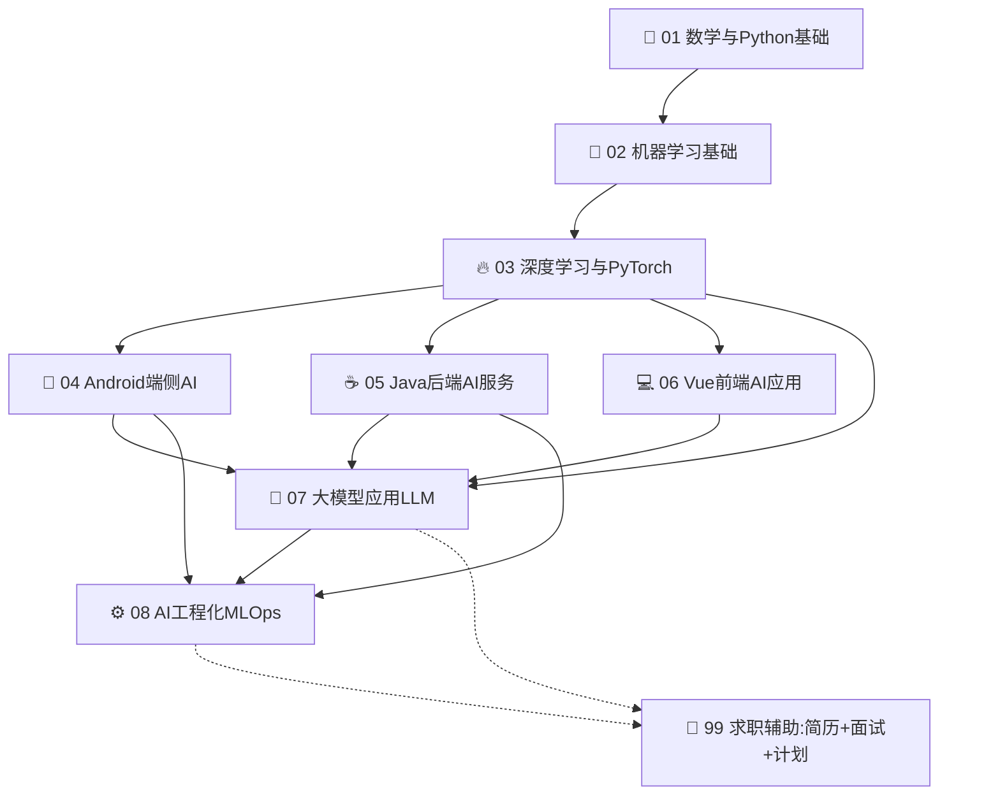

# AI转型系统化学习 - 总导航 README

> **适用人群**: 拥有 2-3 年 Java/Android/Vue.js 开发经验，希望系统化转型AI相关岗位的工程师
> **核心理念**: 不丢弃原有技术栈，而是将AI能力与现有工程能力做**乘法叠加**，形成差异化竞争力
> **总学习周期**: 3个月（90天），每天 2-3 小时 + 周末 6 小时
> **配套项目仓库**: 各技术章节都有配套的 GitHub 实战项目，路径在 `../{技术分类}/{项目名}/` 下

---

## 📚 八大技术方向目录导航

点击链接可直接跳转到对应章节学习：

| 序号 | 技术方向 | 核心岗位方向 | 预计学习周期 | 建议学习优先级 | 快速入口 |
|------|---------|-------------|-------------|--------------|---------|
| **01** | 🧮 **数学与Python基础** | 所有AI岗位通用基础 | 2周 (14天) | ⭐⭐⭐⭐⭐ 必学100% | [进入章节 →](./01-数学与Python基础/README.md) |
| **02** | 🤖 **机器学习基础** | 算法工程师/数据科学家 | 2周 (14天) | ⭐⭐⭐⭐⭐ 必学100% | [进入章节 →](./02-机器学习基础/README.md) |
| **03** | 🔥 **深度学习与PyTorch** | 深度学习/算法/计算机视觉 | 3周 (21天) | ⭐⭐⭐⭐⭐ 必学100% | [进入章节 →](./03-深度学习与PyTorch/README.md) |
| **04** | 📱 **Android端侧AI** | Android AI/端智能工程师 | 2周 (14天) | ⭐⭐⭐⭐ 原Android开发重点 | [进入章节 →](./04-Android端侧AI/README.md) |
| **05** | ☕ **Java后端AI服务** | Java AI/AI平台/MLOps工程师 | 2.5周 (17天) | ⭐⭐⭐⭐ 原Java后端重点 | [进入章节 →](./05-Java后端AI服务/README.md) |
| **06** | 💻 **Vue前端AI应用** | AI全栈/前端工程师 | 1.5周 (10天) | ⭐⭐⭐ 原前端重点选学 | [进入章节 →](./06-Vue前端AI应用/README.md) |
| **07** | 🚀 **大模型应用开发LLM** | LLM应用/RAG/Agent工程师 | 3周 (21天) | ⭐⭐⭐⭐⭐ 2025最热门方向！ | [进入章节 →](./07-大模型应用开发/README.md) |
| **08** | ⚙️ **AI工程化与MLOps** | MLOps/AI平台/推理优化 | 2周 (14天) | ⭐⭐⭐⭐ 高阶岗位必备 | [进入章节 →](./08-AI工程化与MLOps/README.md) |
| **99** | 💼 **求职辅助专区** | 简历+面试+时间规划 | 面试冲刺2周 | ⭐⭐⭐⭐⭐ 最后阶段重点 | [进入章节 →](./99-求职辅助/README.md) |

---

## 🗺️ 学习路线依赖图

先学基础，再选一个你原技术栈的垂直方向做重点突破，最后叠加LLM大模型：



> 💡 **学习策略建议**: 方向 01→02→03 为**公共基础必学**，顺序不可跳过。方向 04/05/06 可根据你的原技术栈**选一个作为主战场**深入，另外两个快速浏览概念即可。方向 07（大模型LLM）**不论你什么背景都强烈推荐学**，这是2025年AI岗位需求量最大的方向。方向 08（MLOps）有多余精力再学，或面试高阶岗位时再补。

---

## 📋 文档使用说明

### 每个技术章节统一的文档结构

每个章节的目录下都包含以下文件，方便你系统化学习：

```
{技术章节}/
├── README.md                 ← 本章导读 + 知识点索引 + 学习优先级建议
├── 核心知识点-xxx.md         ← N个知识点文档，每个讲透一个核心主题（含公式+代码）
├── 代码实战.md               ← 完整可运行的代码示例（复制粘贴就能跑）
├── 面试题库.md               ← 本章对应的高频面试题（含标准答案）
└── GitHub项目推荐.md         ← 实战项目清单（与 ../ 下已下载的项目对应）
```

**配套的项目代码（已下载完毕）都在上级目录中：**

```
ai_learning_path/
├── ai_learning_materials/       ← 你现在在这里：学习文档
│   └── 00-总导航...
│   └── 01-数学与Python基础/...
│
├── 01-math-python/              ← 对应的实战项目代码
│   ├── ML-From-Scratch/doc/     ← 每个项目独立的深度解析+简历写法+面试题
│   ├── algorithms/doc/
│   └── PythonDataScienceHandbook/doc/
├── 02-machine-learning/
├── 03-deep-learning/
├── ... 以此类推
```

> 📝 **重要提示**: 每个项目代码下 `doc/项目解析与面试指南.md` 都包含了专门针对**该项目面试可写进简历的黄金句式**和**高频面试题标准答案**，写简历和面试前一定要看！

---

## 🎯 核心求职策略：AI赋能而非从零开始

**你不是从零转行当AI算法博士，而是把 AI 能力叠加到你已有的技术栈上，形成稀缺的"复合型"人才。**

| 你的原有技术栈 | AI赋能后的定位 | 市场稀缺度 | 薪资溢价范围 |
|--------------|--------------|-----------|-------------|
| 📱 Android 开发 | **端侧AI工程师** / 端智能专家 | ⭐⭐⭐⭐⭐ 极度稀缺 | +30% ~ +70% |
| ☕ Java 后端 | **Java AI服务工程师** / AI平台工程师 | ⭐⭐⭐⭐ 非常稀缺 | +25% ~ +60% |
| 💻 Vue 前端 | **AI全栈工程师** / LLM应用前端 | ⭐⭐⭐⭐ 非常稀缺 | +20% ~ +50% |
| 全栈/多面手 | **LLM应用全栈** / RAG/Agent 工程师 | ⭐⭐⭐⭐⭐ 2025最缺！ | +40% ~ +100% |

---

## ⚡ 快速开始：30分钟热身清单

如果你还在犹豫从哪里开始，按下面步骤按顺序执行：

1. **[5分钟]** 先读：[学习路线总览](./00-总导航与学习路线/学习路线总览.md) → 建立整体框架
2. **[5分钟]** 再读：[知识图谱与术语速查](./00-总导航与学习路线/知识图谱与术语速查.md) → 所有AI术语一次性搞懂
3. **[10分钟]** 再读：[求职辅助-简历优化指南](./99-求职辅助/简历优化指南.md) → 建立最终目标感
4. **[10分钟 + 持续]** 打开 [01-数学与Python基础](./01-数学与Python基础/README.md) → 正式开始学习！

---

## 📞 学习中遇到问题？

- **算法/公式不会推？** → 跳过推导，先理解"它解决什么问题 + 代码怎么用"，面试回头再补原理
- **环境/依赖装不上？** → 先看对应项目的 `doc/项目解析` 的环境搭建章节，或用 Colab（免环境）
- **看了忘怎么办？** → 每学一个知识点，写1条笔记到自己的Notion/飞书，配合代码动手敲一遍
- **项目太复杂？** → 先跑通最小Demo，再逐行分析代码，不要一开始就啃全部源码

> 记住：**完成 > 完美**。先把整体路线跑完一遍（70%理解度），再回头补细节，远好过卡在某一章迟迟不前进。